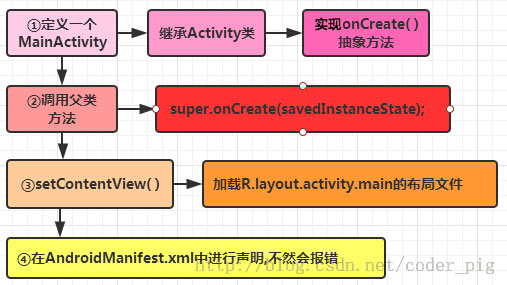
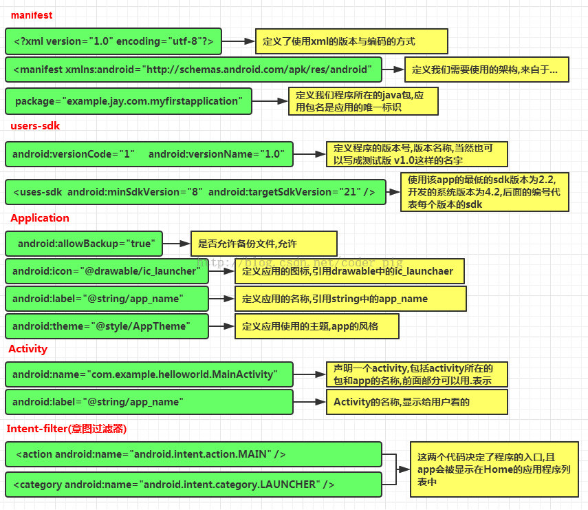
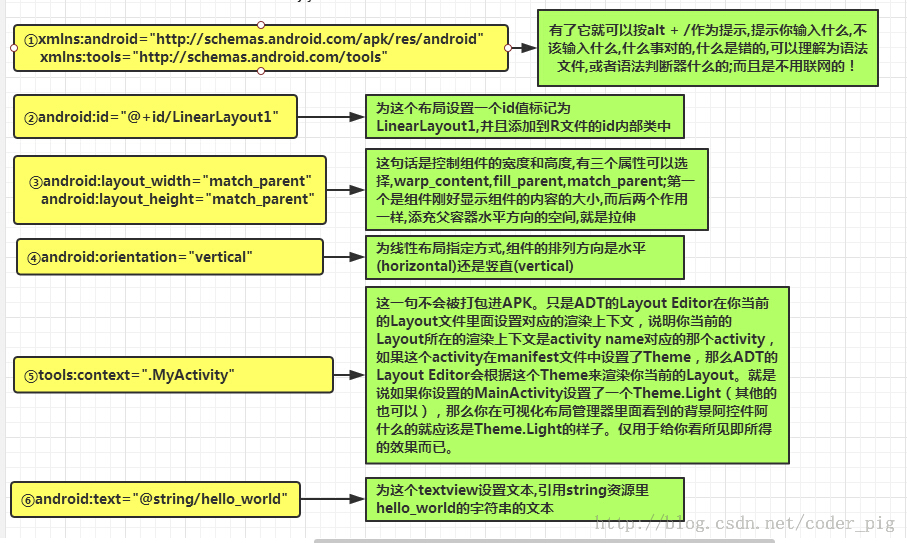

# 项目结构与资源使用
## 项目结构
(这是逻辑结构，实际物理结构有些许差异)  
* **app**
  * manifest
  * **java**： 存放 java 代码  
  * **asset**：和 res 功能相似，但不会创建资源id  
  * **res**：存放各种资源文件的地方  
    * **drawable**：存放各种位图文件  
    * **mipmap**：图片文件  
    * **layout**：布局资源  
    * **values**
      * themes
    * menu：物理菜单按钮资源，现在不常用了  

-------------------
### java
**存放 java 代码的地方**，业务功能都在这里实现  


### asset
和 res 目录类似，也是**存放资源**的  

但**该目录下的资源并不会创建资源 id** ，而是通过 AssetManager以二进制流的形式来读取  


### res/drawable
存放各种位图文件，(.png，.jpg，.9png，.gif等)除此之外可能是一些其他的drawable类型的XML文件  


### res/mipmap
mipmap-hdpi：高分辨率，一般我们把图片丢这里  
mipmap-mdpi：中等分辨率，很少，除非兼容的的手机很旧  
mipmap-xhdpi：超高分辨率，手机屏幕材质越来越好，以后估计会慢慢往这里过渡  
mipmap-xxhdpi：超超高分辨率，这个在高端机上有所体现  


### res/layout
该目录下存放的就是我们的布局文件，另外在一些特定的机型上，我们做屏幕适配  

可以通过 “Code” 和 “Design” 切换显示代码还是图形界面  


### res/values
demens.xml：定义尺寸资源  
string.xml：定义字符串资源  
styles.xml：定义样式资源  
colors.xml：定义颜色资源  
arrays.xml：定义数组资源  
attrs.xml：自定义控件时用的较多，自定义控件的属性！  

**实际上就是会把一些常用的值当作常量一样保存在这，需要时再从此处取用**  

其下的 themes 目录功能和 style 相似，可以对指定的 activity 使用指定的 themes，修改它可以改变手机导航栏颜色、程序大标题颜色等等  

-------------------------
## 资源使用
放在 res 目录下的所有资源文件都会在 `R.java` 文件中生成一个资源 id  
我们可以通过资源 id 完成对资源的访问  

(但是这个 R.java 我暂时还没有找到在哪)  

### 在 Java 中使用
``` Java
// 文字：
txtName.setText(getResources().getText(R.string.name)); 
// 图片：
imgIcon.setBackgroundDrawableResource(R.drawable.icon); 
// 颜色：
txtName.setTextColor(getResouces().getColor(R.color.red)); 
// 布局：
setContentView(R.layout.main);
// 控件：
txtName = (TextView)findViewById(R.id.txt_name);
```

**其实总结起来就是通过 `R.xxx.yyy` 来访问**  
如访问 id 就是 `R.id.xxx`，其**值是一个数字**  

### 在 XML 中使用
``` XML
<TextView android:text="@string/hello_world" android:layout_width="wrap_content" android:layout_height="wrap_content" android:background = "@drawable/img_back"/>
```

**其实就是通过 `@xxx/yyy` 来访问**  

--------------------
## 三个关键文件
### MainActivity.java
代码如下：  
``` Java
package com.example.bupt.myapp1;

import androidx.appcompat.app.AppCompatActivity;
import android.os.Bundle;

public class MainActivity extends AppCompatActivity {
    @Override
    protected void onCreate(Bundle savedInstanceState) {
        super.onCreate(savedInstanceState);
        setContentView(R.layout.activity_main);
    }
}
```

其代码逻辑为：  


### AndroidManifest.xml
  

### activity_main.xml
