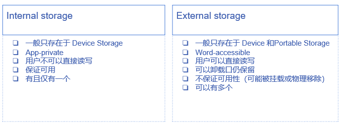
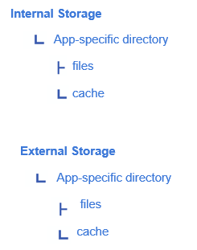
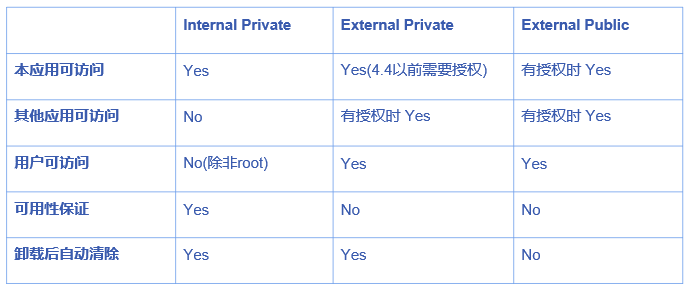

# 本地存储
## 概览
存储的物理介质包括 Device Storage 和 Portable Storage  

存储的逻辑分区包括 Internal Storage 和 External Storage  

  

它们的下级目录都包括:  
  

各种权限的区别如下图所示：  
  

--------------------
## files 文件
* Internal  
  * files 目录：`context.getFilesDir()`  
  * cache 目录：`context.getCacheDir()`  
  * 自定义目录：`context.getDir(name, mode)`  
*  External
   *  files 目录：`context.getExternalFilesDir(String type)`  
   *  cache 目录：`context.getExternalCacheDir()`  
* Public
  * 标准目录：`Environment.getExternalStoragePublicDirectory(String type)`  
  * 根目录：`Environment.getExternalStorageDirectory()`  

其中 type 应该是个宏，如 `Environment.DIRECTORY_DOWNLOADS` 即表示前述的 Download 目录  

### Public 前置检查
#### 权限
**在访问 Public 目录的时候，我们需要检查权限**：  
首先需要在 Manifest 中注明权限：  
``` XML
<uses-permission android:name="android.permission.WRITE_EXTERNAL_STORAGE" />
<uses-permission android:name="android.permission.READ_EXTERNAL_STORAGE"/>
```

然后在 Java 代码中获取权限：  
``` Java
ActivityCompat.requestPermissions(this, new String[]{Manifest.permission.WRITE_EXTERNAL_STORAGE}, REQUEST_CODE_PERMISSION);
```

#### 可用性
**除了检查权限，我们还得保证外部存储是可用的(如 SD 卡可能被拆卸)**  
``` Java
/* 这个函数展示了如何确认外部存储是可读写的 */
public boolean isExternalStorageWritable() {
    String state = Environment.getExternalStorageState();
 	if (Environment.MEDIA_MOUNTED.equals(state)) {
        return true;
    }
    return false;
}

/* 这个函数展示了确认外部存储至少是可读的 */ 
public boolean isExternalStorageReadable() {  
    String state = Environment.getExternalStorageState();
    if (Environment.MEDIA_MOUNTED.equals(state) || Environment.MEDIA_MOUNTED_READ_ONLY.equals(state)) {
        return true;
    }
    return false;
}
```

**一个完整的可参考的例子为：**  
``` Java
// 通过 checkSelfPermisson() 检查权限，返回当前权限状态
int state = ActivityCompat.checkSelfPermission(DebugActivity.this, Manifest.permission.WRITE_EXTERNAL_STORAGE);

// 根据 state 检查权限是否已经获得
if (state == PackageManager.PERMISSION_GRANTED) {
    Toast.makeText(DebugActivity.this, "already granted",
            Toast.LENGTH_SHORT).show();
    return;
}

// 申请权限
ActivityCompat.requestPermissions(DebugActivity.this,
        new String[]{Manifest.permission.WRITE_EXTERNAL_STORAGE},
        REQUEST_CODE_STORAGE_PERMISSION);
// REQUEST_CODE_STORAGE_PERMISSION 是需要定义的 1001
```

### 文件读写
**读写文件是一个耗时操作，所以应该放到子线程当中**  

写文件参考代码：  
``` Java
new Thread(new Runnable() {
    @Override
    public void run() {
        // 可以先判断权限

        // 获取存放文件的目录
        File dir = Environment.getExternalStoragePublicDirectory(Environment.DIRECTORY_DOWNLOADS);

        // 新建一个可操作对象，控制 dir 目录下的文件 hello
        // 这一步并没有实际创建好文件
        File file = new File(dir, "hello");

        // 这是一个封装的写函数
        FileOperator.writeContentToFile(file, "Hello!\nWorld");

    }
}).start();
```

读文件代码：  
``` Java
new Thread(new Runnable() {
    @Override
    public void run() {
        // 可以先判断权限

        // 获取存放文件的目录
        File dir = Environment.getExternalStoragePublicDirectory(Environment.DIRECTORY_DOWNLOADS);

        // 新建一个可操作对象，控制 dir 目录下的文件 hello
        // 这一步并没有实际创建好文件
        File file = new File(dir, "hello");

        final List<String> contents = FileOperator.readContentFromFile(file);

        // 要显示到屏幕上，必须在 UI 线程中做
        runOnUiThread(new Runnable() {
            @Override
            public void run() {
                // 这里显示到了 fileText 组件
                fileText.setText("");
                for (String content : contents) {
                    fileText.append(content + "\n");
                }
            }
        });
    }
}).start();
```

FileOperator 类：  
``` Java
public class FileOperator {
    // 写文件函数
    public static void writeContentToFile(File file, String content) {
        BufferedWriter out = null;
        try {
            //FileOutputStream(file, true),第二个参数为true是追加内容，false是覆盖
            out = new BufferedWriter(new OutputStreamWriter(new FileOutputStream(file, true)));
            out.newLine();//换行
            out.write(content);     // write 将实际内容写入文件
        } catch (Exception e) {
            e.printStackTrace();
        } finally {
            closeQuietly(out);
        }
    }

    // 读文件函数
    public static List<String> readContentFromFile(File file) {
        List<String> contents = new ArrayList<>();
        BufferedReader reader = null;
        if (file != null && file.isFile() && file.exists()) { // 判断文件是否存在
            try {
                reader = new BufferedReader(new InputStreamReader(
                        new FileInputStream(file), "UTF-8"));
                String line;
                while ((line = reader.readLine()) != null) {
                    contents.add(line);
                }
            } catch (IOException e) {
                e.printStackTrace();
            } finally {
                closeQuietly(reader);
            }
        }
        return contents;
    }

    // 关闭读写流
    public static void closeQuietly(Closeable c) {
        if (c != null) {
            try {
                c.close();
            } catch (IOException e) {
                e.printStackTrace();
            }
        }
    }
}
```

----------------
## SharedPreferences
SharedPreferences 是一种类似于键值对的形式，以 XML 文件存储，**一次性会将整个文件读取到内存中**  

**SP 只适合小容量数据存储，如配置信息，否则加载慢，占用大量内存**  

### 获取 SharedPreferences
``` Java
context.getSharedPreferences(name, Context.MODE_PRIVATE);

getActivity().getPreferences(Context.MODE_PRIVATE);
```

**Mode 只能填 Content.MODE_PRIVATE ，因为其他的都被废弃了**  

### 读 SharedPreferences
``` Java
String getString(String key, String defValue); 
Set<String> getStringSet(String key, Set<String> defValues);
int getInt(String key, int defValue);
long getLong(String key, long defValue);
float getFloat(String key, float defValue);
boolean getBoolean(String key, boolean defValue); 
```

**其中参数 defValue 表示默认的值，当没有取到 key 对应的 value 时会返回该值**  

### 写 SharedPreferences
通过 SharedPreferences.Editor 对象去修改 SP：  

``` Java
// 首先获取一个 SP 对象
SharedPreferences sharedPref = getActivity().getPreferences(Context.MODE_PRIVATE);
// 再新建一个 Editor 对象
SharedPreferences.Editor editor = sharedPref.edit();

// 调用 putInt() 方法修改值
editor.putInt(getString(R.string.saved_high_score_key), newHighScore);

// 修改完成后需要提交，以下是两种提交方式
editor.commit();    // 同步写入
editor.apply();     // 异步写入
```

提交时 commit 和 apply 的区别：  
* commit：  
  1. 同步写入内存和磁盘  
  2. 有返回值  
  3. 同时调用时，最后一次调用获胜  
* apply：  
  1. 同步写入内存，异步保存磁盘  
  2. 无返回值  
  3. 同时调用时，最后一次调用覆盖  

**完整代码**：  
``` Java
public class SettingActivity extends AppCompatActivity {

    private static final String KEY_COMMENT = "key_comment";

    // 评论开关
    private Switch commentSwitch;
    private SharedPreferences mSharedPreferences;

    @Override
    protected void onCreate(Bundle savedInstanceState) {
        super.onCreate(savedInstanceState);
        setContentView(R.layout.activity_setting);
        mSharedPreferences = getSharedPreferences("custom_settings", Context.MODE_PRIVATE);
        boolean isOpen = mSharedPreferences.getBoolean(KEY_COMMENT, false);

        commentSwitch = findViewById(R.id.switch_comment);
        commentSwitch.setOnCheckedChangeListener(new CompoundButton.OnCheckedChangeListener() {
            @Override
            public void onCheckedChanged(CompoundButton buttonView, boolean isChecked) {
                SharedPreferences.Editor editor = mSharedPreferences.edit();
                editor.putBoolean(KEY_COMMENT, isChecked);
                editor.commit();
            }
        });
        commentSwitch.setChecked(isOpen);
    }
}
```

------------------
## Database 数据库
**适合大量数据存储**  

数据库的增删改查都属于是 IO 操作，不要放在主线程里  

太复杂了，等以后补充吧   

-----------------
## Room Library
也是一种数据库的使用形式  

在使用前，先在 build.gradle 中加上依赖后同步一下:  
``` 
implementation 'com.facebook.stetho:stetho:1.3.1'
def room_version = "2.2.0-alpha01"

implementation "androidx.room:room-runtime:$room_version"
annotationProcessor "androidx.room:room-compiler:$room_version" // use kapt for Kotlin

// optional - RxJava support for Room
implementation "androidx.room:room-rxjava2:$room_version"

// optional - Guava support for Room, including Optional and ListenableFuture
implementation "androidx.room:room-guava:$room_version"

// Test helpers
testImplementation "androidx.room:room-testing:$room_version"
```

1. **先定义一个 JavaBean 类(就是表中每一列要包含哪些信息)**  
``` Java
// 需要使用 @Entity 注解
@Entity(tableName = "user")
public class User {
    // 这里指明 uid 是主键，但是实际执行插入操作时出现重复的 uid 程序会直接崩溃，所以要先检查主键是否重复
    @PrimaryKey
    public int uid;

    @ColumnInfo(name = "first_name")
    public String firstName;

    @ColumnInfo(name = "last_name")
    public String lastName;
}
```

2. **定义Dao(Data Access Object)接口**:
``` Java
@Dao
public interface UserDao {
    // 实际上就是当调用这里面的方法的时候，自动执行注解中的 SQL 语句，Room 会帮我们根据注解来自动生成函数
    @Query("SELECT * FROM user")
    List<User> getAll();

    // “:变量名” 可以使用方法的参数
    @Query("SELECT * FROM user WHERE uid IN (:userIds)")
    List<User> loadAllByIds(int[] userIds);

    @Query("SELECT * FROM user WHERE first_name LIKE :first AND " + "last_name LIKE :last LIMIT 1")
    User findByName(String first, String last);

    @Insert
    void insertAll(User... users);

    @Update
    void update(User user);

    @Delete
    void delete(User user);
}
```

3. **添加 RoomDatabase**  
``` Java
// entities 的值是之前定义的那个 entity
@Database(entities = {User.class}, version = 1)
public abstract class AppDatabase extends RoomDatabase {
    public abstract UserDao userDao();
}
```

以上三部分都可以单独写在一个文件里  

注意每次表修改之后，version 都应该增加  

之后教程中还要写个 Application 类，不过我没写也正常使用了。所以不知道这段是什么意思：  
``` Java
public class LocationApplication extends Application {
    @Override
    public void onCreate() {
        super.onCreate();
        Stetho.initializeWithDefaults(this);
    }
}
```

**最后要注意的一点是这里的数据库操作也不能在 UI 线程中进行**  

之后要使用数据库，只需要在 Java 代码中使用以下语句即可：  
``` Java
AppDatabase db = Room.databaseBuilder(DatabaseActivity.this, AppDatabase.class, "user_db").build();

User user = new User();
user.uid = 3;
user.name = "hhh";

UserDao userDao = db.userDao();
userDao.insertAll(user);

List<User> li = userDao.getAll();
System.out.println(li.size());
```