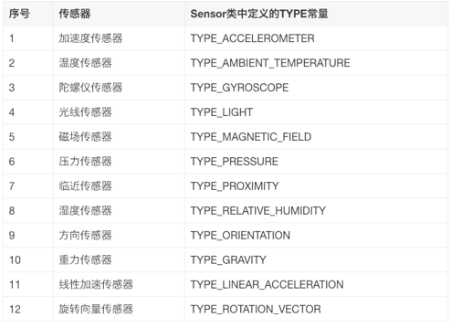
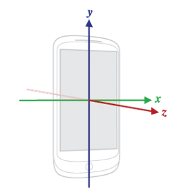
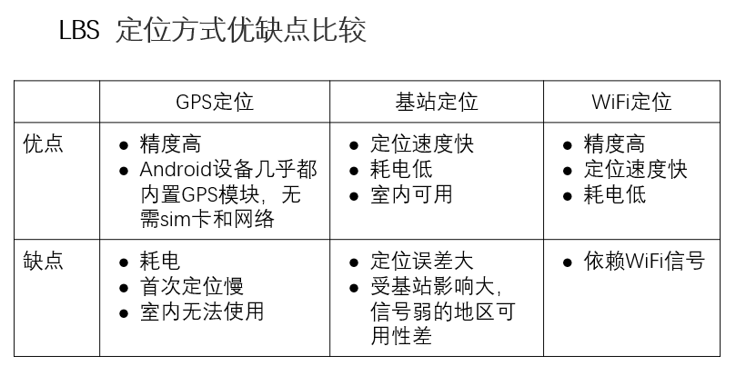

# 硬件与定位
## 传感器
Android 上使用传感器的大致步骤：  
1. 确定设备上可用的传感器  
2. 确定单个传感器的功能，例如其最大范围、功率要求和分辨率  
3. 获取原始传感器数据并设置获取传感器数据的最小速率  
4. 注册和取消注册监视传感器事件的事件监听器  

接下来一步步讲解如何用代码实现  

### 获取 SensorManager
``` Java
SensorManager sensorManager = (SensorManager)getSystemService(Context.SENSOR_SERVICE);
```

此类是传感器服务的实例，提供了各种方法来访问和列出传感器，注册和取消注册传感器事件监听器以及获取方向信息  

该类还提供了几个传感器常数，用于报告传感器精度，设置数据采集速率和校准传感器  

### 通过 SensorManager 获取指定的 Sensor
``` Java
Sensor sensor = sensorManager.getDefaultSensor(Sensor.TYPE_GRAVITY);
```

**需要注意的是获取的传感器要判断是否可用，因为不是所有设备都提供所有传感器**  

不同的传感器类型如下：  
  

### 构造传感器事件监听器
``` Java
SensorEventListener listener = new SensorEventListener() {
    @Override
    public void onSensorChanged(SensorEvent sensorEvent) {
        // 传感器检测数值发生变化时回调
        
    }

    @Override
    public void onAccuracyChanged(Sensor sensor, int i) {
        // 传感器精度变化时回调
    }
};
```

**其中 SensorEvent 对象提供有关传感器事件的信息，它的成员属性中有一个 values 数组，其数值和长度和传感器的种类有关**  

如重力传感器的 values 的 0 1 2 分别是以手机朝向为基准代表的三个方向的加速度(分量)  

**传感器的坐标系通常以下图为准**：  
  

### 将事件监听器和传感器绑定/注册
``` Java
sensorManager.registerListener(listener, sensor, sensorManager.SENSOR_DELAY_NORMAL);
```

registerListener 的第一个参数是监听器、第二个参数是传感器  
第三个参数表示采样频率，主要有以下几种取值(按间隔递增顺序)：  
``` Java
SensorManager.SENSOR_DELAY_FASTEST  // 以最快的速度获得传感器数据 0 毫秒
SensorManager.SENSOR_DELAY_GAME     // 适合与在游戏中获得传感器数据 20,000 毫秒
SensorManager.SENSOR_DELAY_NORMAL   // 以一般的速度获得传感器数据
SensorManager.SENSOR_DELAY_UI       // 适合于在UI控件中获得数据 60,000 毫秒
```

### 取消注册释放资源
``` Java
sensorManager.unregisterListener(listener);
```

### 注意事项
* 最好只在前台使用传感器，当应用退到后台后，应该停止使用传感器  
* 不要阻塞 onSensorChanged 方法，传感器数据可能会高速变化，这意味着系统可能会频繁调用该方法，如果阻塞此方法会导致数据获取延迟  
* 在使用之前需要验证传感器是否存在或可用，不要假定传感器的存在，因为设备可能没有提供相应的传感器或者传感器出现异常不可用  
* 在注册传感器事件监听时，选择适合的传输速率，避免过高的传输速率导致耗电  

-----------------
## 摄像头
Android提供对设备相机硬件的完全访问权限，我们可以构建各种相机或基于视觉的应用程序  

如果我们的app只需要简单拍照，也可以直接调用现有的相机应用程序拍照并将其返回给我们的app:  
``` Java
static final int REQUEST_IMAGE_CAPTURE = 1;
private void dispatchTakePictureIntent() {
    // 启动的也可以是录视频模式
    Intent takePictureIntent = new Intent(MediaStore.ACTION_IMAGE_CAPTURE);
    if (takePictureIntent.resolveActivity(getPackageManager()) != null) {
        startActivityForResult(takePictureIntent, REQUEST_IMAGE_CAPTURE);
    }
}

// 通过 startActivityForResult 调用的需要在当前类中重写 onActivityResult 来处理返回数据
@Override
protected void onActivityResult(int requestCode, int resultCode, Intent data) {
    if (requestCode == REQUEST_IMAGE_CAPTURE && resultCode == RESULT_OK) {
        Bundle extras = data.getExtras();
        Bitmap imageBitmap = (Bitmap) extras.get("data");
        // 将图片显示到一个 ImageView 中
        mImageView.setImageBitmap(imageBitmap);
    }
}
```

---------------
## 定位
**Location Based Service，基于位置服务**  
定位方式主要有 GPS，基站，WiFi 定位与 IP 定位  
  

定位代码和传感器代码步骤相似  

使用定位功能首先需要添加权限：  
``` XML
<!-- 前台定位权限，前者比后者更精准 -->
<uses-permission android:name="android.permission.ACCESS_FINE_LOCATION" />
<uses-permission android:name="android.permission.ACCESS_COARSE_LOCATION" />


<!-- 后台定位权限 -->
<uses-permission android:name="android.permission.ACCESS_BACKGROUND_LOCATION" />
```


好像这三个不是都需要同时用的，但具体我也没搞懂，而且我实际测试发现权限并没有通过弹出框的形式询问，而是默认关闭的，需要手动打开  

之后的完整内容：  
``` Java
String locationProvider = LocationManager.NETWORK_PROVIDER;
// 从系统中获取位置管理器类 LocationManager
LocationManager locationManager = (LocationManager) this.getSystemService(Context.LOCATION_SERVICE);

// 这里应该还有位置权限的检测，不在这里列出

// 因为首次获取位置较慢，可以先通过调用 getLastKnownLacation() 获取最后一次位置
Location location = locationManager.getLastKnownLocation(locationProvider);
TextView t = (TextView) findViewById(R.id.textPosition);
t.setText("经纬度：" + location.getLongitude() + ", " + location.getLatitude());

// 创建位置监听器
LocationListener locationListener = new LocationListener() {
    @Override
    public void onLocationChanged(@NonNull Location location) {
        // 当位置发生变化时，会回调该函数
        TextView t = (TextView) findViewById(R.id.textPosition);
        t.setText("经纬度：" + location.getLongitude() + ", " + location.getLatitude());
    }
};

// 注册监听器监听位置变化信息
locationManager.requestLocationUpdates(LocationManager.NETWORK_PROVIDER, 0, 0, locationListener);

// 不需要时，移除位置监听器
locationManager.removeUpdates(locationListener);
```