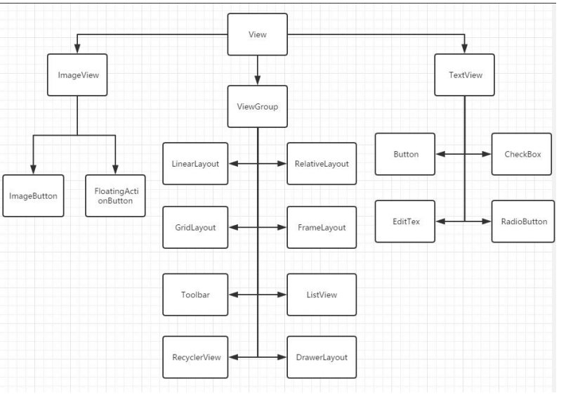
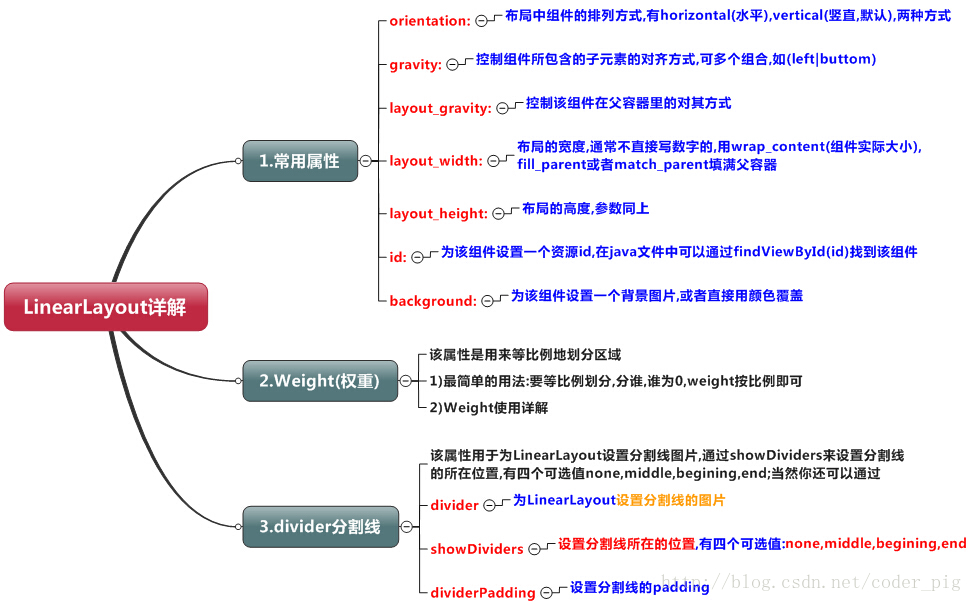
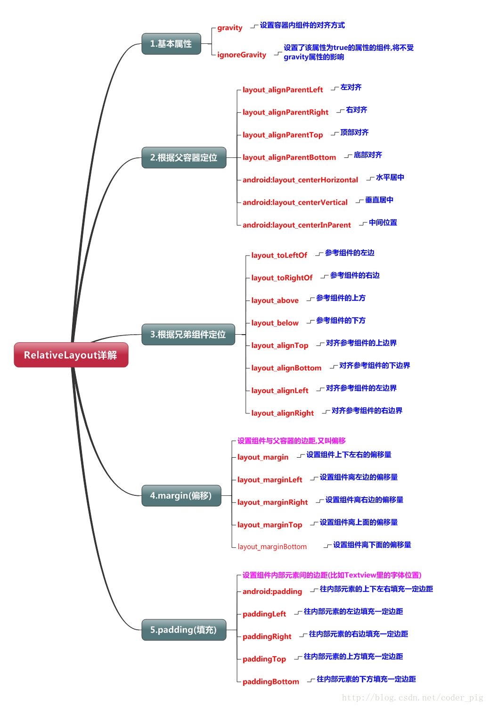

# UI 组件
在 Android APP 中，所有的用户界面元素都是由 View 和 ViewGroup 的对象构成的  

**View 是绘制在屏幕上的用户能与之交互的一个对象**  
**而 ViewGroup 则是一个用于存放其他 View（和 ViewGroup ）对象的布局容器**  

它们的组成形式就是树形结构，所以使用 XML 文件的方式展现布局  

布局的层次越少，性能将会越好  

**各种组件之间的继承关系**：  


---------------
## 布局
Android中有六大布局,分别是: 
1. **LinearLayout**(线性布局)  
2. **RelativeLayout**(相对布局)  
3. **TableLayout**(表格布局)  
4. **FrameLayout**(帧布局)
5. **AbsoluteLayout**(绝对布局)  
6. **GridLayout**(网格布局)  
   
(实际上还应该有 **androidx.constraintlayout.widget.ConstraintLayout**)  

大部分组件都通用的属性：  
``` XML
<LineraLayout
android:layout_width="fill_parent"
android:layout_height="fill_parent"
android:background="#FFFFFF"
android:orientation="hirizontal"
android:text="这是组件中显示的文本信息"  />
```

width 和 height 常用值：  
**match_parent/fill_parent**：尽可能和父元素一样大  
**wrap_content**：尽可能小到刚好装下内容  
当然，也可以是一些**绝对值**  

**在布局中的子组件必须设定一些与布局相关的属性，通常是水平位置、竖直位置；还有一些和布局无关的，如宽、高**  

接下来讲一些布局中组件可以使用的特有属性：  
### LinearLayout 线性布局
  
**android:layout_weight**：该属性决定了组件实际空间的比重  
#### 设置分割线
android:divider：设置作为分割线的图片  
android:showDividers：设置分割线的位置,none(无),beginning(开始),end(结束),middle(每两个组件间)  
dividerPadding：设置分割线的Padding  

### RelativeLayout 相对布局  
  

**相对布局主要是为了和某个其它组件的边界对齐而使用的**  

### androidx.constraintlayout.widget.ConstraintLayout 限制布局
**app:layout_constraintLeft_toLeftOf()**：
把A的left side放在B的left side(左边对齐)  
同理有app:layout_constraintLeft_toRightOf等、以及Top、Bottom的样式  
还有Start、End、Baseline设置起始位置、结束位置、基准线位置对齐  