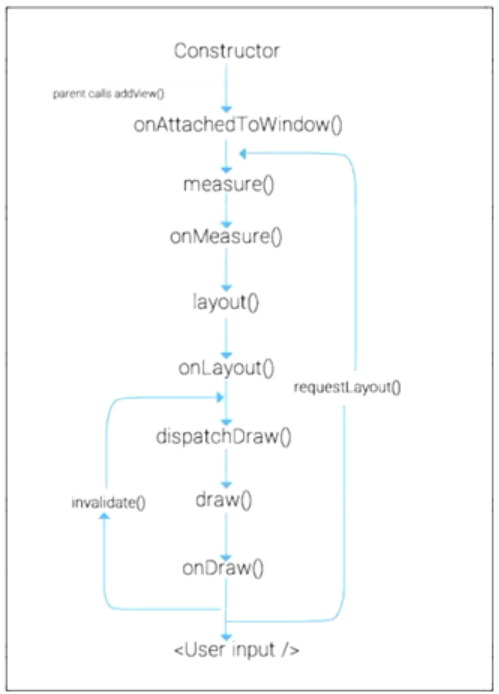

# 自定义view
view 绘制的三个重要步骤：  
1. Measure：测量宽高  
2. Layout：确定位置  
3. Draw：绘制形状  

  

在 ViewGroup 和 View 树形结构中，总是按完成所有的Measure-完成所有的Layout-完成所有的Draw 的顺序去执行  

代码实现起来的关键，是要重写 onMeasure()、onLayout()、onDraw() 方法  

## 重写 onDraw()
``` Java
public class ClockView extends View {
    // 首先应该实现创建该实例时的构造方法
    // 这里的三个构造方法都要，不要在 XML 中使用这个 View 的时候会有错误
    public ClockView(Context context) { 
        super(context); 
    }

    public ClockView(Context context, @Nullable AttributeSet attrs) {
        super(context, attrs);
        init(context, attrs);
    }

    public ClockView(Context context, @Nullable AttributeSet attrs, int defStyleAttr) {
        super(context, attrs, defStyleAttr);
        init(context, attrs);
    }

    @Override
    protected void onDraw(Canvas canvas) {
        super.onDraw(canvas);
        // 绘制代码
    }
}
```

在 onDraw() 中我们使用了 Canvas 参数，这是一个画布  
我们可以调用其方法来进行绘制  

---------------
### Paint 类
**要在画布上绘制，我们还需要一个 Paint 实例**  
**所以通常我们将这样的一个实例作为属性保存在自定义 View 中**  

Paint 创建代码例子：  
``` Java
public class ClockView extends View {
    private Paint mPaint;
    public ClockView(Context context) {
        super(context); 
        mPaint = new Paint();
        mPaint.setColor(Color.BLACK);       // 设置画笔颜色
        mPaint.setStyle(Paint.Style.FILL);  // 设置画笔风格
        mPaint.setAntiAlias(true);          // 设置画笔抗锯齿
        mPaint.setStrokeWidth(10f);         // 设置描边宽度
        mPaint.setTextSize(50f);            // 设置绘制文字时的大小
        mPaint.serTextAlign(Paint.Align.LEFT);  // 设置文字对齐方式
    }

    //...... 下接
}
```

**画笔的风格：FILL 填充、STROKE 描边、FILL_AND_STROKE 等**  
**画笔的文字对齐：LEFT、CENTER、RIGHT，决定了文字与指定对齐线的位置关系**  

如果有需要，也可以保存不同的画笔  

有了 Paint 实例，我们就可以使用 Canvas 中的方法作画，绝大多数方法都要使用这个画笔作为参数  

------------------
### Canvas 类
**画布的左上方是原点，向右为 x 轴正向，向下为 y 轴正向，同 drawable 中 vector 作画**  

Canvas 绘制代码例子：  
``` Java
public class ClockView extends View {
    // ...... 接上述内容
    @Override
    protected void onDraw(Canvas canvas) {
        super.onDraw(canvas);
        // drawPoint 用指定画笔在指定 x,y 坐标画出一个点
        canvas.drawPoint(200, 200, mPaint);
        // 也可以用 drawPoints 和数组同时画多个点
        canvas.drawPoints(new float[]{
            100, 100,
            100, 200,
            100, 300
        }, mPaint);
        
        // drawLine 画线，多条线同上; 参数为起始 x,y 和终止 x,y
        canvas.drawLine(100, 100, 200, 200, mPaint);

        // drawCircle 画正圆; 参数为圆心 x,y 和半径
        canvas.drawCircle(200, 200, 100, mPaint);
        // drawRect 画矩形; 参数为左上右下边的位置
        canvas.drawRect(500, 500, 700, 800, mPaint);
        // drawOval 画椭圆，也是指定左上右下的边界位置(在指定矩形中作出最大的椭圆)
        canvas.drawOval(500, 1000, 800, 1400, mPaint);

        // drawText 画文本，参数是文本的对齐线，与画笔的对齐方式有关
        canvas.drawText("这是一段文本", 100, 100, mPaint);
    }
}
```

--------------
### Path 类
**对于一些不规则图形，我们可以用 Path 类去指定绘制的路径(相当于 drawable 中的 vector 画法)**  

Path 使用代码例子：  
``` Java
public class ClockView extends View {
    // ...... 接上述内容
    @Override
    protected void onDraw(Canvas canvas) {
        super.onDraw(canvas);
        // 这里的方法都很好理解，不再赘述
        Path path = new Path();
        path.moveTo(100, 100);
        path.lineTo(100, 200);
        path.lineTo(200, 200);
        path.close();
        
        // 通过 Canvas.drawPath 方法按路径画上去
        canvas.drawPath(path, mPaint);

        // Canvas.drawTextOnPath 方法可以在指定的路径上绘制文本，后面那两个0是 x 和 y 的偏移
        canvas.drawTextOnPath("这是一个测试文本", path, 0, 0, mPaint);
    }
}
```