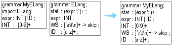

# 基本结构  
一个 .g4 文件主要包含以下内容：  

``` Antlr4
/** Optional javadoc style comment */
grammar Name;   // 文件名必须与文法名一致
options {...}
import ... ;
tokens {...}

channels {...} // lexer grammar only
@actionName {...}

rule1 // parser and lexer rules, possibly intermingled
...
ruleN
```  

----------

## grammar

`grammar`: 定义了该文法的名字，相当于 Java 中的主类，该名字必须与文件名保持一致  

`规则rule`: 规则包括词法规则和语法规则，它们可以在同一规则中混合出现。**词法规则名称必须以大写字母开头，语法规则必须以小写字母开头**  
规则可以看作文法中的产生式  

若要制定只含由有词法规则的程序，则需使用下述开头
``` Antlr4
parser grammar Name;
...
```   
同理，只含有语法规则的程序需要使用: 
``` Antlr4
lexer grammar Name;
...
```  

------------

## options

用于指定一些设置选项，如输出的目标的语言为 C++ 时进行如下设置:  
``` Antlr4
options{language=Cpp;}
```
该操作相当于在使用 antlr4 命令时添加参数 `-Dlanguage=Cpp`


--------------

## import  
import 可以导入其它文件中制定的所有规则、标记规范和命名操作。并且在重名时优先使用当前文件的规则  



-------------

## tokens
tokens 字段定义了一些没有出现在规则中的 token  
然后就不知道干啥用的了

-------------

## channels

只能用在 lexer grammar 而不能在组合语法中使用  

在该字段内可以自定义一些频道，已经定义的频道可以在词法规则中将指定给的内容丢到频道中  

但尚不知道频道具体有什么用  

-----------
## rule
值得注意的是，**词法规则名以小写字母开头，语法规则名以大写字母开头**  

不仅如此，**所有的词法规则总会被重排到语法规则名之前**，可以将其类比于 JS 的 Hoisting。这非常重要，因为**当某个内容可以匹配到多条规则时，总会优先选取可以贪婪匹配的(尽可能长)，其次选取先出现的**，因此我们有时也需要手动控制一下规则的顺序  