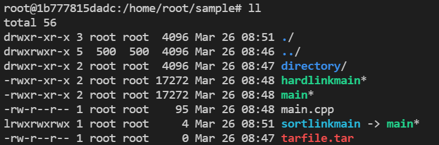

# 基本命令补充
## cd (change directory)
``` Shell
cd [指定路径]
```

**功能**：改变当前工作目录  

若是不指定路径，则相当于 `cd ~`  

----------------

## ls (list files)
``` Shell
ls [选项] [指定路径]
```

**功能**：以字典顺序列出当前目录中的文件  

常用选项：  
* **-a**：列出所有文件，包括隐藏文件  
* **-l**：除文件名称外，亦将文件型态、权限、拥有者、文件大小等资讯详细列出  
* **-F**：在列出的文件名称后加一符号；例如可执行档则加 "*", 目录则加 "/"  
* **-R**：递归列出当前目录中目录文件里的子文件  
* **-i**：列出所有文件的 inode  
* **-r**：按反顺序列出  
* **-t**：按文件建立时间的先后顺序列出  
* **-h**：(human-readable)以便于人阅读的方式打印数值  

其中 `ls -alF` 相当于 `ll` (在 alias 中也可以查看到这是一个别名)  

### 对于 ll 命令列出的格式
  

其意义分别为： 
**`文件属性 文件/硬链接数 所属用户 所属组 大小(字节) 最后修改时间 文件名`**  


#### 文件属性
文件属性中的第一个字符表示种类：  
* **-**：表示普通文件  
* **d**：表示目录  
* **l**：表示链接文件  
* **p**：表示管理文件  
* **b**：表示块设备文件  
* **c**：表示字符设备文件  
* **s**：表示套接字文件  

之后的 rwx 分别对应相应对象的读、写、执行权  

#### 文件/硬链接数
对于目录来说，表示其子文件中目录的数量(包括 “.” 和 “..” 目录，所以至少为 2)  
对于文件来说，表示其硬链接的文件总数(包括自己)，而软链接不会统计在内  
与链接相关的笔记见: [链接文件](../5.文件与目录管理/链接文件.md) 

#### 文件大小
以字节为单位，**其中，一个目录的大小仅表示该目录表的大小，并不表示该目录下所有文件的大小**  

#### 文件名
##### 颜色
白色表示普通文件  
绿色表示可执行文件  
红色表示压缩文件  
深蓝色表示目录  
淡蓝色表示(软)链接文件，且通过 “->” 指向目标文件  
黄色表示设备文件  
(失效的软链接文件的背景色会变黑)  

-------------------

## find
``` Shell
find 路径 -name 文件名 # 在指定路径及子路径中查找文件，文件名最好加引号
find 路径 -samefile 文件名 # 查找与指定文件拥有相同 inode 的所有文件，即查找所有硬链接文件计数
find 路径 -inum inode值 # 查找指定 inode 值文件
find 路径 -type 文件类型    # 文件类型就是对文件属性中的第一个字符，不过用 “f” 表示一般文件而不是 “-”
```

**功能**：查找文件  

当不使用 “-name” 时，会列出所有的搜查对象；而使用只会列出找到的符合条件的文件及其路径  
~~文件名支持正则表达式~~好像并不支持，但是指定的名字和 shell 的文件名生成的逻辑好像一样  

**除此之外，还可以对找到的所有文件执行指定的动作**：  
``` Shell
find 路径 -name 文件名 -exec 命令 {} \; # 分号需要转义
find 路径 -name 文件名 -ok 命令 {} \;  # 同 -exec，但执行前对每个文件都要人工确认
```

**实际上是每匹配到一个文件，就会执行指定的命令一次，而不是将所有匹配到的文件列表一起当作参数给命令**  

**还可以对参数中指定条件进行与或非**：  
``` Shell
find . ! -type d    
# 非：找到当前路径下不是目录的文件  
find -name '*.txt' -o -name '*.c'  
# 或：找到当前路径下后缀是 txt 或 c 的文件
find . \( -name '*.txt' -o -name '*.c' \) 
# 分组：用圆括号表示，但是因为其是 shell 的特殊字符，所以要转义，注意括号前后的空格
find . '(' -name '*.txt' -o -name '*.c' ')' 
# 同上，避免转义
```

------------------

## ln (link)
``` Shell
ln 源文件路径 目标文件路径 # 创建硬链接
ln -s 源文件路径 目标文件路径 # 创建软链接
```

**功能**：创建链接文件  

跳转到笔记：[链接文件](/Linux/5.文件与目录管理/链接文件.md)

---------------------

## mkdir / rmdir
``` Shell
mkdir 目录路径 # make directory
mkdir -p 目录路径 # 当指定的路径不存在时，会递归创建目录直到路径存在
rmdir 目录路径 # remove directory，只能删除空目录
rmdir -p 目录路径 # 如果指定路径的每一层在删除后都是空目录，则会递归删除
```

--------------------
## echo
``` Shell
echo -n 输出内容    # 输出后不换行
echo -e 输出内容    # 支持对后面的输出内容使用部分转义字符
```

**功能**：输出指定内容，输出后默认会换行  

**当使用选项 `-e` 扩展时，支持如下转义**：  
* **\n**：换行且光标移至行首  
* **\c**：输出后不换行  
* **\r**：光标移至行首  
* **\033[数字m**：改变文字的颜色  
* **\t**：制表符，相当于 Tab 键  
