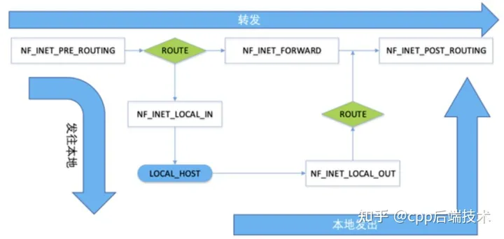

# Netfilter 框架
## 基础概念
Netfilter 是 Linux 内核中的一个强大的网络包过滤和操控框架，它允许你在数据包通过网络协议栈的不同阶段执行自定义操作，包括修改数据包的内容  

**该框架在网络协议栈处理数据包的关键流程中定义了一系列钩子点（Hook 点），并在这些钩子点中注册一系列函数对数据包进行处理**。这些注册在钩子点的函数即为设置在网络协议栈内的数据包通行策略  

下面这张简图可以展示出数据包在网络层需要经过哪些 Hook 点：  
  

其中，矩形方框中的即为 Netfilter 的钩子节点。从图中可以看到，三个方向的数据包需要经过的钩子节点不完全相同： 

发往本地：`NF_INET_PRE_ROUTING`-->`NF_INET_LOCAL_IN`  
转发：`NF_INET_PRE_ROUTING`-->`NF_INET_FORWARD`-->`NF_INET_POST_ROUTING`  
本地发出：`NF_INET_LOCAL_OUT`-->`NF_INET_POST_ROUTING`  

Hook 节点在头文件 `<linux/netfilter.h>` 中是以枚举类型来存储表示的  

**当我们想要在内核模块中对经过的数据包进行处理，则需要在 Hook 节点中注册 Hook 函数来处理数据包**  

----------------------------------
## Hook 函数
### 编写 Hook 函数
Hook 函数的原型有多种，这里介绍比较常见的其中一种：  
``` C
unsigned int hook_function(void *priv, struct sk_buff *skb, const struct nf_hook_state *state);
```

其中：  
* **`priv`**: 是一个指向私有数据的指针，你可以在注册钩子时传递  
* **`skb`**: 是指向 struct sk_buff 结构的指针，它包含了数据包的信息和数据  
* **`state`**: 是指向 struct nf_hook_state 结构的指针，它提供有关数据包和钩子状态的信息  

钩子函数应返回一个无符号整数(已经事先通过宏定义了)，这个返回值决定了数据包的接下来的命运，只要有以下取值：  
* **`NF_ACCEPT`**：允许数据包通过，不进行修改  
* **`NF_DROP`**：拦截并丢弃数据包  
* **`NF_STOLEN`**：钩子函数已经接管了数据包，内核不应该再处理它  
* **`NF_QUEUE`**：将数据包传递到用户空间进行处理  
* **`NF_REPEAT`**：重复调用下一个钩子函数  

`struct sk_buff` 结构体定义在头文件 `<linux/skbuff.h>` 中，用于存储关于数据包的各种信息，例如数据包的头部、协议信息、数据负载以及数据包传输的相关信息  
通常，我们可以通过一些宏来获取数据包中的信息：  
``` C
#include <linux/ip.h>
struct iphdr *ip_header;    // 用于存储 IPv4 头部指针
ip_header = ip_hdr(skb);    // 可以等需要用的时候再去查它的原型

struct ipv6hdr  *iph;       // 用于存储 IPv6 头部的指针
iph = ipv6_hdr(skb);

#include <linux/skbuff.h>
unsigned char *payload = skb->data;  // 获取指向数据负载的指针
unsigned int payload_len = skb->len;  // 获取数据负载的长度
```

涉及到的知识太多了，可以等有需要的时候按需查询  

但要注意，**如果我们在钩子函数中修改了数据包，要考虑是否重新计算校验**：  
``` C
#include <linux/inetdevice.h>
ip_send_check(iph);
```
该函数用于计算校验和并置于 IP 头的正确位置（**对于 IPv6，无需这一步，因为这些细节已经由底层的协议完成**）  

### 注册 Hook 函数
注册 Hook 函数的方法也有多种，这里介绍其中两种：  
``` C
#include <linux/netfilter.h>
// nf_register_net_hook 专门用来注册网络层的 Hook 函数
int nf_register_net_hook(struct net *net, struct nf_hook_ops *reg);

// nf_register_hook 则更通用一点
int nf_register_hook(struct nf_hook_ops *reg);
```

当注册成功时，函数返回 0；否则返回表示失败原因的负值  

`net` 参数指向要注册 Hook 函数的网络命名空间，如果只有一个网络栈，可以将此参数设置为 `&init_net`  
**`reg` 参数指向 `struct nf_hooc_ops` 结构体，其中包含有关注册的 Hook 的信息，包括 Hook 类型、所使用的 Hook 函数以及其他属性**，该结构体的原型如下：    
``` C
struct nf_hook_ops {
    struct list_head list;  // 用于将 Hook 函数的描述信息添加到 Hook 函数链表中，没明白有啥用，可以不定义
    nf_hookfn *hook;        // 指向 Hook 函数的函数指针
    struct module *owner;   // 指向拥有这个 Hook 函数的模块的指针（通常为 THIS_MODULE）
    u_int8_t pf;            // 协议族，例如 NFPROTO_IPV4 或 NFPROTO_IPV6
    unsigned int hooknum;   // 需要挂载的 Hook 节点
    int priority;           //  Hook 函数的优先级，用于确定多个 Hook 函数的执行顺序，例如 NF_IP_PRI_FIRST
};
```
