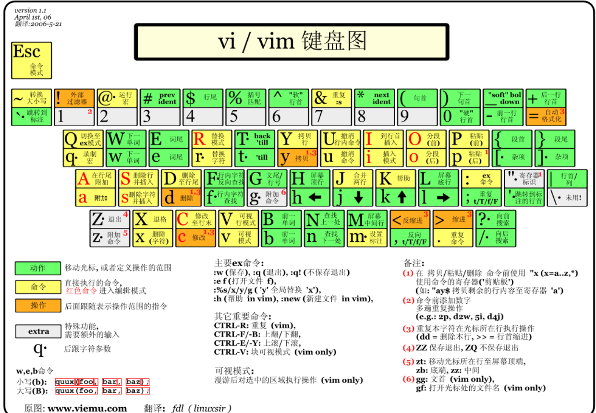

# 文本编辑器vim

所有 Linux 系统都会内置文本编辑器 vi，而 vim 是 vi 的升级版，但使用方法基本一致    
使用方法：`vim 文件`  

## vim 的三种模式
1. **命令模式**
   刚启动时就会进入的模式，此时按下键盘上不同的键有不同的功能，但按下的键不会回显  
   不仅如此，**部分命令可以在前面增加数字，表示该命令重复的次数**  
   常用的有：  
   * **o**：在当前行后插入一新行  
   * **O**：在当前行前插入一新行  
   * **i**：在当前位置插入  
   * **I**：在当前行的行首位置插入  
   * **a**：在当前位置追加  
   * **A**：在当前行的行尾追加  
   * **x**：删除当前字符  
   * **dd**：删除当前行  
   * **u**：撤销命令(undo)  
   * **.**：重复命令
   * **:**：进入底线命令模式  
   * **%**：移动到与当前括号配对的另一个括号处  
   * **ZZ**：保存退出  
   * **ZQ**：不保存退出  
  
     

2. **输入模式**  
   可以输入字符，按 ESC 后回到命令模式  
3. **底线命令模式**  
   以 “:” 进入的模式，使用多字符命令对文件操作：
   * **q**：退出程序  
   * **w**：保存文件  
   * **q!**：不保存退出(强制退出)  
   * **数字**：移动到指定行的行首，其中 “.” 可以表示当前行号，“$” 可以表示文件尾  
   * **wq**：保存并推出，相当于命令模式下按下 “ZZ”  
   * **r 文件**：将指定文件内容读取到当前行之后  
   * **.,$ w 文件**：将当前行-文件尾这一部分的内容保存到指定文件中去。若文件已存在，则必须使用 “w!” 才运行强制保存  
   * **行数,行数 d**：删除指定行  
   * **行数,行数 y**：复制(yank)指定行到剪切板  
   * **p**：粘贴(paste)剪切板内容  
   * **行数,行数 co 行数**：将指定内容复制(copy)到指定行之后下  
   * **行数,行数 m 行数**：将指定内容移动(move)到指定行之后下  
   * **/模式**：进行正则表达式查找，此时按 “n” 查找下一个，按 “N” 查找上一个  
   * **行数,行数s/模式/字符串/g**：进行指定范围内的字符串替换，类似于 sed 命令（记得转义）。为了避免对 “/” 的转义，也可以用 “^” 或 “:” 代替命令中的 “/”  

---------------

## 偏好配置文件
**vim 和 vi 的偏好配置都保存在 `$HOME/.exrc` 中**  
每个用户单独一份，独立设置  

若该文件不存在，可以直接创建一个  

文件中每行表示一个配置，通常可以用到的配置有：  
``` Vim
set number # 每行显示行数
set tabstop=4 # 设置制表符为4字节对齐
set noexpandtab # 不同空格代替制表符
set encoding=UTF-8   # 有时能解决中文编码错误的问题
```

**如果需要修改全局的偏好配置，可以修改 `/etc/vimrc` 文件**
