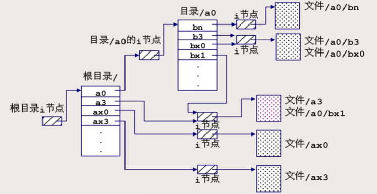

# 文件系统的存储结构
**文件系统将整个逻辑设备以块(扇区)为单位进行划分**，编号从0开始依次增大  
每块512字节或者更大2^n^字节  

硬盘的访问就是以扇区为单位  

## 主要结构
  

### 引导块(0)
**用于启动文件系统，只有根文件系统的引导块有效**。若该块出问题，则系统无法正常启动  

### 专用块(1)
**也叫管理块、超级块，用于存放文件系统的管理信息**  

当执行 `mkfs` 命令的时候，实际上就是初始化这个专用块  

### i节点区(2)
记为 i-node，索引节点。**i节点区由若干块构成**，在 `mkfs` 创建文件系统时就已经确定  

**每一个文件都对应一个 i 节点，包含了文件的基本信息**。信息包括文件类型、属主/组、权限、link数、大小、时戳以及组成文件的逻辑块与物理块之间的映射关系  
**其中，根目录的 i 节点总是位于一个固定的位置**  

但是 i 节点中不包含文件名  

**i 节点的大小是固定的**  

### 文件存储区(3)
**用于存放文件(实际)数据的区域，包括目录表**  

---------------
## 目录结构
Linux 目录结构是**树形带交叉勾链**的目录结构  

### 目录表
每个目录表也是作为一个文件来管理，存放于文件存储区中，有自己的 i 节点和数据存储块  

**目录表由若干个目录项构成，目录项包含文件名和 i 节点号两类信息**  

用 `ls` 命令列出文件大小时，对于目录文件来说，列出的就是目录表的大小  

  

上图中，ax0 与 bx1 都指向同一个 i 节点，它们访问的实际上是同一份文件，这就是交叉勾链(链接文件的实现)  

----------
## 目录表与 i 节点两级结构
**主要目的是为了提高目录检索效率**  