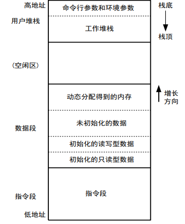

# 进程的基本概念
## 程序与进程
**程序**：  
* 程序是指令和数据的集合  
* 程序存放在磁盘上的一个普通文件里  
* 文件的 i 节点中会将其标为可执行，内容符合系统要求  

**进程**：  
* 进程是包括指令段、用户数据段和系统数据段的执行环境  

**关系**：  
* 程序用于初始化进程的指令段和用户数据段，初始化后，进程和初始化它的程序之间无联系  
* 进程运行时磁盘上的程序文件不可修改/删除  
* 同时运行的多个进程可由同一程序初始化得到，进程之间没什么联系  
* 内核通过安排它们共享指令段甚至不同程序的进程共享函数库（动态链接）以节省内存，但这种安排对用户来说是透明的  

-------------
## 进程的组成部分
四部分：**指令段，数据段，栈段和系统数据**  

### 指令段 Text
程序的 CPU 指令代码，包括主程序和子程序编译后的 CPU 指令代码，以及调用的库函数代码  

指令段的大小固定不变，是只读的  

### 用户数据段
存储一些全局变量，静态(static)变量，字符串常数  

允许数据段增长和缩小，实现内存的动态分配  
(如 malloc()、free() 以及系统调用 sbrk() 等)

### 用户栈端
程序执行所需要的栈空间，用来实现函数的调用  

保存 main 函数得到的命令行参数以及环境参数  

栈端的动态增长与增长限制  

### 系统数据段
上述三部分在进程私有的独立的逻辑地址空间内（CPU用户态访问）  

系统数据段是内核内的数据，每个进程对应一套  

### 进程各部分在虚拟地址空间中的布局
  

--------------------
## 进程执行状态
### 进程的系统数据 PCB
在操作系统内核中，含有进程的属性，包括:
* 页表  
* 打开的文件描述符表  
* 核心态堆栈（几KB）  
* 进程状态，优先级信息  
* 当前目录(记录了当前目录的i-节点)，根目录  
* umask值  
* 进程PID，PPID  
* 进程主的实际UID/GID，有效UID/GID  
* 进程组组号  

**进程 PCB 被分为 user 结构和 proc 结构两部分**  

user 结构位于头文件 `<sys/user.h>` 中，保存了进程运行时才需要的数据  

proc 结构位于头文件 `<sys/proc.h>` 中，保存了进程不运行时也需要用的管理信息  

用户程序不能直接存取和修改进程的系统数据，但可以通过系统调用访问和修改  

### 进程组
进程在其 PCB 结构中有 p_pgrp 域  

**p_pgrp 都相同的进程构成一个进程组**  

**如果 p_pgrp = p_pid 则该进程是组长**  

`setsid()` 系统调用将 PCB 中的 p_pgrp 改为进程自己的 PID，从而脱离原
进程组，成为新进程组的组长  

### 进程基本状态
**进程创建后，主要有运行态和阻塞态(睡眠态)**  

内核总是在分时处理运行状态的进程，而不顾那些处于睡眠状态的进程，所以进程在睡眠时，不占用CPU时间  

睡眠状态的进程，在条件满足后转化为运行状态  

如 C 语言编程中，scanf() 函数会使进程阻塞，直到有输入后才恢复运行  

---------------
## 进程命令
### ps
``` Shell
ps [选项]
```

**功能**：查询各进程状态(process status)，实际上上就是将内核中PCB数组的内容有选择地打印出来  

**常用选项**：
* **无选项**：只列出在当前终端上启动的进程  
* **-e**：列出系统中的所有进程  
* **-f**：以 full 格式列出每一个进程  
* **-l**：以 long 格式列出每一个进程  

**ps 列出的进程属性值**：  
* **UID**：用户ID(注册名)  
* **PID**：进程ID  
* **C**：CPU占用指数：最近一段时间(秒级别)进程占用CPU情况。不同系
统算法不同，例如：正占CPU进程10ms加1，所有进程1秒衰减一半  
* **PPID**：父进程的PID  
* **STIME**：启动时间  
* **SZ**：进程逻辑内存大小(Size)  
* **TTY**：终端的名字  
* **COMMAND**：命令名  
* **WCHAN**：进程睡眠通道(Wait Channel)，进程阻塞在何处  
* **TIME**：累计执行时间(占用CPU的时间)  
* **PRI**：优先级  
* **S**：状态，S(Sleep)，R(Run)， Z(Zombie)  

--------------------
### time
``` Shell
time 命令
```

**功能**：查看命令的执行时情况  

------------------
## 进程库函数

**在 C 语言中，有同类型的系统调用 times()，可以查看当前进程 CPU 时间和已结束子进程占用过的 CPU 时间**:  
``` C
clock_t times(struct tms *buf);
struct tms {
    clock_t tms_utime;  /* user CPU time */
    clock_t tms_stime;  /* system CPU time */
    clock_t tms_cutime; /* user CPU time, terminated-children */
    clock_t tms_cstime; /* system CPU time, terminated children */
}

// 还有 getrusage()，算是 times() 的升级版
```

`clock()` 返回 `times()` 的四个 CPU 时间总和  

`time()` 获得当前时间坐标，以 1970 年 1 月 1 日开始经过的秒数  
使用时: `t=time(0)` 或 `time(&t)`  

