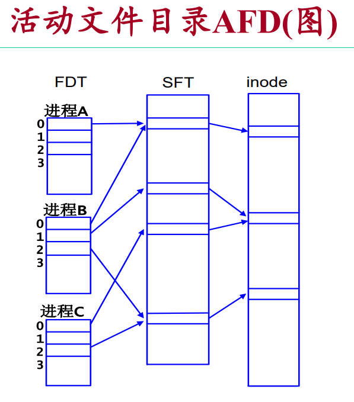
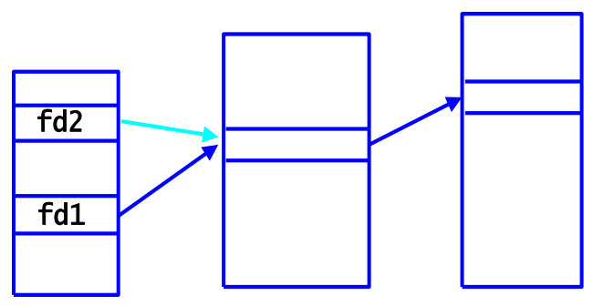

# 文件描述符
## 活动文件目录 AFD
在磁盘中的文件，采用文件名(目录中)和 i-node 的两级结构  

而打开后的文件称为**活动文件**，使用三级结构存储：  
1. **文件描述符表 FDT**：每个进程都有一张，在 PCB 的 user 结构中  
   **user 结构中的整型数组 u_ofile 指示进程打开的是哪个文件**  
   **文件描述符 fd 就是 u_ofile 的下标**  
2. **系统文件表 SFT**：整个内核只有一张，file 结构  
   ``` C
   struct file{ 
   char f_flag; /* 读、写操作要求 */ 
   char f_count; /* 引用计数 */
   long f_offset; /* 文件读写位置指针 */
   int f_inode; /* 内核中活动inode数组的下标 */
   };
   ```
3. **活动i节点表**：整个核心一张，inode结构  
   内存中inode表是外存中inode的缓冲  
   内存inode表里也有个专用的引用计数  

  

使用 fork() 创建的子进程继承父进程的文件描述符表  
父进程在fork前打开的文件，父子进程有相同的文件偏移  

**在 fork() 的子进程中 exec 并不会使原本已经打开的文件关闭(所以文件描述符仍是可以用的)**  

可以对文件增加 **close-on-exec 标志**  
具有该标志的文件在执行 exec 时会被自动关闭  

两种设置方法；  
1. open() 时第三个参数使用 O_CLOEXEC 属性  
2. 通过系统调用 fcntl() 设置  

### fcntl
``` C
#include <sys/types.h>
#include <unistd.h>
#include <fcntl.h>

int fcntl(int fd, int cmd);
int fcntl(int fd, int cmd, long arg);
int fcntl(int fd, int cmd, struct flock *lock);
```

**功能**：fcntl() 函数用于改变已经打开的文件的一些属性  

具体设置方法：  
``` C
// F_GETFD 获取文件 fd 的控制字 flag
// 控制字的比特 0 为 close-on-exec 标志位
flags = fcntl(fd, F_GETFD, 0);
flags |= FD_CLOEXEC;
// F_SETFD 设置文件 fd 的控制字 
fcntl(fd, F_SETFD, flags);
```

文件锁定内容也是通过 fcntl() 完成，详见[锁定操作](8.8.文件和记录的锁定.md#锁定操作)

### dup2
``` C
#include <unistd.h>
int dup2(int oldfd, int newfd);
```

**功能**：复制文件描述符 oldfd 到 newfd  
newfd 可以是空闲的文件描述符  
如果 newfd 是已打开文件，则会先关闭已打开文件  

复制效果：  


可以使用该函数实现 shell 的重定向功能  

**在所有进程中，文件描述符 0/1/2 总是标准输入/输出/错误文件**  