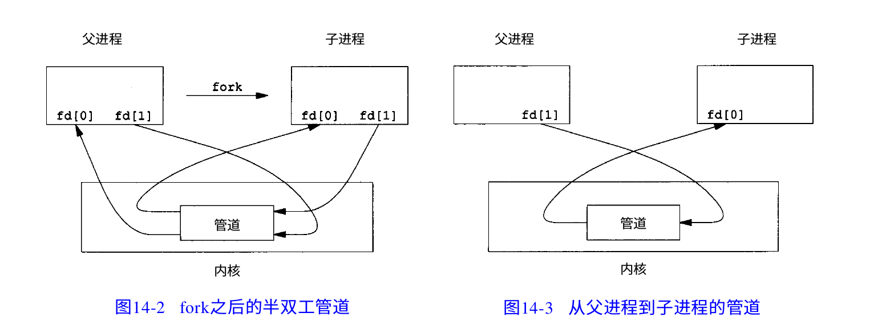

# 管道
## 匿名管道
### pipe
``` C
#include <unistd.h>
int pipe(int pfd[2]);
int pipe(int *pfd);
int pipe(int pfd[]);
```

**功能**：创建一个匿名管道，用来在有亲缘关系的进程间进行通信，成功返回 0，失败返回 -1  

参数数组即为要通信的两个文件的文件描述符（不需要我们赋值，在调用pipe函数后直接将[0]和[1]当做文件操作对象）  

**其中[0]为管道读端，只允许从该端读取管道中的信息**  
**[1]为管道写端，只允许从该段向管道中写信息**  

管道可以看作是一个特殊共享文件，实质是在内存区当中开辟一个固定大小的缓冲区  
从管道中读取走的那部分信息会从缓冲区中清除  

管道是半双工通信的，如果需要双方通信时，需要建立起两个管道  

对管道的读写，可以使用文件相关的函数 read()、write()、close()，因为其本质还是对文件描述符的操作：  
``` C
#include <unistd.h>
// read() 从文件描述符 fd 表示的文件中读取 count 字节到 buf 中
size_t read(int fd, void *buf, size_t count);
// write() 向文件描述符 fd 表示的文件中写入 count 字节的 buf 内容
size_t write(int fd,const void *buf,size_t count);
// close() 关闭一个文件
int close(int fd);
```

**对于不再使用的管道端，一定要记得用close()关闭它**  

当管道中没有数据且使用read()时，若管道写端引用计数（即描述符数量）为0，则read()直接返回0，相当于读文件结束  

若写端引用计数不为0，那么read()会阻塞在那里等待有数据被写入管道  

对于读端引用计数也是一样的，所以一定要关闭  

很多时候，一个进程对一个管道不会既读又写，所以在进程中我们先关闭一个端口  

**如果要双向通信，请使用两个管道**  

可能发生的坏事：当一个管道读和写各仅有一个引用且来自于同一个进程， 此时调用read()会使进程阻塞，然而只有它自己可以将数据写入管道，但它阻塞在那了，导致这个进程无法终止  

  

管道的缺点就是不会记录消息边界  

--------------
## 命名管道