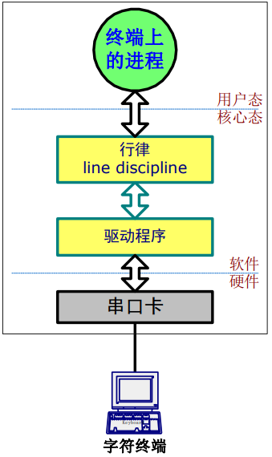

# 开始使用 Linux  
## 进入系统  
UNIX/Linux是多用户系统  
* 主机连接多台字符终端  
* 字符终端作为交互式输入输出设备  

即用户通过 **终端** 与系统进行交互  

--------

## tty 终端  
### 终端的构成：  
1. 键盘(输入设备)  
2. 显示器(输出设备)  
3. RS232串行通信接口(接口)  

### 终端与主机  
终端:主机的输入和输出设备  
终端通过电缆把用户的按键信息送到主机，把
主机发来的信息在屏幕上显示  

主机:程序和数据的存储及处理  
数据及程序存放在主机的硬盘上，程序的运行
也都由主机内的CPU占用主机内存来完  

--------

## Line Discipline 行律  
### 行律的作用  
1. **缓冲数据**：一行内字符的缓冲、回显与编辑，直到按下回车键  
2. **数据加工**：如：将\n转化为\r\n  
3. **转化字符为信号**：如将Ctrl-C字符转化为中止进程运行的信号  

  
**终端与行律的接口是上行下行字符流**  

------------

### 转义序列  
转义序列可以：  
控制光标位置、字符颜色、字符大小等等  
选择终端的字符集  
控制终端上的打印机、刷卡机、磁条器、密码键  

-----------

## 主机与终端的流量控制  
* 终端的显示速度跟不上主机的发送速度  
* 主机送来数据终端需要打印出来，但打印速度慢  
* 主机送来的显示内容，需暂停显示，仔细分析  
* 需要一种机制控制主机方向来的数据流量  

==> 需要控制主机发送数据和终端显示数据的速度  

### 软件方式：流控字符  
终端希望主机**暂停发送数据时，发Xoff字符(ASCII 17)，对应键盘 Ctrl+S**  
终端希望主机**继续发送数据时，发Xon字符(ASCII 19)，对应键盘 Ctrl+Q**  
(有时因终端的不同而有一定影响)  

### 硬件方式：RS232接口的CTS信号线（Clear To Send）

------------

## 仿真和虚拟终端  
### 仿真终端  
PC机串口，运行终端仿真软件来仿真终端。  
例如: DOS操作系统下的CrossTalk  
Windows中的“超级终端”  
仿真的内容包括实现终端的转义码序列功能  

### 虚拟终端  
如：UNIX主机与PC机通过网络相连，客户端运行telnet，服务器端telnetd，成为UNIX的一个基于TCP通信的虚拟终端  
安全终端，在TCP连接上加密和压缩数据，如：Windows客户端软件SecureCR  

----------

**Linux 命令区分大小写**