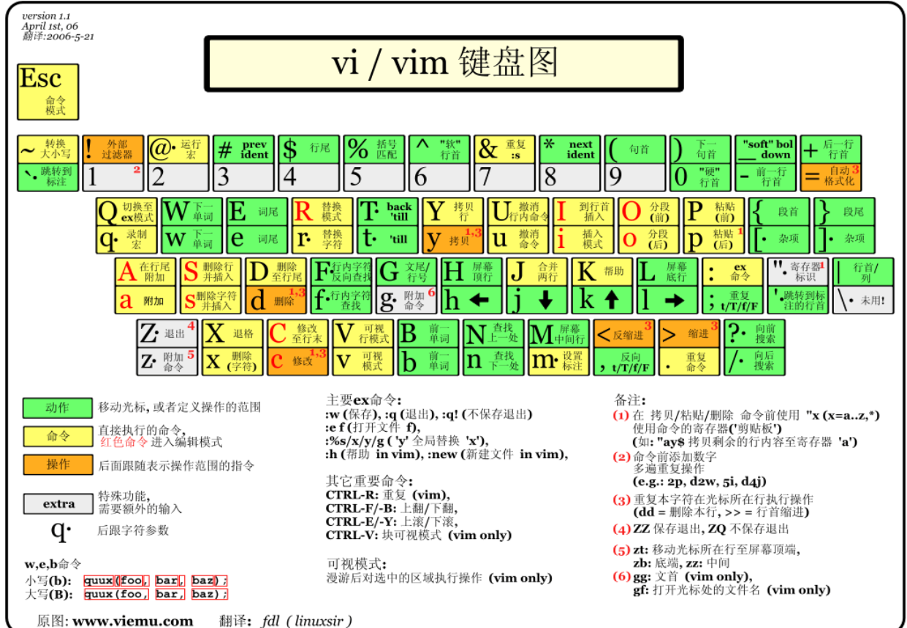

# 文本编辑器vim

所有 Linux 系统都会内置文本编辑器 vi，而 vim 是 vi 的升级版  
使用方法：`vim 文件`  

## vim 的三种模式
1. **命令模式**
   刚启动时就会进入的模式，此时按下键盘上不同的键有不同的功能  
   常用的有：  
   * **o**：在当前行后插入一新行  
   * **O**：在当前行前插入一新行  
   * **i**：在当前位置插入  
   * **I**：在当前行的行首位置插入  
   * **a**：在当前位置追加  
   * **A**：在当前行的行尾追加  
   * **:**：进入底线命令模式  
     

2. **输入模式**  
   可以输入字符，按 ESC 后回到命令模式  
3. **底线命令模式**  
   以 “:” 进入的模式，使用多字符命令对文件操作：
   * **q**：退出程序  
   * **w**：保存文件  
   * **q!**：不保存退出