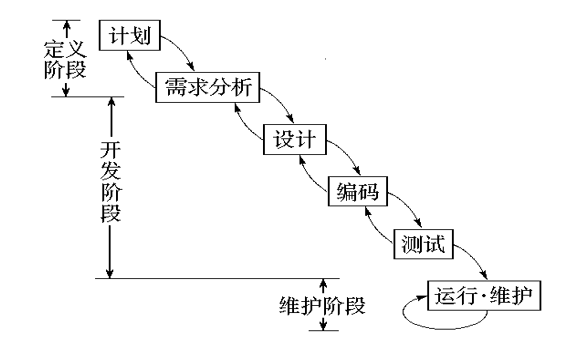
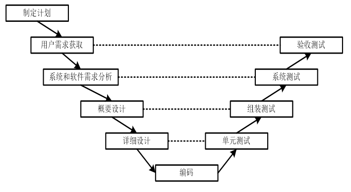
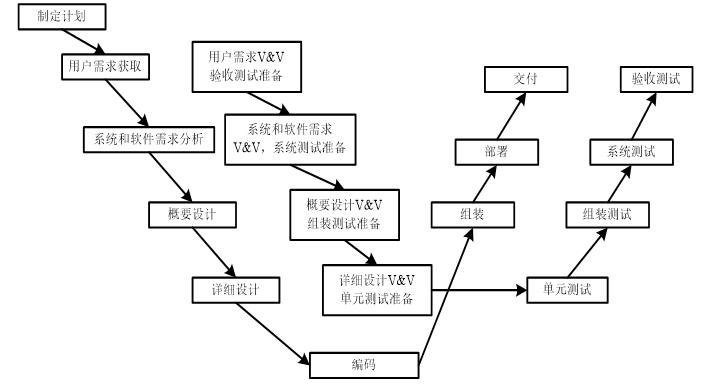
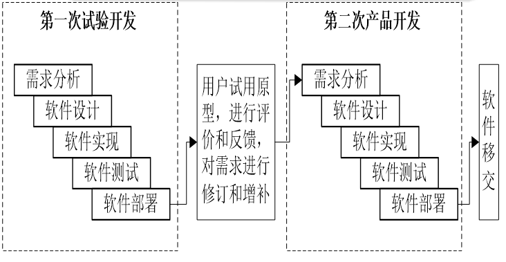
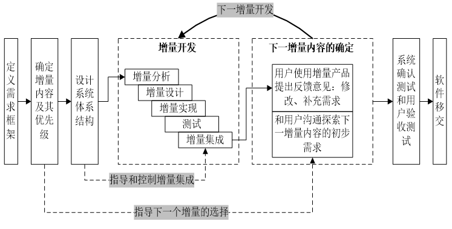
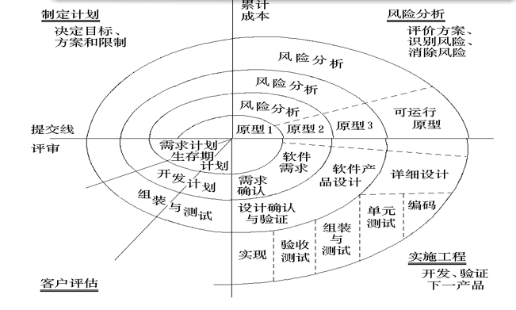
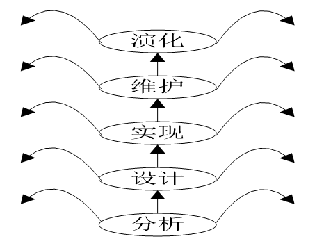
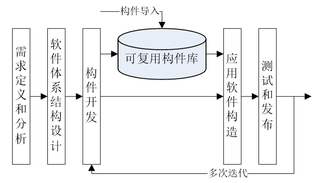
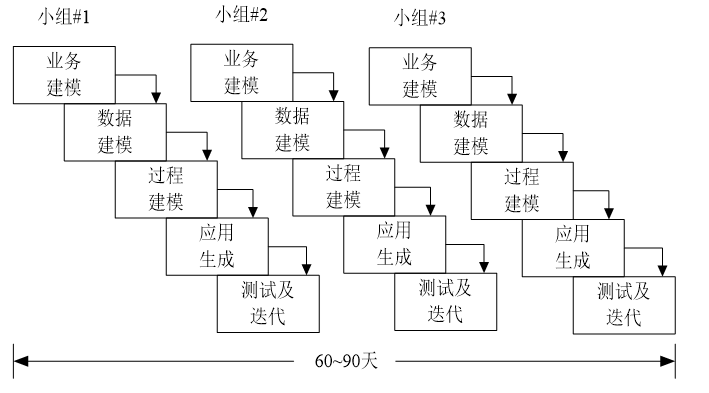

# 传统软件生命周期模型  
## 一. 瀑布模型：
  
瀑布模型包含软件生命周期的6个基本活动，并将软件生命周期划分为**定义阶段、开发阶段和维护阶段**  

瀑布模型中的每一个开发活动具有下列特征：
1. 本活动的工作对象来自于上一项活动的输出
2. 根据本阶段的活动规程执行相应的任务。
3. 产生本阶段活动相关产出—软件工件，作为下一活动的输入。
4. 对本阶段活动执行情况进行评审。   

瀑布模型中 运行维护 活动使具有最长生命周期的循环往复阶段  

### 优点：
1. 软件生命周期的阶段划分不仅降低了软件开发的复杂程度，而且提高了软件开发过程的透明性，便于将软件工程过程和软件管理过程有机地融合在一起，从而提高软件开发过程的可管理性。  
2. 推迟了软件实现，强调在软件实现前必须进行分析和设计工作。  
3. 瀑布模型以项目的阶段评审和文档控制为手段有效地对整个开发过进行指导，保证了阶段之间的正确衔接，能够及时发现并纠正开发过中存在的缺陷，从而能够使产品达到预期的质量要求  

### 缺点: 
1. **模型缺乏灵活性，特别是无法解决软件需求不明确或不准确的问题，这是瀑布模型最突出的缺点。因此，瀑布模型只适合于需求明确的软件项目。**  
2. 模型的风险控制能力较弱。成品时间长；体系结构的风险和错误只有在测试阶段才能发现，返工导致项目延期。  
3. 软件活动是文档驱动的，文档过多会增加工作量，文档完成情况会误导管理人员。  

-----------

## 二. V 模型和 W 模型  
### V 模型
  
V 模型属于瀑布模型的变种，瀑布模型将测试作为软件实现之后的一个独立阶段，没有强调测试的重要性。
针对瀑布模型这个缺点，1980年代后期 Paul Rook 提出了 V 模型。
  
V 模型的价值在于纠正了人们不重视测试阶段重要性的错误认识，将测试分等级，并和前面的开发阶段对应起来。  

### W 模型
  
V 模型仍然将测试作为一个独立的阶段，所以并没有提高模型抵抗风险的能力。  
Evolutif 公司在 V 模型的基础上提出了 W 模型，将测试广义化，增加了确认和验证内容，并贯穿整个软件生命周期。  

W 模型由两个 V 型模型组成，分别代表测试与开发过程 ，两个过程是同步进行的  

### 总结
尽管 V 模型和 W 模型都扩展强调了测试的重要性，但仍然只适合需求明确的软件项目  

-----------

## 三. 原型方法  
为了应对开发需求不明确的项目提出的**原型方法**，对模糊的需求开发一个原型，然后根据用户对原型的反馈来进行改进。周而复始，直到产品满足用户的需求  

### 基本概念：
**原型**：是指模拟某种产品的原始模型。软件原型是一个早期可以运行的版本，它反映最终系统的部分重要特性。**建立原型要快！**    
原型不同于最终的系统，需要快速实现和运行，因此，原型可以忽略一切暂时不必关心的部分（抽象）  

#### 分类（按目的）：  
**探索型** ：弄清对目标系统的要求  
**实验型** ：系统实现前，为了考察系统的可行性  
**进化型** ：将原型扩展到开发过程，通过原型开发逐步实现所有系统功能。（即不断完善原型直至形成成品）  

#### 原型使用策略：
**废弃策略** ：对应探索型和实验型
**追加策略** ：对应进化型

### 优点：  
1. 对于用户来说，判断原型系统的好坏的比直接写出需求更加容易  
2. 通过原型演示，用户可以很早体验系统的使用，减少后期产品培训使用成本  
3. 容易确定系统的性能、服务的可应用性、设计的可行性和产品的结果  
4. 原型的最终版本可用作最终产品或最终系统的一部分  

### 缺点：
1. 原型需要快速开发，导致文档容易被忽略  
2. 建立原型的许多工作可能被浪费(尤其对于废弃策略)  
3. 项目难以规划和管理  

### 原型方法应用过程：  
* 快速分析  
* 快速构造：尽快实现一个可运行的系统，可忽略目标系统在某些细节（如安全性、健壮性、异常处理等）上的要求 。 
* 用户使用  
* 评价反馈：是否满足规格说明的要求；纠正分析过程中的一些误解和错误；增补新的要求 
* 修改 
* 反复迭代，直到形成最终产品

### 原型方法支持的软件生命周期：
原型方法可以支持软件生命周期的不同阶段：
* 辅助或代替分析阶段 (确定需求)  
* 辅助设计阶段 (确定设计方案的合理性)  
* 代替分析与设计阶段   
* 代替分析、设计和实现阶段   
* 代替全部开发阶段 (典型的演化模型 )  

------------

## 四. 演化模型  
经验告诉我们：开发 **两次** 后的软件能较好地满足用户的要求。
* 第一次：试验开发，目的是探索可行性，弄清楚项目的需求。第一次得到的试验性产品称为“原型”。  
* 第二次：在第一次的原型基础上进行开发，从而获得较为满意的软件产品。  

  
它的本质就是用原型方法代替软件生命周期的全部开发活动  

### 优点：
演化模型主要针对需求不是很明确的软件项目  

### 缺点：
* 原型的快速开发可能会忽略文档（抛弃了瀑布模型的文档控制优点）  
* 探索式演化模型可能会导致最后的软件系统的系统结构较差  
* 可能会用到一些不符合主流、不符合要求或者不成熟的工具和技术  

-----------

## 五. 增量模型  
增量模型首先由Mills等人于1980年提出，**结合了瀑布模型和演化模型的优点。**  

允许客户的需求可以逐步提出来（叫做**增量** ；每一次“增量”需求的划分与“增量”实现的集成是以不影响系统体系结构为前提的。  

**在增量模型中，客户定义需求框架，确定系统需求实现的优先级；此后针对核心需求以及系统的性能要求确定系统的体系结构，并以此体系结构指导增量的集成，保证在整个开发过程中体系结构的稳定性。**  

  

### 优点:
1. 增强了客户使用系统的信心，逐步提出对后续增量的需求  
2. 项目总体失败的风险较低  
3. 增量从高到低的优先级确定保障了系统重要功能部分的可靠性  
4. 同一个体系结构提高了系统的稳定性和可维护性  

### 缺点：
1. 如何根据用户的需求确定增量的大小是困难的  
2. 确定所有的基本业务服务比较困难  

------------

## 六. 螺旋模型  
### 提出背景：
1. 对于复杂的大型软件，事先不能确定完整需求是常事，而且设计方案和技术方案需多次实验才能明确，故开发一个只明确需求的原型是远远不能解决问题的，需要开发内容逐步丰富的多个原型  
2. 大型软件项目存在风险因素，因此**螺旋模型将瀑布模型与演化模型结合起来，并加入了两种模型均忽略了的风险分析**  

  
螺旋模型沿着螺线旋转，在四个象限上分别表达了四个方面的活动，即：
* **制定计划**──确定软件目标，选定实施方案，弄清项目开发的限制条件  
* **风险分析**──分析所选方案，考虑如何识别和消除风险  
* **实施工程**──实施软件开发  
* **客户评估**──评价开发工作，提出修正建议  

### 优点:
螺旋模型适合于大型软件的开发  

### 缺点：
风险分析需要相当丰富的评估经验，风险的规避又需要深厚的专业知识，这给螺旋模型的应用增加了难度  

-----------

## 七. 喷泉模型(迭代模型)  
喷泉模型认为软件开发过程具有两个固有的本质特征：  
* **迭代** ：软件的开发需要多次重复、演进。
* **无间隙** ：各活动各阶段间无明显的界限，应该是无重复、可以并行的。支持分析和设计结果的自然复用。  
  
喷泉模型适用于面向对象的软件开发过程  

  
迭代性: 喷泉可以喷上去，又落下来，反复活动  
无间隙性：掉下来的水可以落在中间或两边，表明各个开发阶段没有特定次序，无需串行，也可以在任意阶段补充其它阶段遗漏的需求  

----------

## 八. 构件组装模型  
利用软件模块化思想，将整个系统进行分解，分析出软件由哪些构建组成，之后可以复用构件库中的一个或多个构建  

**构件组装模型本质上是演化的，开发过程是迭代的。**  

### 五个阶段：  
* 需求定义和分析  
* 软件体系结构设计  
* 构件开发  
* 应用软件构造  
* 测试和发布  

  

### 开发步骤：  
1. 定义和分析需求  
2. 标识本项目需要什么构件  
3. 从库中查找构件或相似的构件  
4. 如果可用转(5)，否则自行开发或修改，确认后入库  
5. 构造为新系统作第m次迭代  
6. 测试、确认。  

-------------

## 九. 快速应用开发(RAD)模型  
快速应用开发(Rapid Application Development，RAD)是一个增量型的软件开发过程模型，采用构件组装方法进行快速开发。  
强调极短的开发周期  

### 五个阶段：  
1. **业务建模** ：通过捕获业务过程中信息流的流动及处理情况描述业务处理系统应该完成的功能。回答以什么信息驱动业务过程运作? 要生成什么信息? 谁生成它? 信息流的去向? 由谁处理? 可以辅之以数据流图。  
2. **数据建模** ：对于支持业务过程的数据流，建立数据对象集合,定义数据对象属性,与其它数据对象的关系构成数据模型，可辅之以E-R图。  
3. **过程建模** ：定义如何使数据对象在信息流中完成各业务功能。描述数据对象的增加、修改、删除、查找。即细化数据流图中的处理框。  
4. **应用生成** ：利用第四代语言(4GL)写出处理程序，重用已有构件或创建新的可重用构件，利用环境提供的工具，自动生成，构造出整个的应用系统。  
5. **测试及迭代** ：由于大量重用，一般只作总体测试，但新创建的构件还是要测试的。当一轮需求完成快速开发后，可以迭代进入下一轮需求的开发。  

