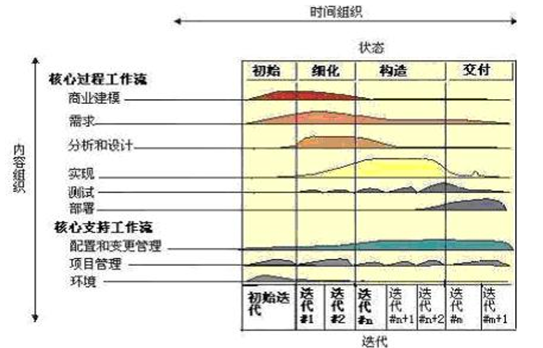

# 新型软件生命周期模型  
## 一. 统一软件开发过程(RUP)
RUP（Rational Unified Process）既是一种软件生命周期模型，又是一种支持面向对象软件开发的工具，它将软件开发过程要素和软件工件要素整合在统一的框架中。  

### 基本结构  
RUP是一个二维的软件开发模型。
* **横轴** ：**在时间上将生命周期过程展开成四个阶段（Phase），分别是初始、细化、构造和交付，每个阶段特有的里程碑[^里程碑]（Milestone）是该阶段结束的标志，阶段结束时需要进行评估。每个阶段里又划分为不同的迭代（Iteration），每个迭代又划分小目标或不同的增量。**  
[^里程碑]: 里程碑：用来说明项目进展情况的事件。通常把一个开发活动的结束或一个项目开发任务的完成定义为一个里程碑  

* **纵轴** ：按照活动的内容进行组织，包括活动（activity）、活动产出的工件（artifact）、活动的执行角色（worker）以及活动执行的工作流（workflow），体现软件开发过程的静态结构。**在图中每个工作流的面积表示使用的强度**  

  

### 四个阶段：  
1. **初始阶段**： 初步分析项目需求，考虑当前团队的资源是否有足以支撑完成项目的可行性，并制定项目计划  
   其里程碑称作**软件目标里程碑**，包括一些重要的文档，如项目愿景（vision）、原始用例模型、原始业务风险评估、一个或者多个原型、原始业务场景等。  

   该阶段完成后，需要对这些文档进行评审，以确定正确理解用例需求、项目风险评估合理、阶段计划可行等。  
2. **细化阶段**： 详细分析用户需求并进行软件分析，构造系统的模块功能、模块接口和模块实现。  
   **体系结构里程碑**。包括风险分析文档、软件体系结构基线、项目计划、可执行的进化原型、初始版本的用户手册等。  

   通过评审确定软件体系结构的稳定性、确认高风险的业务需求和技术机制已经解决、修订的项目计划可行等。  
3. **构造阶段**： 基于第二阶段的软件体系结构，开发完成软件构建，以此继承为完整的软件产品，并进行相应的测试。  
   **运行能力里程碑**。包括可以运行的软件产品、用户手册等，它决定了产品是否可以在测试环境中进行部署。  

   要确定软件、环境、用户是否可以开始系统的运行。  
4. **移交阶段**： 软件产品正常运行并交付用户使用。  
   **产品发布里程碑**。包括维护和售后支持文档手册等。  

   要确定最终目标是否实现，是否应该开始产品下一个版本的另一个开发周期。  

### RUP 的迭代增量思想  
RUP 是以用例为驱动，软件体系结构为核心，应用迭代及增量的新型软件生命周期模型  
迭代是指 RUP 的每一个阶段可以进一步划分为一个或多个迭代过程，从一个迭代过程到另一个迭代过程增量形成最终的系统。  
**RUP 是融合了喷泉模型和增量模型的一种综合生命周期模型。**  

### RUP 迭代工作当中的核心工作流：
6个核心过程工作流(Core Process Workflows)：  
1. 商业建模（Business Modeling）  
2. 需求（Requirements）  
3. 分析和设计（Analysis & Design）  
4. 实现（Implementation）  
5. 测试（Test）  
6. 部署（Deployment）  
与传统模型中瀑布模型的六个开发活动类似  

3个核心支持工作流(Core Supporting Workflows)：  
1. 配置和变更管理（Configuration & Change Management）  
   描绘如何在多个成员组成的项目中控制大量控件(对代码和文档进行版本管理，如 git)  
2. 项目管理（Project Management）  
   为项目管理、风险管理提供框架，为项目计划、人员配备、项目执行和监控提供使用准则  
3. 环境（Environment）  
   提供软件开发环境  

----------

## 二. 敏捷开发  
### 敏捷宣言：  
* 个体和交互 胜过 过程和工具  
* 可以工作的软件 胜过 面面俱到的文档  
* 客户合作 胜过 合同谈判  
* 响应变化 胜过 遵循计划  

**敏捷方法的主要特点就是具有快速及灵活的响应变更的能力**  

**在敏捷开发中，软件项目的构建被切分成多个子项目，各个子项目的成果都经过测试，具备集成和可运行的特征**。换言之，就是把一个大项目分为多个相互联系，但也可独立运行的小项目，并分别完成，在此过程中软件一直处于可使用状态。  

敏捷方法很多,包括极限编程(XP)、 Scrum、功能驱动开发(FDD)、水晶、净室开发等多种方法，这些方法本质实际上是一样的，都遵循“敏捷宣言”原则。  

### 极限编程(eXtreme Programming)：
XP 是一种轻量级的软件开发方法，是一种以实践为基础的软件工程过程和思想。  
它使用快速的反馈，大量而迅速的交流，经过保证的测试来最大限度的满足用户的需求。  
**XP 强调用户满意，开发人员可以对需求的变化作出快速的反应，尤其适合需求经常变更的领域**。  

#### XP 的工作环境：  
每个参加项目开发的人都将担任一个角色（项目经理、项目监督人等等）并履行相应的权利和义务。用户也是项目组的一部分。  
为了在软件开发过程中最大程度地实现和满足客户和开发人员的基本权利和义务，XP要求把工作环境(人文环境和工作环境)也做得最好。  

#### XP 需求分析：  
开发人员和客户一起，把各种需求变成一个个小的需求模块（User Story）  
这些模块又会根据实际情况被组合在一起或者被分解成更小的模块，且它们都被记录在一些小卡片（Story Card）上  
客户根据每个模块的商业价值来指定它们的优先级  
然后，开发人员确定每个需求模块的开发风险  
经过开发人员和客户的评估后，它们被安排在不同的开发周期里，客户将得到一个尽可能准确的开发计划  
客户为每个需求模块指定验收测试（功能测试）  

