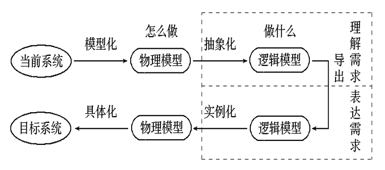
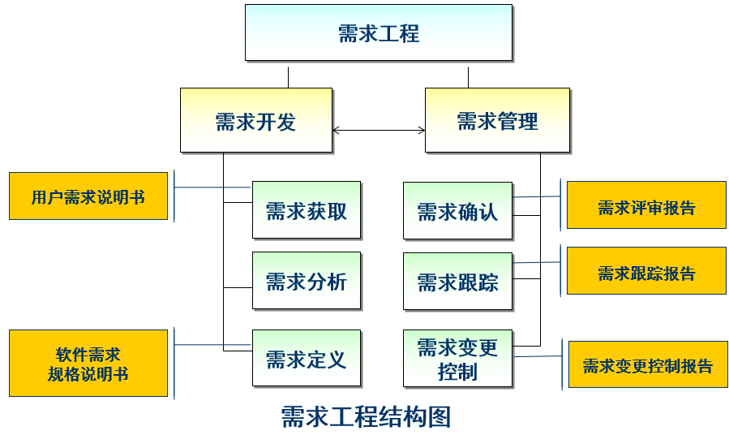
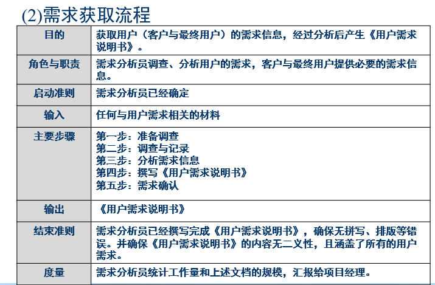
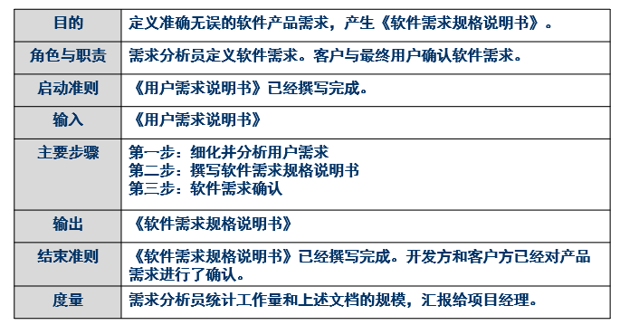
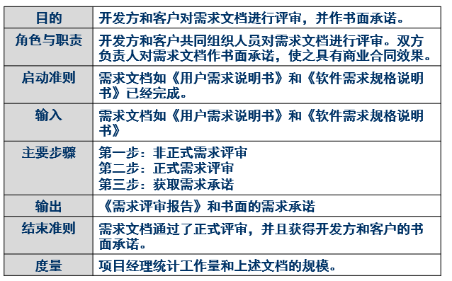

# 软件需求分析
## 系统分析
系统分析主要探索软件项目的目标、市场预期、主要的技术指标等，用于帮助决策者做出是否进行软件项目立项的决定  

即：**根据开发团队现有的人力物力，研究开发该项目的可行性**  
需求分析是一组统称为计算机系统工程的活动

### 可行性分析(Feasibility-study)
减少投资损失  
目的是确定问题是否值得去解决，为决策者提供经济、技术甚至法律上的可行性报告  

------------------------

## 需求定义
通俗的软件需求定义：针对待开发的软件产品，软件开发人员通过对软件产品的拥有者和使用者的交流和调研，获取相关的业务职能、业务知识和业务流程等信息，并对这些信息进行分析和整理后形成的有关该软件产品必须提供的功能和性能等指标的规格描述。  

**由于用户和开发人员处于不同的行业，可能导致相关知识的描述存在差异而导致难以理解。故宽泛的将就是获取客户的业务专业知识后对信息进行整理分析，并形成产品的功能和性能等指标的规格描述**  
也正式因为如此而产生不确定性  

### 不确定性
开发软件系统最困难的部分就是准确说明开发什么，此工作一旦做错，将会给系统带来极大的损害，并且以后对它修改也极为困难  

**需求的不确定性会使开发的各个阶段对需求的理解存在偏差**  
需求的准确描述和一致性理解，是软件能否被客户接受的前提，也是保证软件质量的标准  

--------------------

## 软件需求分析的目标及任务
**任务**：准确地定义新系统的目标，回答系统必须“做什么”的问题，并编制需求规格说明书。  

需求分析是研究一种无二义性的表达工具  
用户和软件开发人员都对需求有一致的理解，没有偏差  

**目标**：借助于当前系统的逻辑模型导出目标系统的逻辑模型，解决目标系统的 “做什么” 的问题  

当前系统是指用户现在的实际生产或办公业务环境  

**步骤**：
1. **将当前系统模型化为物理模型**：明确用户在当前系统中是如何进行实际业务的（如图书馆管理系统中用户如何进行借书还书）  
2. **把物理模型抽象化为逻辑模型**：将 “怎么做” 的具体实施步骤的因素去掉，抽象为只反映系统功能的逻辑模型（如图书馆管理模型，去掉用户如何借书还书的步骤，只保留该系统可以为用户做什么的功能描述）  
3. **通过表达和理解需求导出逻辑模型**：这个导出过程就是需求分析的过程 它的最终结果是回答用户的目标系统到底需要通过软件做什么，而不是怎么做  

  

### 需求分析的必要性
1. 需求分析在系统分析和可行性分析更深入地描述了软件的功能、性能以及对外接口，为最后的测试和验收奠定了基础  
2. 它允许软件开发人员对关键问题进行细化，并构建相应的分析模型：数据、功能和行为模型  
3. 分析模型成为设计模型的基础，需求规格说明书也为软件测试人员和用户提供了软件质量评估的依据  
4. 它准确地表达了用户对系统的各项要求，使开发团队的各个人员对需求的理解一致，不至于产生严重影响  

-----------------

## 软件需求分析建模原则和方法
### 分析建模的操作性原则
1. **问题的信息域必须被表示和理解**：需求分析必须建立**数据模型**，用以描述系统需要处理哪些数据和信息  
2. **软件将完成的功能必须被定义**：必须建立**功能模型**，用以描述系统应当做什么  
3. **软件的行为(作为外部事件的结果)必须被表示**：必须建立**行为模型**，以此描述软件的功能模块之间是如何进行交互，来响应外部事件  
   
总得来说，就是必须建立**数据模型、功能模型和行为模型**  

#### 数据模型
它描述系统需要处理的信息和数据  
包括信息的组成对象、数据之间的关系，信息流动过程和方向、信息内部的数据结构  

#### 功能模型
描述系统应当做什么  
它由多个模块组成，描述对进入软件的信息和数据进行变换和处理  

#### 行为模型
如果说功能模型是静态模型，那么行为模型就是动态模型  
它反映了当外界事件发生后，软件内部的状态变化，以及功能模块之间的交互过程  

如自动机中的状态转移图就是行为模型的一个很好的表示方法  

### 工程化原则(老师没讲，应该也不是很重要)

---------------

## 软件需求工程
软件的需求分析是一系列复杂的软件工程活动，为了便于对需求进行更好的管理，人们把所有与需求直接相关的活动通称为**需求工程**  

  

需求工程可以分为两大类：**需求开发**和**需求管理**  

### 需求开发
需求开发的目的是通过调查与分析，获取用户需求并定义软件需求  

包含三个主要活动：  
1. **需求获取**：产生用户需求说明书，用于粗略描述用户需求  
2. **需求分析**  
3. **需求定义**：产生软件需求规格说明书，用于更精确描述用户需求，为后续设计活动提供基础  

用户需求说明书和软件需求规格说明书之间可能并不存在一一映射关系  

### 需求管理
需求管理的目的是在客户与软件开发方之间建立对需求的共同理解，维护需求和其它工作成果的一致性，并控制需求的变更  

包含三个主要活动：  
1. **需求确认**：产生需求评审报告  
2. **需求跟踪**：产生需求跟踪报告  
3. **需求变更控制**：产生需求变更控制报告  

保证需求从始至终的一致性，和变更的可控性  

---------------

## 软件需求分析过程
三个阶段：  
1. **需求获取**：包括需求沟通和需求获取活动，产生用户需求说明书  
2. **需求定义**：包括需求分析与综合、需求建模和指定需求分析规格说明，产生软件需求规格说明书  
3. **需求确认**：包括需求评审和需求承诺，产生需求评审报告和用户书面承诺  

### 需求获取阶段
**需求获取的对象是用户和客户**  
用户是指使用软件的人员  
客户是指购买软件的人员  
客户与最终用户可能是同一个人也可能不是  

**需求获取难点**：  
1. **用户无法清粗地表达需求**  
2. **需求的理解问题**：可能产生误解，所以需求管理中的需求确认必不可少  
3. **用户经常变更需求**：需求的变更可能导致项目混乱，所以需求管理中的需求跟踪和变更控也很重要  

#### 需求获取流程：  
  

**目的**：获取用户需求信息。产生用户需求说明书（主要以自然语言描述）  
**角色**：需求分析员和用户  
输入任何与用户需求相关的材料，输出是用户需求说明书  
**主要步骤**：  
1. **准备调查**：调查什么？如何调查？调查人员及地点等计划如何？  
2. **调查与记录**  
3. **分析需求信息**  
4. **撰写用户需求说明书**：归纳总结需求后撰写  
5. **需求确认**  

### 需求定义阶段  
  

**目的**：定义准确无误的软件产品需求，产生软件需求规格说明书（主要以形式化模型符号和计算机语言描述）  
**角色**：需求分析员和用户  
以用户需求说明书为输入，输出软件需求规格说明书  

**主要步骤**：  
1. **细化并分析用户需求**：需要进行需求建模，需求建模着重于描述系统做什么，而不是如何做。  
2. **撰写软件需求规格说明书**  
3. **软件需求确认**  

常用的建模分析方法有：  
1. **面向对象的分析方法(OOA)**  
2. **面向数据流的结构化分析方法(SA)**  
3. 面向数据结构得到 Jackson 方法
4. 建立动态模型的状态转换图、PetriNet 等  

### 需求确认阶段
  

**目的**：开发方和客户对需求文档进行评审，并作书面承诺，使之具有商业合同效果  
**角色**：开发方和客户共同组织人员  
以用户需求说明书和软件需求规格说明书为输入，输出需求评审报告和书面的需求承诺  

**主要步骤**：  
1. **需求评审**  
2. **书面承诺**  