# UML 中的图
**每一个视图都是由一个或多个图组成的**，一个图就是在不同视角对系统侧面的一个表示，所有图组一个完整的视图。  

UML1.4中提供了下述九种不同的图：  
1. **[用例图](#一用例图-use-case-diagram)（Use case diagram）**：描述系统的功能；
2. **[类图](#二类图-class-diagram)（Class diagram）**：描述系统的静态结构（类及其相互关系）；
3. **[对象图](#三对象图)（Object diagram）**： 描述系统在某个时刻的静态结构（对象及其相互关系）；
4. **[顺序图](#四顺序图)（Sequence diagram）**：按时间顺序描述系统元素间的交互；
5. **[协作图](#五协作图)（Collaboration diagram）**：按照时间和空间的顺序描述系统元素间的交互和它们之间的关系；
6. **状态图（State diagram）**：描述了系统元素的状态条件和响应；
7. **活动图（Activity diagram）**：描述了系统元素的活动；
8. **构件图（Component diagram）**：描述了实现系统的元素的组织；
9. **部署图（Deployment diagram）**：描述了环境元素的配置并把实现系统的元素映射到配置上。

-----------------

## 一.用例图 Use case diagram
首先明确几个概念
* **参与者 actor**：是具有行为能力的事物或人。参与者是主动使用系统的人或事物  
* **场景 scenario**：是参与者和被讨论系统之间一系列特定的活动和交互，通常被称为“用例的实例”。场景是使用系统的一个特定情节或用例的一条执行路径  
* **用例 Use Case**：通俗地讲，用例就是描述参与者如何使用系统来达到目标的一组成功场景和失败场景的集合。通过用户和系统的交互，用例向用户提供有价值的结果值  

> 举个例子，开发了一个图书馆管理系统，则：  
> 参与者是使用系统的老师、学生、图书馆管理人。  
> 场景是使用使用系统的特定交互活动。如学生要借书的完整过程(场景可能成功也可能失败)。
> 用例就是学生使用系统满足借书目标的场景集合。这个用例可以叫做借书用例
> 系统的最终目标就是满足所有的参与者的用例  

用例方法是当今广泛使用的用于发现和记录系统功能性需求的方法。
对于用户来说，未看到系统前可能很难直接描绘系统的功能点需求。但是通过用例的方法来描述，用户就可以轻松描绘  

### 表示方法
参与者一般用一个人型符号表示，参与者的名字放在图符的下方，如果参与者不是人，则还可以使用矩形表示，它带有 actor 版型
用例可表示为一个包含用例名字的椭圆，用例名通常是一个动词短语  

**用例图包含系统边界、参与者和用例等三种模型元素图示，画用例图时既要画出三种模型元素，同时还要画出元素之间的各种关系**  
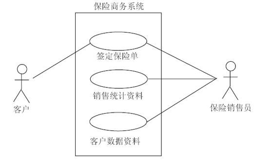

--------------------
## 二.类图 Class diagram
类图用于描述类以及类之间的关系  

### 类的表示
类用长方形表示，长方形分成上、中、下三个区域，上方的区域内标识类的名字，中间的区域内标识类的属性，下方的区域内标识类的操作，这三部分作为一个整体描述某个类  
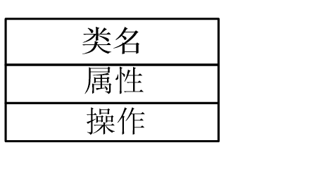  

#### 名字
类的名字写在长方形最上面，类名最好能够反映类所代表的问题域中的概念  

#### 属性 (成员变量)
类的属性放在类名字的下方，用来描述该类的对象所具有的特征。  
描述属性的语法格式为：  
`可见性 属性名：类型名= 初始值 {性质串}`
(性质串差不多就是取值范围)  
可见性可以通过 `+/-` 表示  

#### 操作 (成员函数)
操作是类能够做的事情，在类图中操作部分位于长方形的最底部。一个类可以有多种操作，每种操作由操作名、参数表、返回值类型等几部分构成。  
标准语法格式为：  
`可见性 操作名（参数表）：返回值类型 {性质串}`  
参数表由多个参数构成，参数的语法格式：  
`参数名：参数类型名=缺省值`  

  

### 类的关系
除了表示类本身以外，类图中还需要表示类之间的关系：  
1. **[依赖](#依赖关系)**  
2. **[关联](#关联关系)**  
3. **[聚合](#聚合关系)**  
4. **[组合](#组合关系)**  
5. **[继承](#继承关系)**  

#### 依赖关系
依赖是一种使用的关系，即一个类的实现需要另一个类的协助，所以依赖关系通常是单向的。**UML中使用带箭头的虚线表示依赖关系，箭头指向被依赖的类**

依赖具有偶然性、临时性，是非常弱的关系。只有在使用时建立，使用完毕后关系解除  

在代码中表现为一个类中调用了另一个类中的内容  

#### 关联关系
关联是一种拥有的关系，它使一个类知道另一个类的属性和方法，是一种长期性、相对平等的关系  

**关联可以有双向(用无向实线表示)和导航(单向箭头)，关联的两端可以标注重数(基数)，表示类之间的数量对比关系**  
(有点类似于数据库中图的表示)  
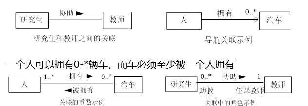  

在代码中表现为一个类是另一个类的成员变量  

##### 关联类
**有时需要把关联关系表示成一个类。和类一样，关联也可以有自己的属性和操作。此时，这个关联实际上是个关联类（association class）**  
在表示时，使用虚线将关联类和关联关系的线连接起来  

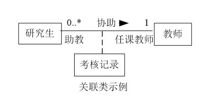  

关联类保存的是关联关系的状态等信息，而不属于任何一个类  

#### 聚合关系
聚合是表示整体的类和表示部分的类之间的“整体--部分”关系，是一种强类型的关联。在聚合关系中，**把作为“整体”的类称为聚集（aggregate），作为“部分”的类称为成分**  

**聚合关系中的整体和部分之间用带空心菱形箭头的连线连接，箭头指向整体**  

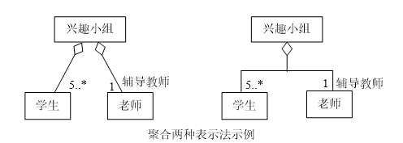  

**整体类和部分类的生命周期是相对独立的，这就意味着部分类可以单独存在**  
如上图中，即使兴趣小组解散了，学生类和老师类也不会消失  

#### 组合关系
组合是更强类型的聚合，要求部分的生存周期取决于整体的生存周期，**部分不能脱离整体而单独存在，每个部分只能属于一个整体**  

**除了菱形是实心之外，组合和聚合的表示法相同**  

如订单是由多个条目组合而成的  

#### 继承关系  
**继承也称泛化**，是面向对象描述类之间相似性的一种重要机制  

**父类与子类的泛化（generalization）关系图示为一个带空心三角形的直线，空心三角形紧挨着父类**  

如选择题、填空题都继承于试题  

#### 多层继承和多态
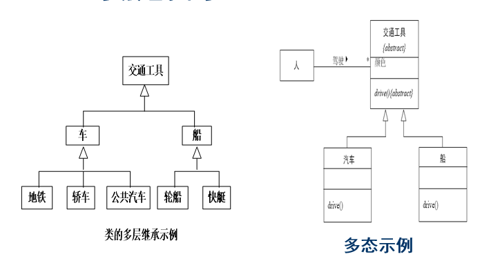

### 类的总结
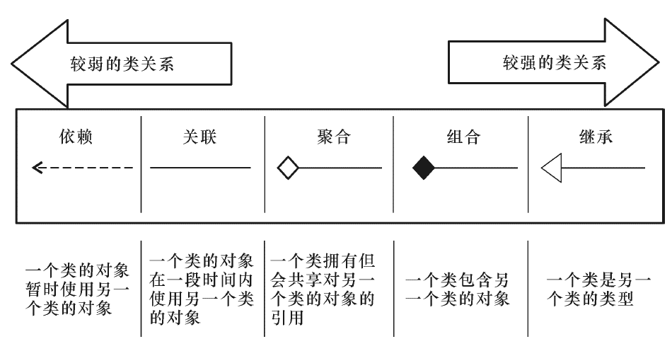

-----------------
## 三.对象图
类图表示类以及类之间的关系，**对象图表示在某一时刻类的具体实例和这些实例之间的具体连接关系**  

### 表示方法
**对象的名字下面要加下划线**，对象名有下列三种表示格式
`对象名：类名`  
`:类名` (表示匿名对象)  
`对象名`  

**关联关系（?）的实例化称作链**  

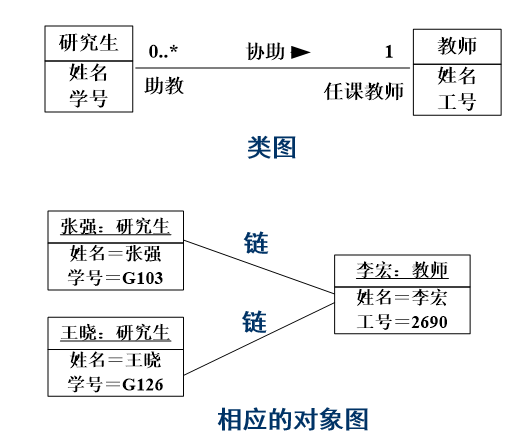  

---------------------
## 四.顺序图
在类图和对象图中可以详细描述系统中有哪些类和对象组成，以及描述类和对象之间的关系，但没有描述如何进行消息交互和协作的，因此是一种静态图  

而顺序图是一种动态图，详细描述了表示对象之间以及对象与参与者之间交互的图，它由一组协作的对象（或参与者）以及他们之间可发送的消息组成，强调消息之间的时间顺序。  

**顺序图是二维的，其中，垂直方向表示时间，水平方向表示不同的对象或参与者**

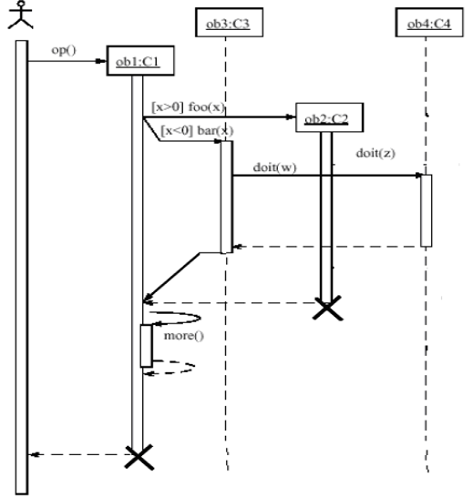  
* **对象生命线**
  参与者或对象都有对象生命线。对象生命线表示对象在一段时间内的存在，表示成垂直虚线，并位于对象符号之下  
* **消息(操作)**
  消息是对象之间通信的描述，表示为从一条生命线到另一条生命线的一条带有箭头的水平实线（简称为箭线），从源对象指向目标对象。在箭线上书写消息的名称及其参数或者参数表达式。
  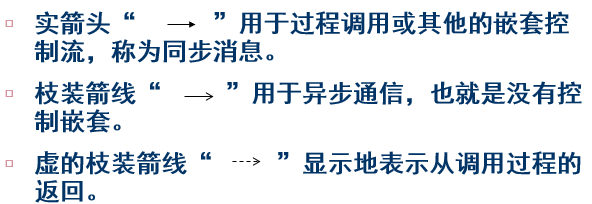  
  同步需要等待返回，而异步不用  
  在顺序图中大多数默认都有返回，所以虚箭头可以不用画出    
* **控制焦点**
  控制焦点表示了对象的一个操作执行的持续时间，也表示了对象和它的调用者之间的控制关系。当操作执行完毕后，通过虚线箭头返回操作的执行结果
  在对象生命线中用一个窄长的矩形表示控制焦点。
  在一个对象的操作递归地调用自己或调用本对象的其他操作的情况下，第二个控制焦点符号画在第一个符号稍微靠右的位置

--------------
## 五.协作图
协作图由对象、链以及链上的消息构成，其中也可以有参与者  

协作图功能与顺序图相同，但有两点不同：  
1. 协作图中有链接表示对象之间的关系，而顺序图中没有  
2. 协作图中没有从上到下的时间轴，但为了表示消息顺序，所以使用了消息序号  

在 UML 中顺序图和协作图可以相互转换，而不丢失语义信息，因为这两种图都共享相同的基本模型。**它们统称为类和对象的“交互图”**  

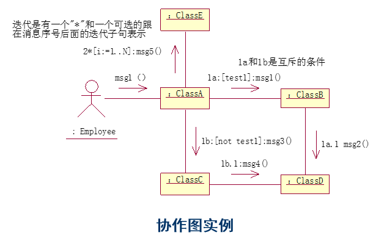  
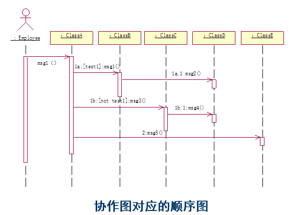  

------------
剩下的不讲了