# 面向对象分析概述
## OOA
**面向对象分析（Object-Oriented Analysis，简称OOA）就是运用面向对象的方法进行系统分析，是软件生命周期的一个阶段**  

用类和对象去描述事物，用类之间的关联关系去表达它们之间的联系，同时还需要定义类和对象的属性等  

> 举个例子：图书馆管理系统  
> 学生、老师、图书馆管理员、图书、借书证等类  
> 学生类的性别、年龄等属性  

### OOA与OOD的区别
OOA是面向对象分析  
OOD是面向对象设计  

OOA说明了现实世界中的关系，但不考虑与系统的具体实现相关的因素  
而OOD则是针对系统的具体实现  

### OOA 过程
主要包括以下四类活动，产生两大模型：  
1. **用例建模->功能需求模型**：利用用例以及用例图来捕获和描述用户的需求，从而建立系统的功能需求模型  
2. **创建领域模型->领域模型**：从业务需求描述和用例描述中提取“关键概念”，形成领域模型  
3. **绘制系统顺序图**：从用例出发，将系统看作一个黑盒子，绘制系统顺序图  
4. **创建系统操作契约**：从系统顺序图和领域模型出发，建立系统操作契约  

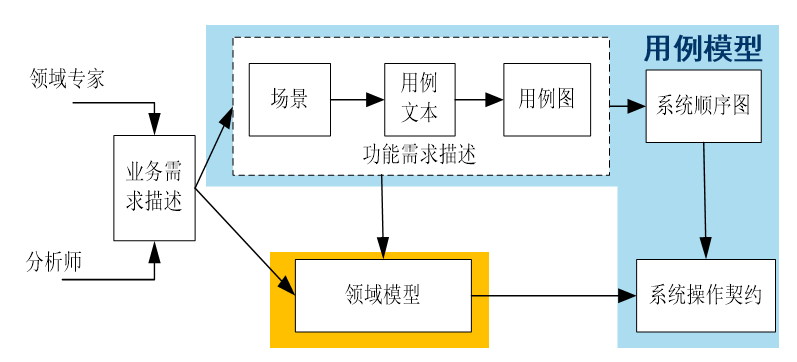  

**其中用例图包括用例图、系统顺序图以及操作契约**  
**领域模型主要通过 UML 中的类图表示**  

---------------
## 一.用例建模
### 基本过程
1. 确定系统边界  
2. 识别主要参与者  
3. 根据主要参与者目标，识别和定义用例  

#### 1.确定系统边界
**系统边界是一个系统所包含的所有系统成分与系统以外各事物的分界线**  

通常就是用户与系统交互的接口  

#### 2.识别主要参与者
这个参与者就是用例图中的参与者，是具有行为能力的事物(人、系统、硬件等)  

**参与者主要有三类**：  
**主要参与者**：  
**指的是在使用系统服务的过程中满足自己的用户目标的那些参与者**。识别出这类参与者，可以帮助找到用户目标，从而确定系统的功能需求  

**次要参与者**：  
**指的是为系统提供服务的那些参与者**。识别出这类参与者，可以帮助确定外部接口和协议  

**后台参与者**：  
**指的是对用例的行为感兴趣的那些参与者**。识别出这类参与者，可以保证找到所有方面的兴趣并让用例满足之  

> 举个例子：电子商务系统  
> 主要参与者：购买者，因为他使用系统满足购物需求  
> 次要参与者：防欺诈系统，可能需要为主系统提供防欺诈服务  
> 后台参与者：广告商，它们对用户的购买需求感兴趣  

参与者是一个类，参与者类之间的关系主要是借阅关系，如图书馆管理系统中的，学生和教室都可以继承与借阅者类  

#### 3.识别和定义用例  
用例是描述参与者如何使用系统来达到目标的一组成功场景和失败场景的集合  

##### 识别用例的步骤：  
根据需求描述中的业务场景，定义参与者使用系统的交互场景  
找出场景中参与者使用系统的动作(动词短语)，写出参与者每个动作的目标  
找出或总结出能满足参与者目标的，能为其带来一次完整意义结果值的动作，将其定义为一个用户级别的用例  

用例有不同的级别，**用户级别的用例通常是一个完整的业务功能，能实现参与者的目标**(如学生借到了书)  
而**子功能级别的用例只是用户级别用例的一个步骤**(如借书前需要验证身份)  

需要重点关注的就是用户级别的用例  

#### 用例表示
最后，需要使用用例图将用例表示出来  
用例图中通常需要描述参与者、用例、参与者和用例之间的关系，以及用例之间的关系(包含、扩展、继承等)  

##### 用例之间的关系
**包含关系(include)**：  
一部分行为经常会出现在多个用例中，为了避免重复，可以创建一个子功能级别的用例，并让其他的用例包含它  

**包含关系使用虚线箭头表示，从基用例指向子用例，并在虚线上标注 “《include》”**  

**扩展关系(extend)**：  
由于某种原因已有的用例文本不能被修改，但是可能又要为种种新的扩展场景和条件步骤不断修改用例  

如取款功能可以扩展出是否打印凭据  

扩展子用例通常是基用例的可选扩展选项  
**使用虚线箭头，从扩展用例指向基用例，并标注“《extend》”**  

#### 用例描述
对用例的描述，可以用自然语言，也可以采用用户自定义的语言  

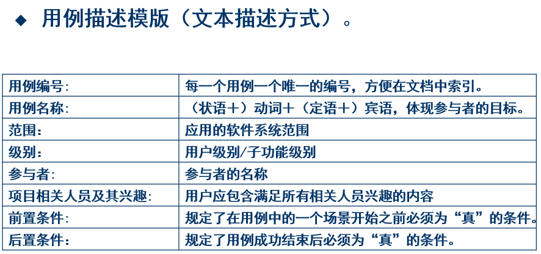  
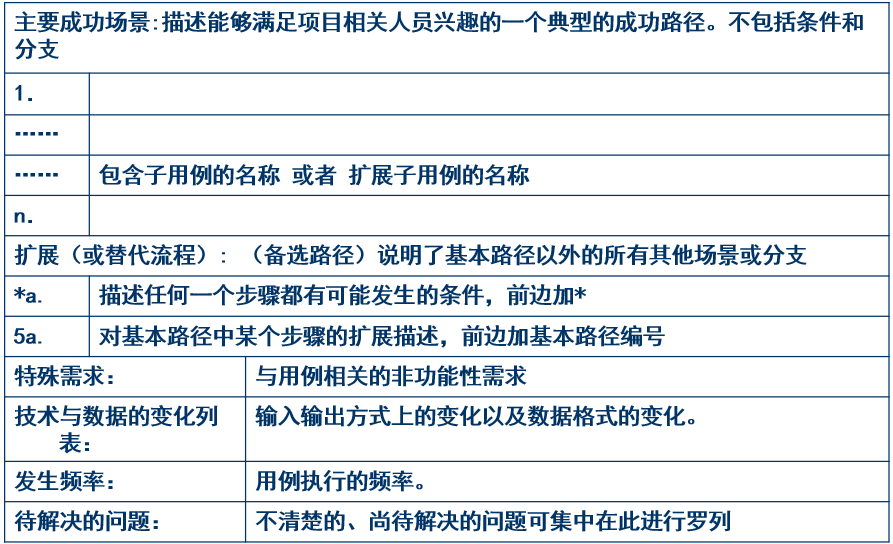  

除了文字描述，也可以用活动图描述(很像流程图)  

> 点菜实例：  
> 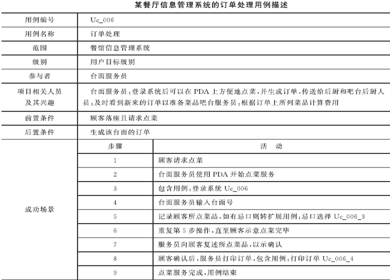  
> 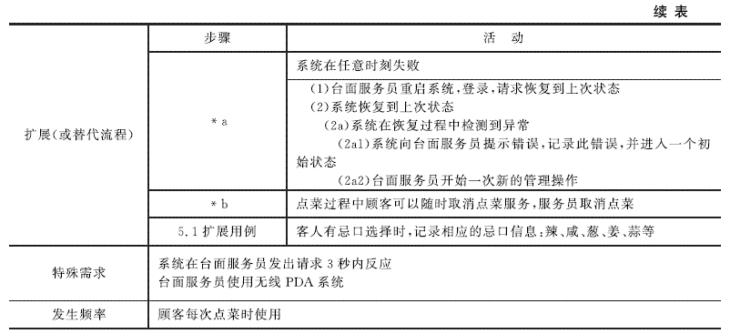  

------------------
## 二.创建领域模型
**领域模型：针对某一特定领域内概念类或者对象的抽象可视化表示**  

主要用于概括地描述业务背景及重要的业务流程，并**通过UML的类图和活动图进行展示**，帮助软件开发人员在短时间内了解业务  

**业务背景**：指从用户的角度去描述系统中代表业务关键概念的事务(通常由类表示，叫做概念类)，业务背景包含概念类以及它们之间的关系，常表示成**类图**  

**业务流程**：描述的是业务背景中各种参与者或角色所执行的关键活动和核心流程，常表示成**活动图**  

创建领域模型的步骤：  
1. 识别或抽象出领域的概念类或对象  
2. 建立概念类之间的关系  
3. 设置概念类的关键属性  

### 1.识别概念类
两个技巧：  
1. **使用概念类分类列表**  
   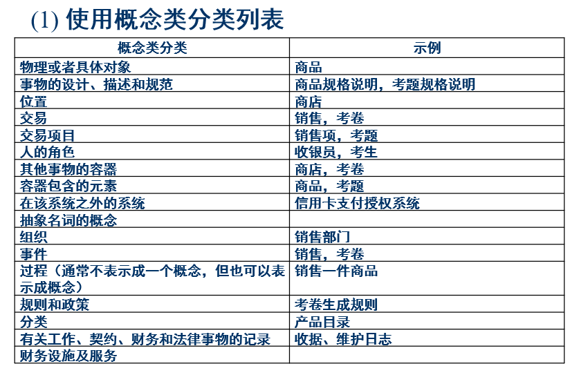  
2. **根据名词短语识别找出概念类**  
   名词可以是概念类或概念类属性，其中属性一般是可以赋值的  
   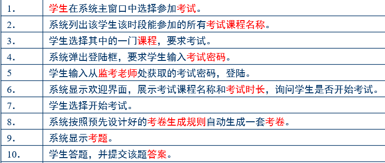  

### 2.添加关联
**“需要知道”型关联**：  
需要将概念之间的关系信息保持一段时间的关联。领域模型中需要着重考虑  
(如谁借了哪一本书)  

**“只需理解”型关联**：  
有助于增强对领域中关键概念的理解的关联，对系统没有影响  
(如管理员和某学生是父子关系，这个信息需求毫无影响)  

两个技巧：  
1. **通用关联列表**  
2. **根据动词和动词短语识别**  

过多的关联类型可能会使模型混乱，应避免显示冗余的和导出的关联关系  
识别概念类比识别关联更重要  

### 3.添加属性
**添加概念类属性和关联上的属性**  

领域模型中的属性往往是需求（用例）建议或者暗示我们需要记忆的那些信息  

在寻找概念类的时候可能有些名词短语就是可以被用作属性的  

**一般只需考虑属性名称、类型和初始值(如果有的话)即可**  

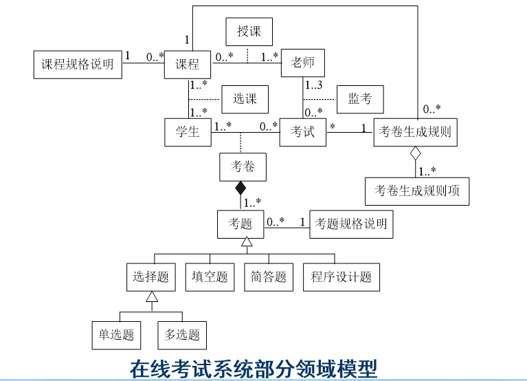  

------------------
## 三.绘制系统顺序图  

**一个系统顺序图用来表示在用例的一个特定场景中，外部参与者产生的事件、事件的顺序以及系统之间的事件**  

系统顺序图可以使用 UML 中的顺序图来描述  

### 三个元素
1. **参与者**，主动向系统发出事件  
2. **系统**，负责接受参与者发出的系统事件同时做出响应  
3. 参与者与系统之间交互的**系统事件**  

为了识别系统事件，需要从用例的主要成功场景中以及各种替代场景中寻找系统事件，建立系统顺序图  

> 如考试系统中：  
> 学生在系统选择参加考试，就是发出了参加考试的系统事件(getAvailableTestParpers(stuid))  

**系统事件的本质有点像参与者调用系统中提供的方法，因此可以携带参数**  

### 开始绘制
按时间顺序依次画出每一个系统时间  

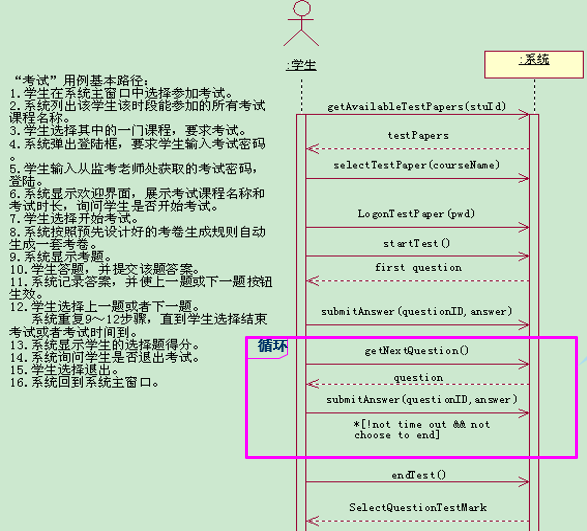  

**其中实线箭头表示参与者主动发出的系统事件，箭头上方标参数的名字**  

**虚线箭头表示系统的相应，箭头上放标响应结果**  

**“*” 号和 “[]” 分别代表了迭代标记和循环条件**  

--------------
## 四.创建系统操作契约
当系统收到系统事件时，需要触发内部的某个动作然后给出响应，这些触发的系统动作叫做**内部操作**  

**一个系统事件对应一个系统操作，具有相同的名字和参数**  
（系统事件就是参与者发出的调用系统操作的一个消息）  

**操作契约是为系统操作而定义的，描述系统操作执行的结果（引起系统中对象状态的改变）**  
如系统操作之后系统中增减了哪些对象、哪些关系或者属性发生了改变  

### 操作契约模板
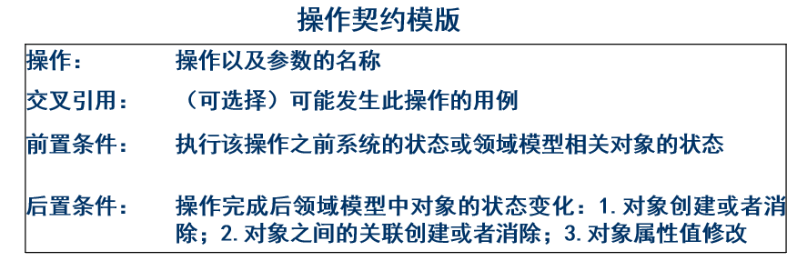  

**每一个操作契约对应一个系统操作**  

后置条件不是在系统操作中要执行的动作；相反，**后置条件是在系统操作完成之后领域模型中对象状态的变化（针对结果而不是过程）**，包括对象的创建和删除、对象之间的关联创建或者消除、对象属性值修改。

后置条件的一个重要特点是它是声明性的，而且是面向状态变化而不是面向行为的  

实例：  
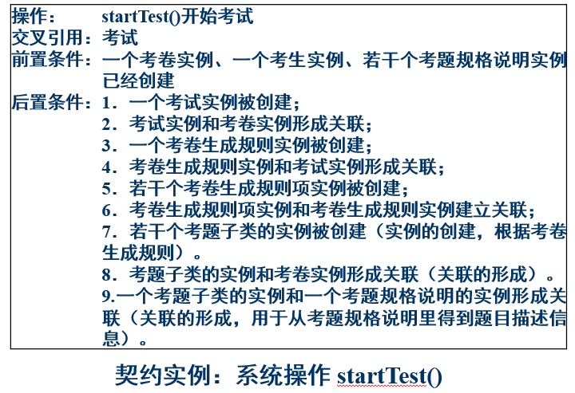  

契约不是必须的，只是系统的补充描述，如果用例已经有大多数涉及需要的细节，则契约没有什么价值  

### 指导原则
1. 从系统顺序图中识别系统事件，然后针对每一个系统事件设计对应的系统操作  
2. 对于复杂的、结果微妙的以及不清晰的系统操作，构造一个契约，作为用例的补充。对简单的不用创建契约  
3. 后置条件只需关注三点：  
   1. 实例创建和删除  
   2. 属性修改  
   3. 关联形成和断开  
4. 后置条件的陈述应该采用过去时态的声明语气和被动句型，以强调系统状态所发生的变化  
5. 后置条件可在迭代开发中逐步完善  

----------------
## 小结  
面向对象分析四个活动：  
**用例建模、创建领域模型、创建系统顺序图、创建操作契约**  
两大模型：  
**用例模型、领域模型**  

用例模型由以下四个部分构成：  
1. 用例图，UML use-case diagram  
2. 用例说明  
3. 系统顺序图，UML sequence diagram  
4. 操作契约  

领域模型由以下两个部分构成:  
1. 业务背景：概念类及概念类之间关系构成的类图，UML class diagram
2. 业务流程：由UML活动图表示的业务对象之间为了完成某个活动所执行的一系列子活动和动作序列。
