# 结构化需求分析  
## 结构化分析发展简史  
**Structured Analysis (SA)**:   
面向数据流进行需求分析。适合于数据处理类型软件的需求分析  

分析建模开始于20世纪60-70年代，但结构化分析方法的第一次出现是作为另一个重要课题：“结构化设计”的附属品  

其目的是需要一种图形符号体系来表示数据和对数据进行变换的处理，这些处理最终能被映射到软件体系结构的设计中  

--------------
## 结构化分析模型结构  
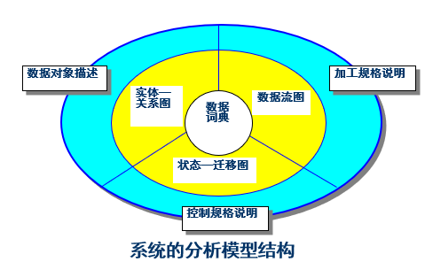  

### 三大模型和一个核心  
**数据模型**：用实体-关系图表示，用来描述系统要处理的数据对象、对象属性以及对象之间的关系  
**功能模型**：用数据流图表示，用来描述数据在系统中如何流动，以及系统对数据流的变换功能  
**行为模型**：用状态迁移图表示，描述了外部事件发生时，系统如何采取动作的行为  
**数据词典核心**：以文字词条表示，记录了数据流图中所有被命名的图形元素，使得每一个图形元素的名字都有一个确切的解释  

### 如何创建  
#### 数据模型  
为了把用户的数据要求清晰明确地表达出来，软件开发人员通常建立一个**概念性的数据模型（也称为信息模型）**  

概念性模型按照用户的观点来对数据和信息建模。它描述了从用户角度看到的数据，反映了用户的现实环境，但与在软件系统中的实现方法无关  
（与面向对象分析中的领域模型十分类似）  

**最常用的表示概念性数据模型的方法，是实体/关系方法（Entity Relationship Approach）**  
其概念与数据库中学的完全一致  

即**ER图描述现实世界中的实体，而不涉及这些实体在系统中的实现方法**    

用这种方法表示的概念性数据模型又称为**ER模型**  

* **数据对象**：可以是任意的一个外部实体，拥有属性和关系，但没有方法，可以用数据库中的表格样式表示  
* **属性**：属性定义了数据对象的性质  
* **关系**：数据对象之间的相互连接的方式称为关系  
* **基数（Cardinality）**：数据模型必须能够表示在一个给定的关系中实体的对应情况，即对象—关系对的基数  

##### ER图
ER图的主要目的是以图形的形式表示实体以及实体之间的关系  

**带标记（或名称）的矩形表示实体**  
**连接实体的线表示关系**  

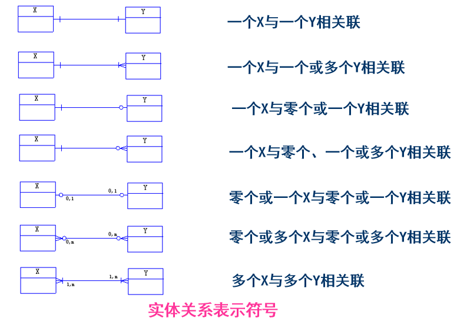  

> 实例：  
> 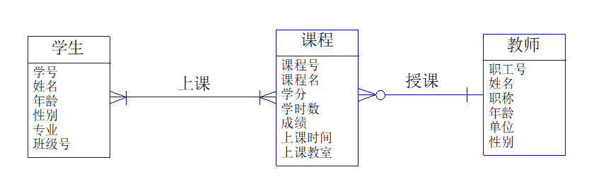

##### 规范化
数据模型还要规范化，**目的是消除数据冗余**  

**关系规范化的程度通常按属性间的依赖程度来区分，并以范式（Normal Form，NF）来表达**。范式是符合某一种级别的关系模式的集合  

目前关系数据库有六种范式。一般说来，数据库只需满足第三范式（3NF）就可以达到设计的要求了  

--------------
#### 功能模型   
**功能模型需要体现系统的数据流的加工、变换过程**  

数据流图是描述信息流和数据从输入移动到输出时被系统的功能变换的图形化技术  

**DFD也被称为数据流图（Data Flow Diagram）或泡泡图（Bubble Chart）**  

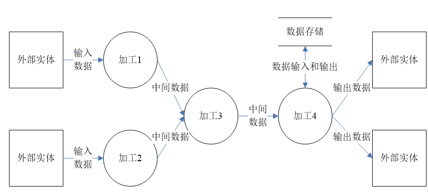  

**外部实体用正方形表示**，主要是系统的使用者或参与者  
**加工用圆形表示**，是系统中对数据流的加工等操作，名字通常是动词短语短语  
**数据存储用平行线表示**，它主要用于保存数据，可能是一个数据库或任何形式的文件  
**数据流用箭头表示**，它描述系统中需要被加工的数据和流向，通常还需要给出数据流名称，**而数据存储和加工之间一般是双向箭头**  

如果一个加工有多个输入数据流或输出数据流，我们还可以给出更细致的数据流关系  

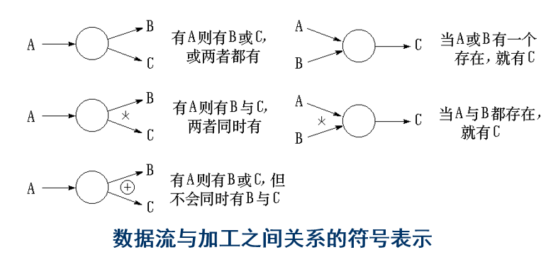  

##### 分层数据流图
对复杂的问题，一次画出数据流图不现实，可以以分层的数据流图反映这种结构关系  

在多层数据流图中，可以把顶层流图、底层流图和中间层流图区分开来  

顶层流图仅包含一个加工，它代表被开发系统  

底层流图是指其加工不须再做分解的数据流图，其加工称为“原子加工”  

中间层流图则表示对其上层父图的细化  

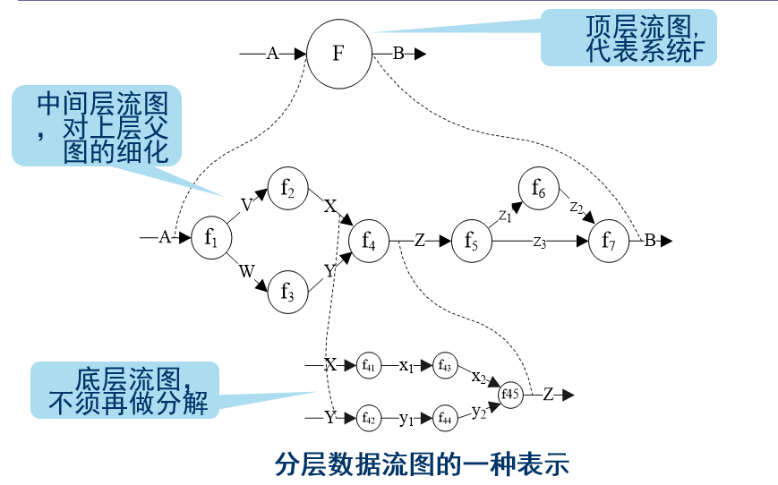  
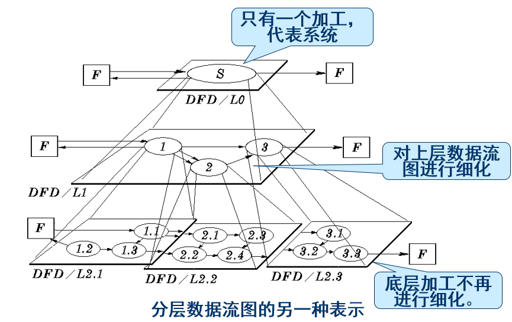  

#### 数据流图的具体画法
**自外向内，自顶向下，逐层细化，完善求精**  

#### 检查和修改原则
1. 数据流图上所有图符号只**限于四种基本形元素**  

2. 数据流图的主图必包括前述**四种基本元素缺一不可**  

3. 数据流图的主图上数据流必须封闭在外实体之间，外部实可以不只一个  

4. 每个加工至少有一输入数据流和一个输出数据流  

5. 在数据流图中，需**按层给加工框编号**，表该加工处在哪一层，以及上下层的父图与子的对应关系  

6. **数据流图的平衡原则**：父图与子图的输入输出数据流必须一致  

7. 子图中若有新的数据流需要逐层更新上级  

8. 数据流图不可以有控制流程  

> 例：  
> 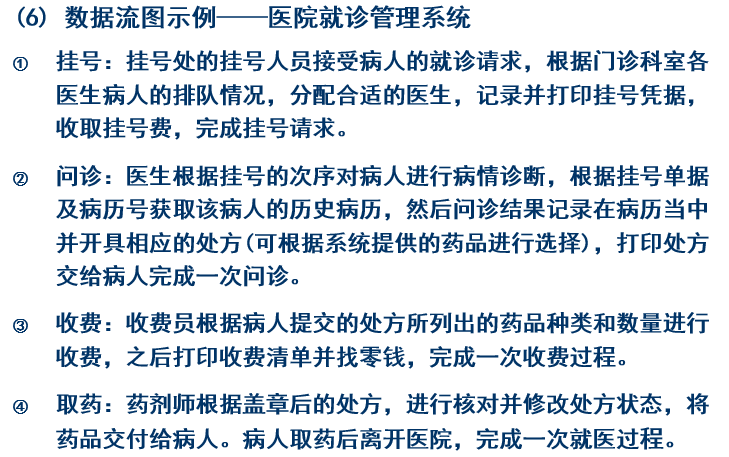  
> 构建顶层数据流图：  
>  1. 确定外部实体：挂号人员、医生、收费员、药剂师(病人通过这些人帮他对系统操作，所以病人不是实际实体)  
> 2. 确定加工：因为是顶层，所以可以把整个管理系统看作一个加工  
> 3. 确定数据流：挂号人员输入挂号请求和挂号费，输出挂号单。具体数据流如下：  
> 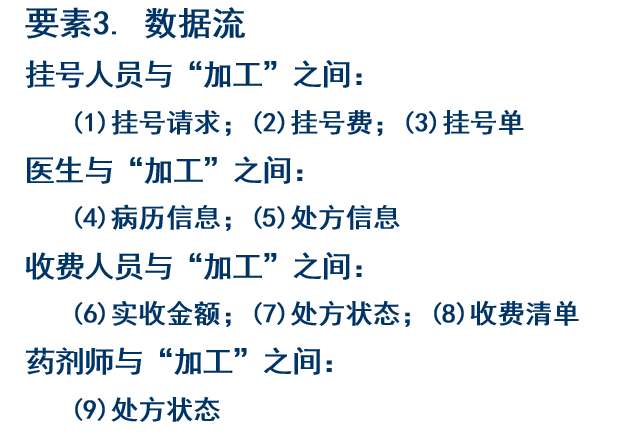  
> 4. 数据存储：病历、挂号单、医生排队信息、处方、收费清单等  
> 顶层数据流图：  
> 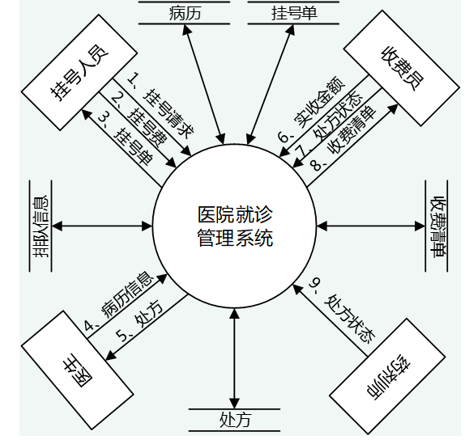  
> 细分之后：  
> 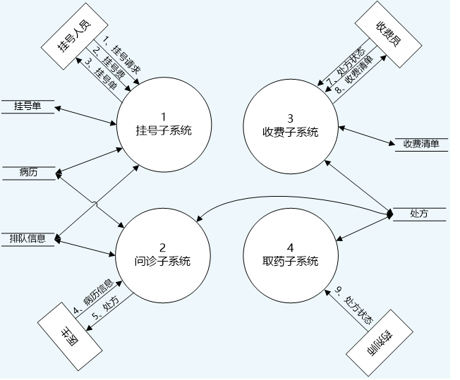  
> 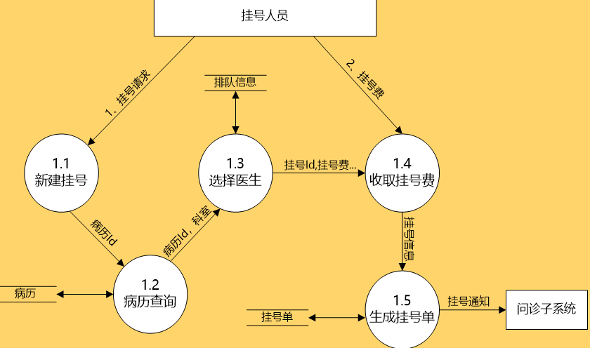  

#### 扩展：实时系统的数据流图
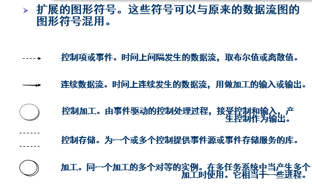  

对于如水温控制系统，温度就是一个连续的数据流  

----------------
#### 行为模型
为了直观地分析系统的动作，从特定的视点出发描述系统的行为，需要采用动态分析的方法  

**最常用的动态分析方法**：
* 状态迁移图  
* 时序图（UML中的序列图）  
* Petri网  

##### 状态迁移图
可以用状态迁移图(STD, State Transition Diagram)或状态迁移表描述系统或对象的状态，以及导致系统或对象的状态改变的事件，从而描述系统的行为  

**用圆圈表示状态，用箭头表示一种可行的转移，并在箭头上写上导致迁移的信号或事件名**  
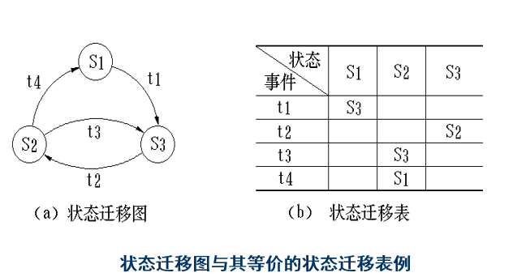  

**说白了就是形式语言与自动机中学的那些内容**  

有时状态迁移图也可以分层表示  

**扩展**：  
用菱形表示判断内容  
用方形表示处理内容  
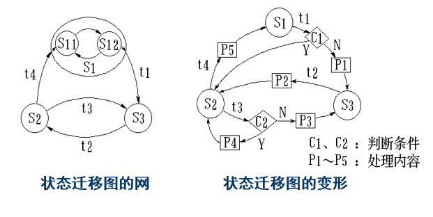  

##### Petri 网
Petri网简称PNG（Petri Net Graph），是一种有向图  

包含四种基本元素：  
* **圆圈符号代表位置P(Place)**：可以看作是系统的一个状态  
* **短直线代表转换T(Transition)**：用于将输入函数转换为输出函数  
* **输入函数I(Input)是由位置指向转换的箭头**  
* **输出函数O(Output)是由转换指向位置的箭头**  

**位置中可能出现若干个黑点，称之为标记(token)**，表明系统或对象正处于此位置  

**对于一个转换，当每个输入位置所拥有的标记数大于等于从该位置到转换的线数时，就允许转换**  

位置在系统中的总数不是固定不变的  

> 如:  
> 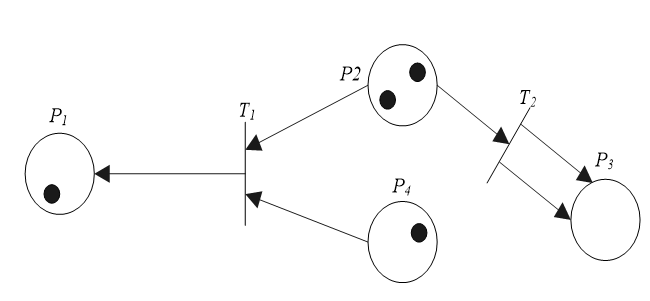  
> 此时T1可以转换，移除P2和P4位置中的一个黑点，然后再P1中增加一个黑点  

> 例：  
> 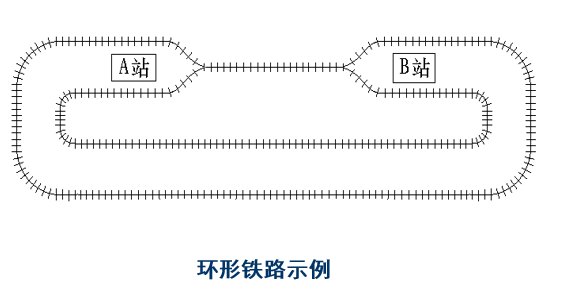  
> 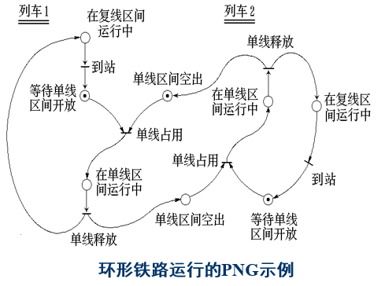  

----------------------
#### 数据词典
**数据词典(DD, Data Dictionary)**  

**作用**：是对于数据流图中出现的所有被命名的图形元素在数据词典中作为一个词条加以定义，使得每一个图形元素的名字都有一个确切的解释  

数据词典中所有的定义应是严密的、精确的，不可有半点含混并消除二义性  

##### 数据词典构成  
* **数据流词条**  
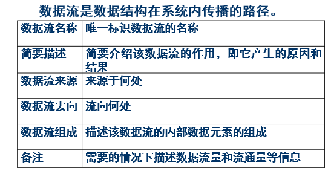  

* **数据元素词条**  
  数据元素是数据处理中的最小单元，在某一数据流的数据结构中，可能包含多个数据元素  
  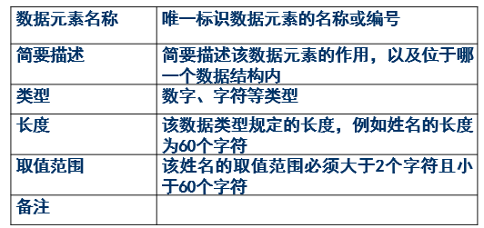  

* **数据文件词条**  
  数据文件说明了数据结构保存的地方  
  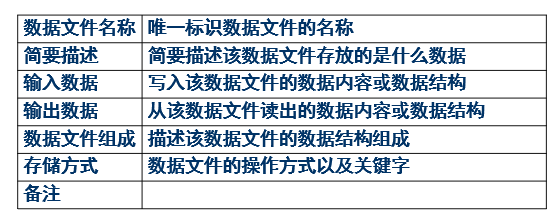  

* **加工逻辑词条**  
  描述了数据流图中的加工  
  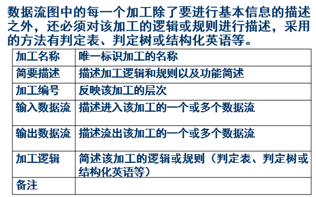  

* **外部实体词条**  
  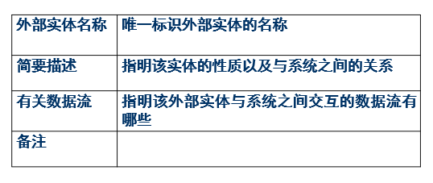  

##### 数据结构说明
**数据流中复杂的数据结构，可以通过特定的方法描述**：  
**定义式**：  
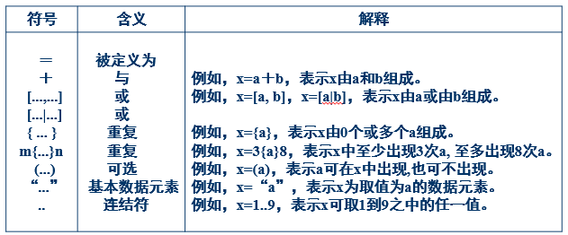  

例：  
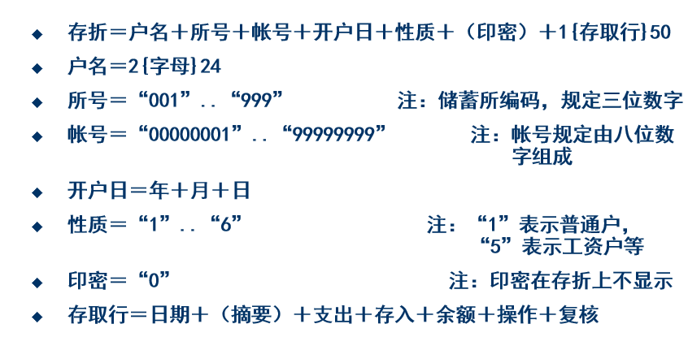  

**Warnier 图**：  
**使用树形结构描绘数据结构，用花括号表示层次关系，用圆括号给出数据项的重复次数**  

例：  
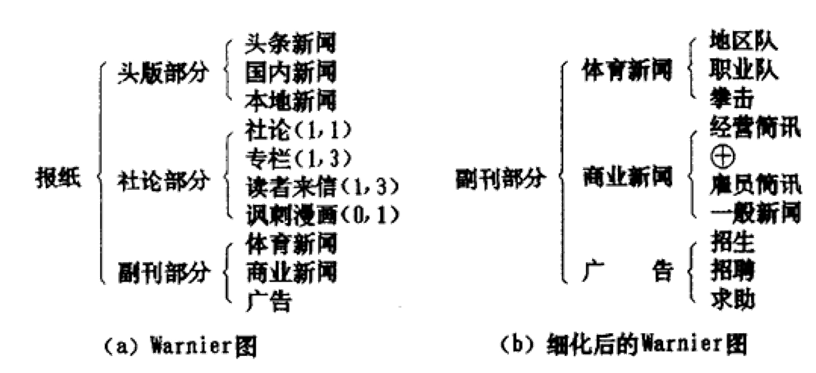  

##### 加工逻辑说明
在加工逻辑词条中，对每个基本加工，都要有一个基本加工逻辑说明  

**基本加工逻辑说明必须描述基本加工如何把输入数据流变换为输出数据流的加工规则**  

加工逻辑说明必须描述实现加工的策略而不是实现加工的细节  

**结构化英语**：  
结构化英语也称为PDL(过程设计语言)，其实就是伪代码  

**判定表**：  
在某些数据处理问题中，某数据流图的**加工需要依赖于多个逻辑条件的取值**，这时使用判定表(Decision Table)来描述比较合  

判定表有四个部分组成：  
条件桩(Condition Stub)  
条件项(Condition Entry)  
动作桩(Action Stub)  
动作项(Action Entry)  

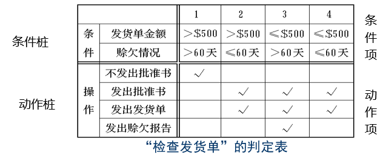  

对于不同条件相同动作，在表中也可以**化简合并**：  
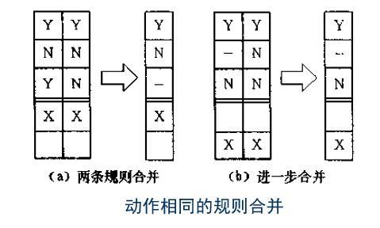  

**判定树**：  
**每一个分支节点代表判定条件，每一个叶子节点代表一个处理动作**  

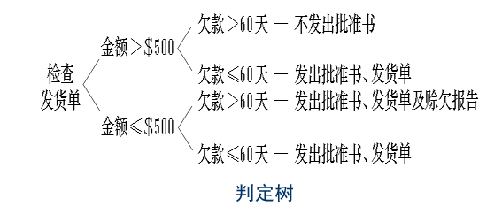  

-----------------
## 软件需求规格说明书
软件需求规格说明书的内容和软件需求分析的最终成果将体现在软件需求规格说明书中，它不仅是软件生命周期的一个极为重要的里程碑，也是软件设计的坚实基础  

框架不同的作者有不同的结构，国内也有相应的国标规范  
