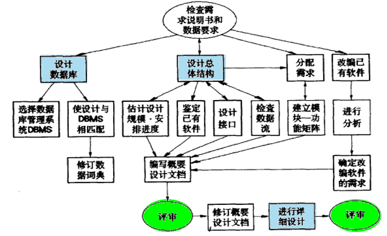
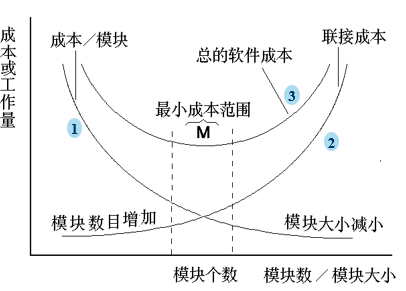
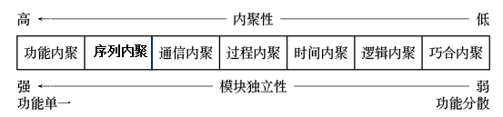
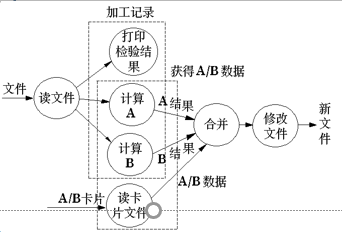
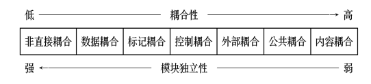
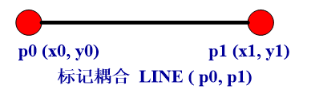
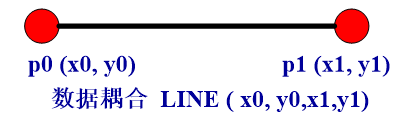
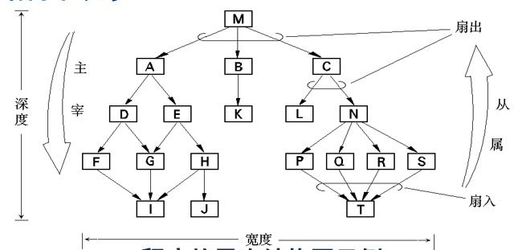
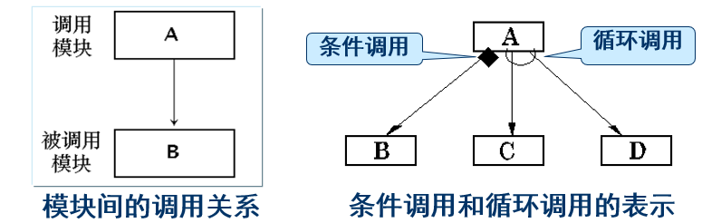
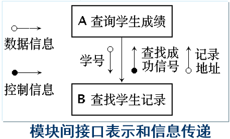

# 软件设计
## 软件设计概述
### 软件设计目标
**软件设计的最基本目标就是回答“概括地描述系统如何实现用户所提出来的功能和性能等方面的需求？”这个问题**  

### 软件设计过程
从工程管理的角度看，分两步：  
1. 概要设计：将软件需求转化为数据结构和软件的系统结构，并建立接口  
2. 详细设计：即过程设计，通过对软件结构进行细化，得到各功能模块的详细数据结构和算法  

从技术观点看：  
1. 数据设计：其中数据设计将软件各模块需要处理的数据，以及需要长久储存的数据，进行数据结构和数据存储的设计  
2. 系统结构设计：系统结构设计定义了软件系统各主要功能模块之间的关系，包括软件的模块接口设计  
3. 过程设计：过程设计主要涉及各功能模块内部结构的详细定义，包括模块主要算法逻辑和局部数据结构的定义  

概要设计{系统结构设计和模块全局数据设计}  
详细设计{过程设计和模块局部数据设计}  

### 软件设计重要性
1. 软件设计是开发阶段中最重要的步骤，**它是软件开发过程中质量得以保证的关键步骤**  

2. **软件设计又是将用户要求准确地转化成为最终的软件产品的唯一途径**  

3. **软件设计是后续开发步骤(实现、测试)及软件维护工作的基础**  

----------------
## 软件概要设计
**1.制定设计规范**  
在进入软件开发阶段之初，首先应为软件开发组制定在设计时应该共同遵守的标准  

**2.软件系统结构的总体设计**：  
**是软件概要设计的关键步骤**  

采用某种设计方法，将一个复杂的系统按功能划分成模块的层次结构  

确定每个模块的功能，建立与已确定的软件需求的对应关系  

确定模块间的调用关系  

确定模块间的接口，即模块间传递的信息。设计接口的信息结构  

优化已有结构使系统达到要求的性能指标  

**3.处理方式设计**  
首先，需要确定为实现软件系统的功能需求所必需的算法，评估算法的性能  

其次，需要确定为满足软件系统的性能需求所必需的算法和模块间的控制方式（性能设计)  

**4.数据结构设计**  
确定软件涉及的文件系统的结构以及数据库的模式、子模式，进行数据完整性和安全性的设计  

**5.可靠性设计(质量设计)**  
软件可靠性简言之是指程序和文档中出现的错误较少  

软件经常需要修改和扩充，因此，开始设计软件的时候要考虑如何方便软件的修改和扩充的要求  

**6.界面设计**  
界面直观反映软件的系统功能，体现设计人员是否正确理解软件需求，同时也是快速软件开发的一个必需环节  

可以根据所采用的生命周期模型来确定实施界面设计的次序  

界面设计的方式、方法决定一个软件系统的易用性。

**7.编写概要设计阶段文档**  
包括：  
概要设计说明书。给出系统目标、总体设计、数据设计、处理方式设计、运行设计、出错设计等  

数据库设计说明书。给出所使用数据库简介、数据模式设计、物理设计等  

用户手册。对需求分析阶段编写的初步的用户手册进行审订  

制定初步的测试计划。对测试的策略、方法和步骤提出明确的要求  

**8.8. 概要设计评审**  

----------------
## 软件详细设计
需要完成的工作：  
确定软件各个功能模块内的算法以及各功能模块的内部数据组织  

选定某种过程的表达形式来描述各种算法  

进行详细设计的评审  

软件设计整体流程：  
  

---------------------
## 软件设计模型
**软件设计模型由静态结构和动态结构组成**  
* **静态结构**：功能结构、数据结构，用于展示软件系统能够满足所有需求的框架结构  
* **动态结构**：以某种方式表示功能响应需求时处理数据的过程或条件，用于进一步解释软件结构中各功能之间如何协调工作的机制  

**软件设计模型取决于需求分析结构模型**  

* 面向对象方法中：
  功能结构 <---> 用例模型  
  数据结构 <---> 领域模型  
  动态结构 <---> 领域模型中表示业务流程的活动图  
* 结构化方法中：  
  功能结构 <---> 数据流图  
  数据结构 <---> 实体关系图  
  动态结构 <---> 状态迁移图  

软件设计模型通过软件设计活动得到，包括：  
* 软件的系统结构设计  
* 软件的数据设计  
* 软件的接口设计  
* 软件的过程设计  
* 软件的组件设计  
* 软件的结构优化设计  

-----------------
## 软件设计原则
### 软件设计的一般原则
软件设计原则就是人们长期从事软件设计活动总结出来的经验和技能  

**软件设计的一般性原则是：软件设计既是过程又是模型**  

设计过程是一系列的迭代的设计活动，使设计人员能够描述目标系统的各个侧面  

设计模型首先描述目标系统的整体架构，然后逐步细化架构得到构造每个细节的指导原则，从而得到系统的一系列不同的视图  

#### 衡量软件过程的技术原则
* 设计必须实现分析模型中描述的所有显式需求，必须满足用户希望的所有隐式需求  

* 对于开发者和未来的维护者而言，设计必须是可读的、可理解的，使得将来易于编程、易于测试、易于维护  

* 设计应该给出软件的全貌，包括从实现角度可看到的数据、功能、行为  

#### 衡量设计模型的技术原则
* 设计模型应该是一个分层结构。该结构：
  * 使用可识别的设计模式搭建系统结构  
  * 由具备良好设计特征的构件构成  
  * 可以用演化的方式实现  
* 设计应当模块化  
* 设计应当包含数据、系统结构、接口和构件（模块）的清晰的视图  
* 设计应当根据将要实现的对象和数据模式导出合适的数据结构  
* 设计应当建立具有独立功能特征的构件  
* 设计应当建立能够降低模块与外部环境之间复杂连接的接口  
* 设计模型应当通过使用软件需求信息所驱动的可重复的方法导出  

### 模块化
**模块又称构件，在传统的方法中指用一个名字就可调用的一段程序，或者可单独命名且可编址的软件组成部分**  

类似于高级语言中的过程、函数等。它一般具有如下三个基本属性：
* **功能**：即指该模块实现什么功能，做什么事情  
* **逻辑**：即描述模块内部怎么做  
* **状态**：即该模块使用时的环境和条件  

#### 模块表示
必须按模块的**外部特性**与**内部特性**分别描述  
* **模块的外部特性**：模块的模块名、参数表以及模块作用域等  

* **模块的内部特性**：指模块内部的算法实现逻辑以及局部数据结构  

通常先确定外部特性（概要设计的任务），然后确定内部特性（详细设计的任务）  

**模块化的好处**：  
* 模块化设计降低了系统的复杂性，使得系统容易修改  
* 推动了系统各个部分的并行开发，从而提高了软件的生产效率  

-------------------
#### 模块划分
分解出来的问题必须相互独立  

  

先了解一下这个概念：  
**信息隐藏**：每个模块的实现细节对于其它模块来说是隐蔽的。就是说，模块中所包含的信息（包括数据和过程）不允许其它不需要这些信息的模块使用  
仅提供少量公共接口  

##### 模块独立性
**模块独立性是指软件系统中每个模块只涉及软件要求的具体的子功能，而和软件系统中其它的模块的接口是简单的**  

度量模块独立性的两个准则是**单个模块的内聚**和**模块间的耦合**：  
* **内聚**：单个模块功能强度(一个模块内部各个元素彼此结合的紧密程度)的度量  
* **耦合**：模块之间的互相连接的紧密程度的度量  

模块独立性比较强的模块应是**高内聚低耦合**的模块  

-------------
##### 内聚
**一个内聚程度高的模块（在理想情况下）应当只做一件事**，可以划分为7中类型  

  

**1. 巧合内聚 Coincidental Cohesion**  
当几个模块内凑巧有一些程序段代码相同，又没有明确表现出独立的功能，程序员为了减少存储把这些代码独立出来建立一个新的模块，这个模块就是巧合内聚模块。它是内聚程度最低的模块  

缺点是模块的内容不易理解，不易修改和维护  

**2. 逻辑内聚 Logical Cohesion**  
这种模块把几种相关的功能组合在一起，每次被调用时，由传送给模块的控制型参数来确定该模块应执行哪一种功能。逻辑内聚模块表明了各部分之间在功能上的相关关系  

缺点是模块内功能太多难以维护；当仅使用其中一个功能时，却需要把其它功能代码一起放入内存，降低了效率；模块外部必须知道该模块所有功能选项，破坏了信息隐藏原则  

**3. 时间内聚 Classical Cohesion**  
时间内聚又称为经典内聚。这种模块大多为多功能模块，但模块间的各个功能的执行与时间有关，通常要求一个模块内的所有功能必须在同一时间段内执行。例如初始化模块和终止模块  

时间内聚模块中所有部分都要在同一时间内执行，所以它的内部逻辑更简单，存在的开关（或判定）转移更少  

**4. 过程内聚 Procedure Cohesion**  
一个模块由几个子模块组成，且通过一定的次序执行  

使用流程图作为工具设计程序的时候，常常通过流程图来确定模块划分。把流程图中的某一部分划出组成模块，就得到过程内聚模块  

过程内聚模块仅包括完整功能的一部分，所以它的内聚程度仍然比较低，模块间的耦合程度还比较高  

**5. 通信内聚 Communicational Cohesion**  
如果一个模块内各功能部分都使用了相同的输入数据，或产生了相同的输出流向，则称之为通信内聚模块  

通常，通信内聚模块是通过数据流图来定义的  

  

**6. 序列内聚 Sequential Cohesion**  
一个模块中各个处理元素（子模块）和同一个功能密切相关，而且这些处理必须顺序执行，通常前一个子模块的输出数据是后一个子模块的输入数据

序列内聚与过程内聚的区别在于过程内聚中的各个子模块之间不一定传递数据，而序列内聚子模块之间须传递数据  

**7. 功能内聚 Functional Cohesion**  
一个模块中各个部分都是完成某一具体功能必不可少的组成部分，或者说一个模块中各个部分都是为完成一项具体功能而协同工作，紧密联系，不可分割的，则称该模块为功能内聚模块。功能内聚模块是内聚性最强的模块  

功能内聚模块的优点是它们容易修改和维护，因为它们的功能是明确的，模块间的耦合是简单的  

--------------
##### 耦合
**耦合是模块之间的相对独立性（互相连接的紧密程度）的度量。它取决于各个模块之间接口的复杂程度、调用模块的方式以及哪些信息通过接口**  

一般模块之间可能的连接方式有七种，构成耦合性的七种类型  

**1. 内容耦合 Content Coupling**  
如果发生下列情形，两个模块之间就发生了内容耦合：  
1. 一个模块直接访问另一个模块的内部数据  
2. 一个模块不通过正常入口转到另一模块内部  
3. 两个模块有一部分程序代码重迭  
4. 一个模块有多个入口  

**2. 公共耦合 Common Coupling**  
若一组模块都访问同一个公共数据环境，则它们之间的耦合就称为公共耦合  

公共的数据环境可以是全局数据结构、共享的通信区、内存的公共覆盖区等  

公共耦合造成的问题：  
1. 所有公共耦合模块都和公共数据环境有关，修改数据会影响所有模块  
2. 无法控制各个模块对公共数据的存取，影响软件模块的可靠性  
3. 公共数据名的使用降低了程序可读性  

**3.外部耦合 External Coupling**  
一组模块都访问同一全局简单变量而不是同一全局数据结构，而且不是通过参数表传递该全局变量的信息，则称之为外部耦合  

外部耦合引起的问题类似于公共耦合，区别在于在外部耦合中不存在依赖于一个数据结构内部各项的物理安排  

**4. 控制耦合 Control Coupling**  
如果一个模块通过传送开关、标志、名字等控制信息，明显地控制选择另一模块的功能，就是控制耦合  

**5. 标记耦合 Stamp Coupling**  
如果一组模块通过参数表传递记录信息，就是标记耦合  

这个记录是某一数据结构的子结构，而不是简单变量  

这要求这些模块都必须清楚该记录的结构，并按结构要求对记录进行操作  

  

**6. 数据耦合 Data Coupling**  
如果一个模块访问另一个模块时，彼此之间是通过传递简单的数据参数（不是控制参数、公共数据结构或外部变量）来交换输入、输出信息的，则称这种耦合为数据耦合  

  

**7. 非直接耦合 Non-direct Coupling**
如果两个模块之间没有直接关系，它们之间的联系完全是通过主模块或上层模块的控制和调用来实现的，这就是非直接耦合  

这种耦合的模块独立性最强。

##### 降低耦合度方法
1. 根据问题的特点选择适当的耦合类型  
   **松散的耦合类型包括非直接耦合、数据耦合和标记耦合**  

2. 降低模块接口的复杂性  
3. 把模块的通信信息放在缓冲区  

--------------------
## 软件设计基础
### 自顶向下，逐步细化  
将软件的体系结构按自顶向下方式，对各个层次的过程细节和数据细节逐层细化，直到用程序设计语言的语句能够实现为止，从而最后确立整个的体系结构  

### 系统控制结构
系统控制结构表明了程序构件（模块）的组织情况。控制层次往往用程序的层次（树形或网状）结构来表示  

**其中树的高度称为程序结构的深度**，在一定意义上反应了程序结构的规模和复杂程度    

**程序层次结构中，同一层模块的最大模块个数称为程序结构的宽度**  

  

如上图中，深度为 5，宽度为 7  

**对于一个模块来说，它可以直接调用的其它模块数目成为扇出，同理有扇入**  

上图中 M 有 3 个扇出，T 有 4 个扇入  

### 结构划分
程序结构可以按水平方向或垂直方向进行划分  

**水平划分按主要的程序功能(主要程序功能指所有程序都有的通用功能，如输入输出、数据处理)来定义模块结构的各个分支**。顶层模块是控制模块，用来协调程序各个功能之间的通信和运行。其下级模块的最简单的水平划分方法是建立三个分支：输入、处理（数据变换）和输出  

**垂直划分也叫做因子划分，通常是按照程序的业务功能进行划分**。主要用在程序的体系结构中，且工作自顶向下逐层分布：顶层模块执行控制功能，少做实际处理工作，而低层模块是实际输入、计算和输出的具体执行者  

### 结构图
结构图是精确表达程序结构的图形表示方法  

它清楚地反映出程序中模块间的层次调用关系和联系：不仅严格地定义了各个模块的名字、功能和接口，而且还反映了设计思想。即它以特定的符号表示模块、模块间的调用关系和模块间信息的传递  

**模块：在结构图中，模块用矩形框表示，并用模块的名字标记它**。模块的名字应当能够表明该模块的功能，通常是动宾短语。**对于现成的模块，则以双纵边矩形框表示**  

**调用：模块间的调用关系用单箭头表示，箭头从调用模块指向所调用模块**  

隐含的意思是执行完所调用模块完成了之后，控制又返回到了调用模块  

**条件调用：条件调用时，在箭头尾部标以一个菱形符号**  

**循环调用：当在调用箭头尾部则标以一个弧形符号**  

  

**模块间的接口和信息传递：为了表示在模块之间传递的数据和控制信息，在连接模块的箭头旁边另给出箭头，并且用尾端带有空心圆的短箭头表示数据信息，用尾端带有实心圆的短箭头表示控制信息，通常在短箭头附近应注有信息的名称**  

  

### 数据结构
数据结构是数据的各个元素之间的逻辑关系的一种表示  

程序算法的实现一定是基于数据结构的  
如标量、顺序向量、链表、树、数组等  

### 软件过程
程序结构描述了整个程序的控制层次关系和各个部分的接口情况，可以看作是静态设计  

**软件过程则着重描述各个模块的处理细节，属于程序的动态设计**  

软件过程必须提供精确的处理说明，包括事件的顺序、正确的判定点、重复的操作直至数据的组织和结构等等  

**软件模块的过程设计通常采用程序流程图**  

程序结构与软件过程是有关系的。对每个模块的处理必须指明该模块所在的上下级环境。软件过程遵从程序结构的主从关系，因此它也是层次化的  