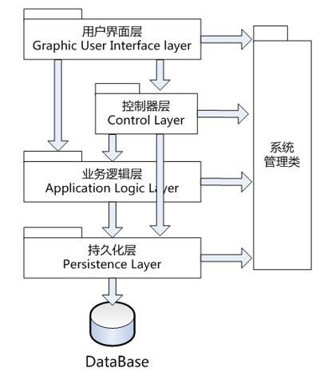
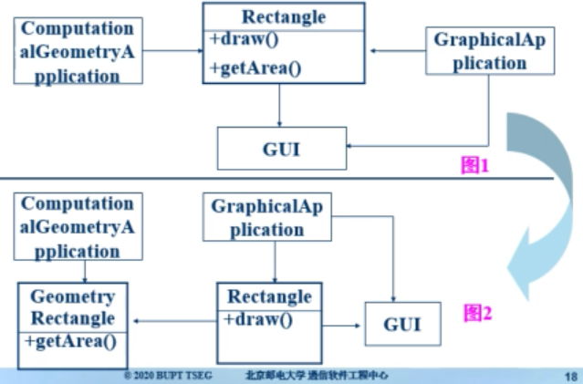
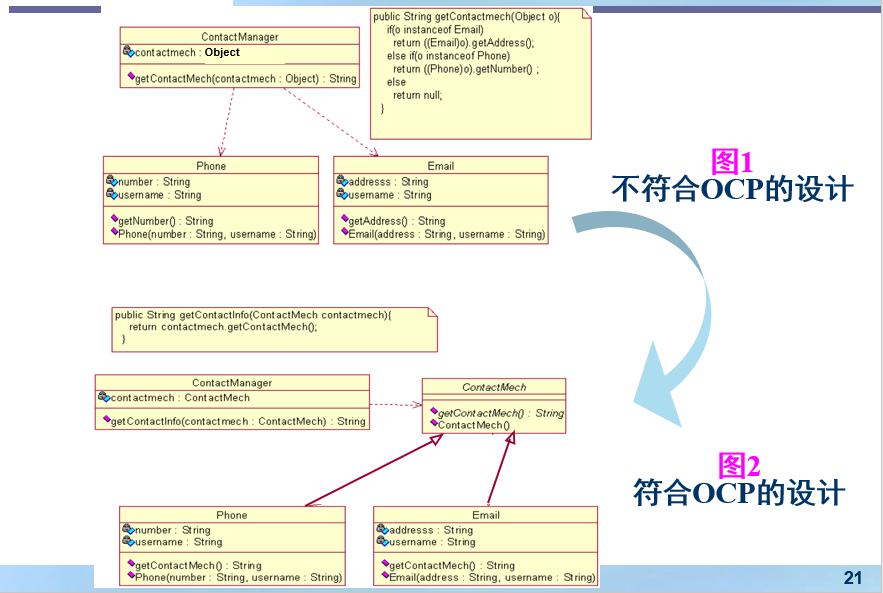
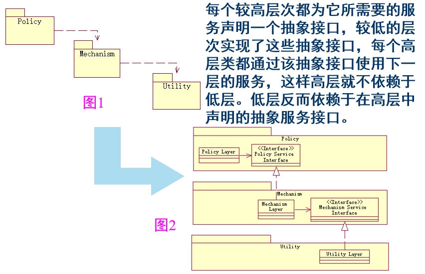
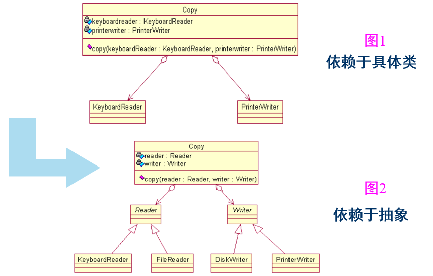
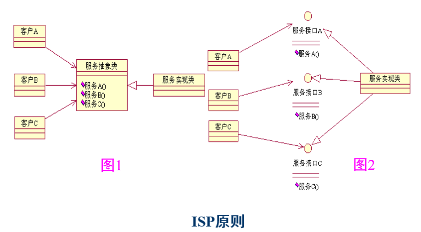
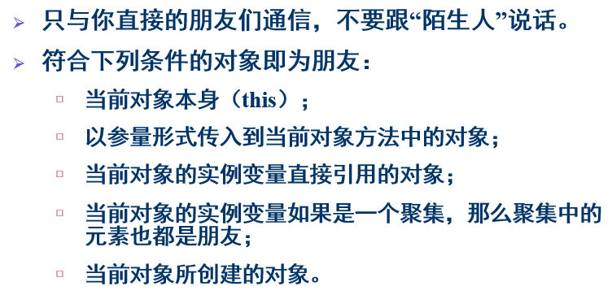

# 面向对象设计
## OOD
**面向对象设计 OOD 就是在OOA模型基础上运用面向对象方法进行系统设计，目标是产生一个符合具体实现条件的面向对象设计 OOD 模型**  

面向对象分析是从用户的角度去描述系统的功能，它创建的模型和用户的业务相关，分为领域模型和用例模型，领域中的类叫做概念类  

而面向对象设计是从系统的实现角度去描述系统的设计与细节，它所创建的模型和具体的实现环境相关，通常叫做设计模型，模型中的类叫做设计类  

OOA 和 OOD 采用一致的表示法(对象)，使得从 OOA 到 OOD 不存在转换，只需要做必要的修改和调整，或补充某些细节，并增加几个与实现有关的相对独立的部分  

### OOD 的主要工作
1. **软件体系结构设计**  
2. **用例实现方案设计**  
3. **用户界面设计**  

软件体系结构设计在用例实现方案设计之前进行，用户界面设计和其他两项工作之间无明显的先后次序关系  

**软件体系结构设计产生软件体系结构图，通常用 UML 中的包图来描述**  

**用例实现方案设计产生用例行为交互图以及设计类图**，此外，对于复杂对象的内部状态变化，可以采用 UML 中的状态图描述  

对于设计类内部方法的详细设计，可以采用 UML 中的活动图描述  

面向对象的用户界面设计是一个相对独立的过程，不是本课程重点  

-------------
## 软件体系结构设计
软件体系结构是描述某一特定应用领域中系统组织方式的惯用模式  

### 层次化设计
层次化将软件模型化成多个层次集合，每个层次由多个类或组件构成，这些类或组件一起完成某个特定功能，并通过层与层之间特定的接口进行互相调用

**优点**：  
1. 将软件分层可以增加它的健壮性  
2. 良好的系统分层结构会使系统易于扩展和维护  

**原则**：  
**模块化和信息隐藏**：层应该是模块化的。应该能够重写某—层，或对整个层进行替换，只要接口保持不变，系统的其他部分应该不受影响。这将有助于系统易于扩展和维护，并增加软件的可移植性  

接下来介绍一种五层软件分层结构，它用 UML 的包图表示：  
  

#### 1.用户界面层
作为人机交互接口，用户界面类实现了系统的主要用户界面元素  

把用户界面类从业务领域类中分离出来，就可以使用我们选择的任何方式改变用户界面  

用户界面层的实现要点：任何系统的用户界面能够以多种可能的形式出现，然而底层的业务逻辑却保持不变  

#### 2.控制器/处理层
位于用户界面层和业务逻辑层之间，用于接受用户界面传送过来的各种事件，并协调与控制业务逻辑层以及其它层次的类和对象，共同完成用户发出的系统事件  

对于比较复杂的用例，控制器/处理类并不处理具体的任务细节，但是它应知道如何去分解任务、如何将子任务分派给其他的辅助类（如业务/领域类甚至其他控制器／处理类）、以及如何在辅助类之间进行消息传递和协调  

控制器层使得用户界面层和业务逻辑层分离，修改用户界面时，并不影响业务逻辑的功能；当改变业务逻辑层的实现方式时，也不会影响用户界面层的使用  

不同的用例有不同的系统事件，因此，控制器的种类和数目通常与用例相对应  

不同的用例对应不同的控制器，相似的用例可以共享同一个控制器  

> 如：图书馆管理系统中  
> 借书用例对应借书控制器，专门用于借书场景中用户发出的所有请求  
> 同样有还书、查书等控制器类  

对于一些简单的用例，可以不设置控制器类，直接在用户界面层中设置控制协调功能，并将用户的系统事件直接发给底层的业务逻辑层  

**控制器类通常没有属性，都是方法，通过这些方法内部再去调用业务逻辑层中概念类的方法**  

#### 3.业务逻辑/业务领域层
它负责通过一定的算法和业务逻辑，处理用户传递过来的系统事件，并给出最后的响应结果  

**业务逻辑层包含的类通常来自于面向对象分析中领域模型的概念类**  

在 OOA 阶段关注的是问题域中概念的本质含义以及属性，在 OOD 阶段将会对这些概念增加操作，并进行必要的修改和调整，使之成为设计模型中业务/领域层中的类  

**即 OOA 中有属性但没方法，而 OOD 中要增加方法**  

#### 4.持久化层
持久类把永久存储、检索、更新和删除对象的能力封装起来，使底层的存储技术不暴露出来  

**引入持久化层的目的在于减少业务逻辑层与数据存储机制之间的耦合性**。当数据存储机制或策略发生变化的时候，能减少维护工作  

无论持久存储策略如何变化，业务/领域类都不会受影响，从而增加了应用程序的可维护性、可扩展性和可移植性  

#### 5.系统管理层
系统类为应用提供操作系统相关的功能，包括文件处理、多任务、多线程、网络等服务  

这些功能通常是以非面向对象的方式实现的  

系统类通过使用面向对象代码将操作系统提供的功能进行包装，使软件与操作系统分离，这样增加了应用的可移植性  

系统类位于软件开发中的最低层，其他各层的类都可以向系统类发送消息，但是系统类只被允许向其他的系统类发送消息  

----------------------
## 面向对象设计基本原则
### 1.单一职责原则SRP
**单一职责原则 SRP (Single Responsibility Principle) 指就一个类而言，应该仅有一个引起它变化的原因**  

通俗地讲，就是一个类只完成一个功能  

在代码中，引起它变化的原因指表现为 public 的方法  

**在SRP中，将职责定义为“变化的原因”**  

在构造对象时，应该将对象的不同职责分离至两个或多个类中，确保引起该类变化的原因只有一个，从而提高类的内聚度  

  

### 2.开闭原则OCP
**开闭原则 OCP(Open Closed Principle) 软件实体(类、模块、函数等)应该是可以扩展、但是不可修改的**  

实现OCP的关键是使用抽象来识别不同类之间的共性和变化点，利用封装技术对变化点进行封装  

  

### 3.里氏替换原则LSP
**里氏替换原则LSP (Liskov Substitution Principle) 指子类应当可以替换父类并出现在父类能够出现的任何地方**  

即，子类必须实现父类的所有对外共有方法，并于该方法中的原有语义功能保持一致  

该原则可以用来检测继承是否正确  

#### 4.依赖倒置原则DIP
依赖倒置原则DIP (Dependency Inversion Principle)包含以下两个方面：  
1. **高层模块不应该依赖于低层模决。二者都应该依赖于抽象**  

2. **抽象不应该依赖于细节。细节应该依赖于抽象**  

  

  

#### 5.接口隔离原则ISP
**接口隔离原则ISP (Interface Segregation Principle) 采用多个与特定客户类有关的接口比采用一个通用的涵盖多个业务方法的接口要好**  

向一个客户提供超过客户要求的服务承诺，会给服务提供方带来不必要的维护负担  

  

#### 6.组合/聚合复用原则CARP
**组合/聚合复用原则CARP (Composite/Aggregation Reuse Principle, CARP) 在一个新对象里面使用一些已有对象，使之成为新对象的一部分；新对象通过向已有对象委托(delegate)一部分责任而达到复用已有对象的目的**  

即：  
1. 实现复用时，应首先考虑组合/聚合关系(黑盒复用，把其它对象作为自己的属性使用)，其次才是继承(白盒复用)  
2. 在使用继承时，要严格 LSP 原则  
3. 如果两个类具有“has-a”关系则应使用组合/聚合，如果具有“is-a”关系则可使用继承  

继承关系相当于子类要直到父类的源代码，极大地破坏了信息隐藏的原则  

#### 7.迪米特法则LoD
**迪米特法则LoD (Law of Demeter, LoD) 最少知识原则：一个对象应当可能少的了解其它对象**  

迪米特法则是信息隐藏原则的应用  

  