# 设计用例实现方案
## 设计用例
用例实现指的是在设计模型中用协作的对象描述如何实现用例的各个特定场景，包括所有的成功场景和失败场景  

设计用例实现方案就是要找出所有层次中各需要有哪些对象（类）来参与、协同工作，以实现用例的各个场景  

### 步骤
**1. 创建系统动态结构**  
即分析出用例中的每个系统事件由哪些对象参与以及如何协同工作来完成  

用 UML 交互/协作图描述对象间的信息交互操作  

**2. 创建系统静态结构**  
在动态结构模型之上，创建系统设计类图，确定类之间的调用关系和每个类应当具备的操作和方法  

这里的设计类与领域模型的概念类有所不同，除了具有属性外，还有特定的操作方法  

**设计类的来源由两部分**：  
1. **由领域模型中的概念类转换而来**(这些类位于五层体系结构的业务逻辑层)  
2. **为系统实现而新增的一些类**，如负责对象持久化的类、负责通信的类  

**每一个设计类对应的对象都有自己明确的职责。对象的职责分为两种类型**：  
1. **了解型（knowing）职责**，细分为三类：  
   1. 对象要了解自己私有的封装数据  
   2. 了解相关联的对象  
   3. 了解能够派生或者计算的事物  

领域模型是获取对象了解型职责的重要来源，因为领域模型揭示了对象的属性和关联关系  

2. **行为型（doing）职责**，细分为三类：  
   1. 对象自身要能执行一些行为，如创建一个对象或者进行计算  
   2. 对象要能启动其他对象中的动作  
   3. 对象要能控制或协调其他对象中的活动  

行为型职责通过定义对象内部的方法，或描述对象间的方法调用关系来实现  

**方法**是对象操作的实现，是完成对象行为型职责的手段  

**面向对象设计最关键的活动是正确地给对象分配职责**，这直接关系到设计模型的质量  

-----------------
### 模式
**模式**是面向对象软件的设计经验，是可重用的设计思想，描述了在特定环境中某一类问题的成功解决方案，并提供经过实践检验的解决这类问题的通用模式  

模式定义了一组相互协作的类，包括类的职责和类之间的交互方式，它其实是使用面向对象基本原则对具体问题的解决方案  

一个模式包含四个部分：  
1. **模式名称**：一个助记名，用一两个词描述模式的问题、解决方案和效果  
2. **问题**：描述了何时使用模式。或者说模式的使用问题域  
3. **解决方案**：描述了设计的组成部分、组成部分之间的相互关系及各自的职责和协作方式（如包含的类、类的方法、类间的关系等）  
4. **效果**：描述了模式应用的效果和使用模式应权衡的问题。

#### GRASP 设计模式
**GRASP（General Responsibility Assignment Software Patterns）是一种软件设计模式，称为对象职责分配模式(统一职责分配软件模式)**  

基本设计原则：  
* 信息专家（Information Expert）  
* 创建者（Creator）  
* 控制器（Controller）  
* 低耦合（Low Coupling）  
* 高内聚（High Cohesion）  
* 多态（Polymorphism）  
* 纯虚构（Pure Fabrication）  
* 间接性（Indirection）  
* 防止变异（Protected Variations） 

##### 信息专家
是给对象分配职责的通用原则：  
**将职责分配给拥有履行职责所必需信息的类，这个类就叫做信息专家**。换言之，对象处理自己拥有信息的事务  

**选取类的方法**：  
如果在设计模型中存在相关的类，先到设计模型中查看  
如果在设计模型中不存在相关的类，则到领域模型中查看，试着应用或扩展领域模型，得出相应的设计类  

职责的实现需要信息，而信息往往分布在不同的对象中，**一个任务可能需要多个对象（信息专家）协作来完成**  

> 例：得到一份考卷的选择题得分  
> 需要知道：这份考卷有哪些选择题、以及各选择题的得分；从单选题或多选题类中获取学生提交的答案；从考题规格说明中获取该题的标准答案  
> 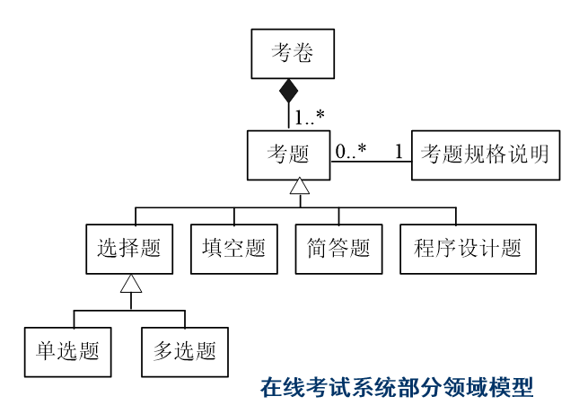  
> 于是可以在领域模型中找到三个信息专家：考题、考卷和考题规格说明  
> 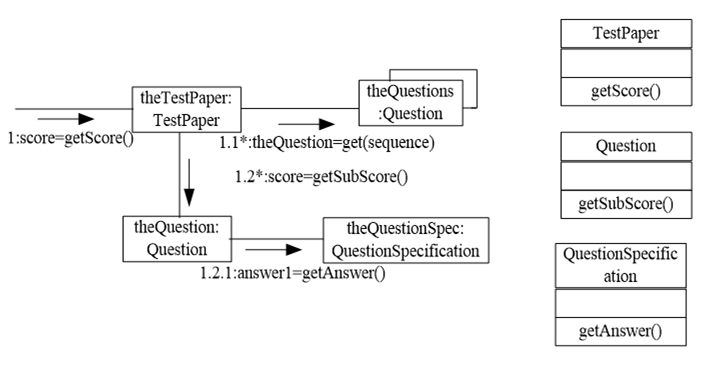  

##### 创建者
**确定谁负责产生类的实例**  

**如果符合下面的一个或者多个条件，则可将创建类A实例的职责分配给类B(B创建A)**：  
* B聚合(aggregate)或包含(contain)对象A  
* B记录（record）对象A  
* B密切使用对象A  
* B拥有创建对象A所需要的初始化数据（B是创建对象A的信息专家）  

> 例：在线考试系统中确定考卷生成规则项实例的类  
> 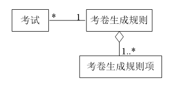  
> 因为考卷生成规则聚合了考卷生成规则项对象，因此考卷生成规则类是创建考卷生成规则项实例的很好候选者  

##### 控制器模式
**用于回答哪个非用户接口类应该负责处理一个系统输入事件（一个系统输入事件是由一个外部参与者产生的事件），这个非用户界面类就是控制器**  

用户首先通过操作用户界面类产生系统事件，然后将它委托给一个控制器来实现，然后由控制器分发到下一层次进行实现  

如果系统事件较为简单，也可以不经过控制器  

**控制器分离了用户界面实现和系统内部的逻辑，使它们互不影响**  

控制器分两类：  
1. **外观（facade）控制器**，它代表整个系统，它用于接受用户产生的所有事件，通常以系统名字命名  
2. **用例控制器**，它与每个用例相对应，代表一个发生系统事件的用例场景，通常以用例名命名  

当一个系统不具有“太多”的系统事件，或者用户接口不可能将事件消息重定向到其他控制器时，选择外观控制器是合适的。这时，外观控制器相当于一个应用的封面，隔离了用户接口和应用逻辑  

如果外观控制器由于职责过多而变得“臃肿”的时候，应该选择用例控制器。如果选择了用例控制器，那么每一个用例都有一个不同的控制类，而且只有一个，以便维护用例的状态。用例控制器可以实现有一定执行顺序的系统操作  

**不论是外观控制器还是用例控制器，它们只是接收系统事件消息，并没有实现系统操作的职责，系统操作应该分发给领域对象处理**  

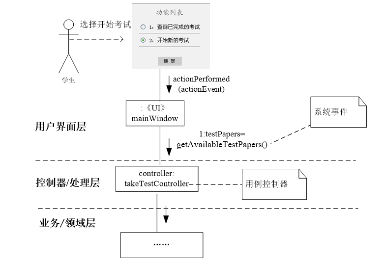  

**控制器类应由用户界面层的类创造**

------------------
## 类职责分配(创建系统动态结构)
针对特定场景中各个系统事件单独绘制交互图(可以是 UML 时序图或协作图)，用以说明系统接收到该事件后，由哪些对象互相协作、来共同完成对事件的处理，从而抽象出对象以及对象的职责  

如，考试系统中用户登录和考试的系统事件如下：  
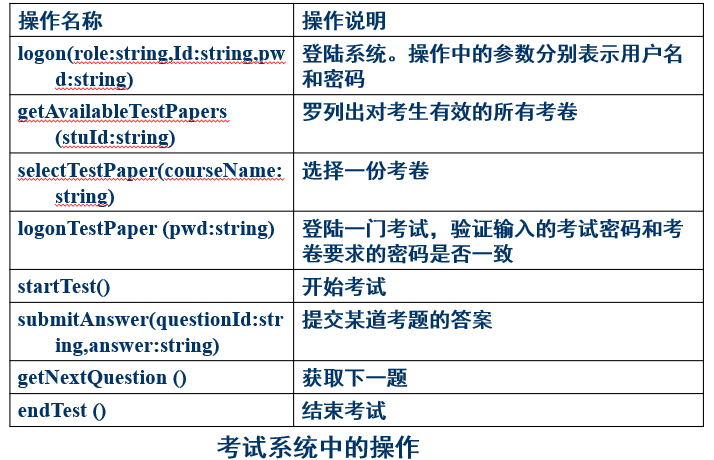  
登录时：  
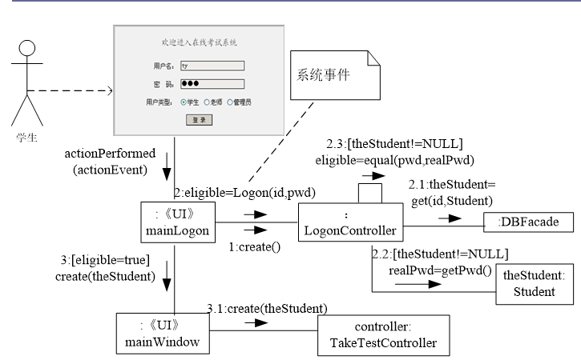  
(用例较多，使用用例控制器)  

略  

--------------
## 持久化层设计
由于业务领域层的对象包含重要的业务数据，需要将它们持久化地保存在数据库或文件中  

### 问题一：谁来负责持久化
按信息专家模式，最好由领域对象自己来承担这个职责，因为只有领域对象自己知道它的数据  

但是这样会使得领域对象和持久化存储机构之间具有很强的耦合  
其次持久化职责与领域对象本身的职责不符，违反单一职责原则  

故正确的做法是：**为每一个领域对象设计一个专门负责其持久化的映射类(Mapper)**  

如：StudentMapper：负责学生信息持久化；TestMapper：负责考试信息持久化；TestPaperMapper：负责考卷信息持久化  

**持久化的操作中有不少内容都很相似，可以把这些公共的内容都抽取出来形成一个抽象接口(IMapper)，然后再让映射类去实现该接口**  

### 问题二：谁来维护领域类和对应 Mapper 类之间的对应关系
**设计一个 DBFacade 类**，这个类相当于持久化层的控制器，它接收所有领域对象的持久化请求，并将其分发到对应的持久化映射 Mapper 对象  

**DBFacade 类是持久化层对外提供服务的唯一窗口**，它提供了与 IMapper 接口相对应的操作，满足增删改查四类功能  

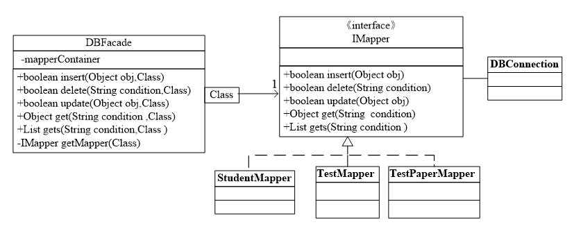

DBFacade 只依赖 IMapper 接口，符合开闭原则  

此外，将与数据库之间连接与释放交给 DBConnection 类，各个 Mapper 调用它提供的功能即可实现与数据库的连接和释放  

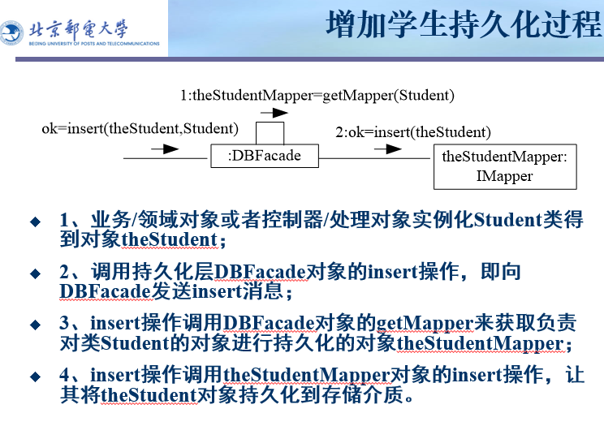  
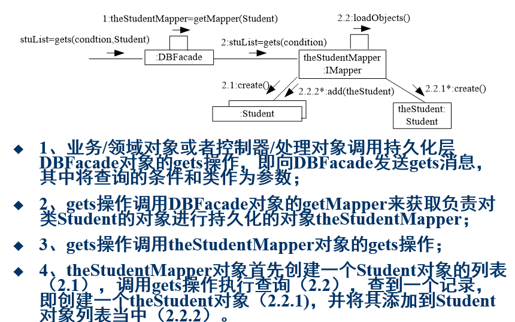  

------------
## 创建设计类图(创建系统静态结构)
设计类图中主要定义类、类的属性和操作，但是不定义实现操作的算法  

### 步骤
1. 通过扫描所有的交互图以及领域模型中涉及的类，识别参与软件解决方案的类  
2. 将领域模型中已经识别出来的部分属性添加到类中  
3. 给类添加操作。通过交互图可以获得每一个类的操作。一般的，发送给类X的所有消息的集合就是类X必须定义的大多数操作  
4. 添加更多的类型信息。包括属性类型、方法参数类型以及返回类型  
5. 添加关联和导航  
6. 类成员的细节表示（可选）。如成员的属性可见性，方法体的描述等  

**在第三步中需要注意**：  
* 交互图中的 create 创建消息一般被忽略，因为其一般通过构造函数实现  
* 不列出对象的 get 和 set 方法，以免影响可读性  
* 发送给多对象的消息，处理消息的操作不是多对象中的每一个对象的方法，而是容纳这些对象的容器对象  

**在第五步中需要注意**：  
导航（navigability）是关联角色的一个属性，表示从一个源对象沿着关联导航方向可以单向地到达一个目标类  

在面向对象编程语言中，如果类A要导航到类B，则在类A中将创建一个类B的实例属性  

定义A到B带导航修饰关联的常见情况有以下几种：  
A发送一个消息到B  
A创建一个B的实例  
A需要维护到B的一个连接  

**用户界面层**: 主要包括一些 UI 界面的设计  
**控制器/处理层**: 和前面将的控制器一样  
**业务/领域层**: 主要包括一些设计中主要的对象类  
**持久化层**: 包括 DBFacade 和 IMapper 等子类  

-----------------
## startUp 用例
大多数系统在启动过程中都要做一些系统初始化操作，所以**可以设置一个 startUp 用例，来完成相关初始化工作**  

**一般最后再进行startUp用例的设计，以保证其包含所有初始化活动**  

初始化活动通过创建领域对象来实现。一般首先创建一些初始化领域对象，由它负责后续直接领域对象的创建  

初始化领域对象的选择原则是：  
* 具有组合或聚合关系的根类  
* 具有持久化保存的信息类  
* 控制器类  

-----------------
## 总结
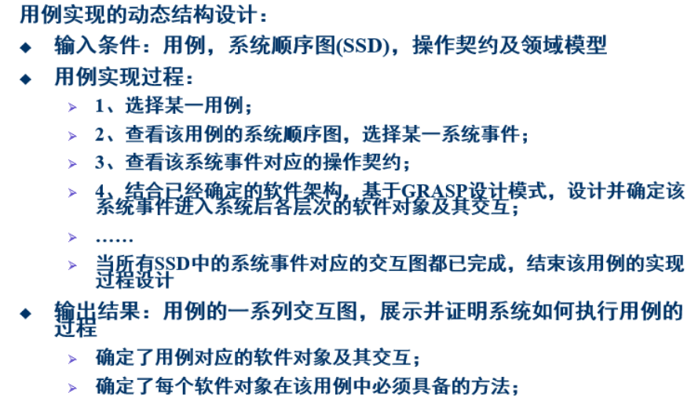  

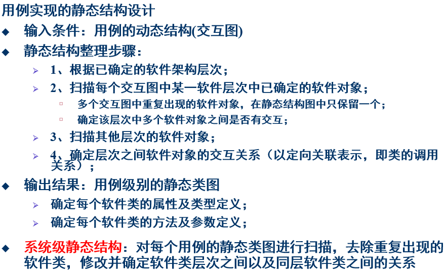  