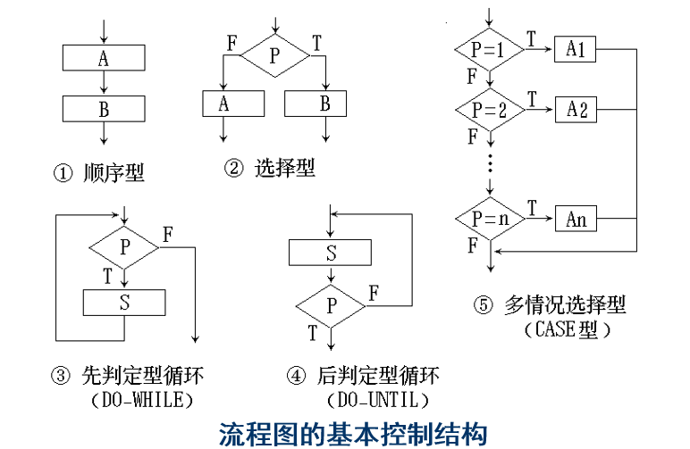

# 结构化设计方法
## 结构化设计映射模型
基于结构化需求分析模型  
  

数据设计将实体―关系图中描述的对象和关系，以及数据词典中描述的详细数据内容转化为数据结构的定义  

系统结构设计定义软件系统各主要成份之间的关系。接口设计根据数据流图定义软件内部各成份之间、软件与其它协同系统之间以及软件与用户之间的交互机制  

过程设计则是把结构成份转换成软件的过程性描述。在编码阶段，根据这种过程性描述，生成源程序代码，最终通过测试得到完整有效的软件  

----------------
## 数据流图转换系统功能结构图
结构化设计的核心是模块化、自顶向下细分，因此设计关键是如何划分模块  

### 系统功能结构图
**系统功能结构图是对软件模块化的图形化说明**，它描述了软件由哪些模块组成、模块间的调用关系，以及模块间的接口信息传递  

包括四个模块：  
* **传入模块**：从下属模块取得数据，经过某些处理，再将其传送给上级模块  
* **传出模块**：从上级模块获得数据，进行某些处理，再将其传送给下属模块  
* **变换模块**：即加工模块。它从上级模块取得数据，进行特定的处理，转换成其它形式，再传送回上级模块。大多数计算模块（原子模块）属于这一类  
* **协调模块**：对所有下属模块进行协调和管理的模块。 在系统的输入／输出部分或数据加工部分可以找到这样的模块。在一个好的系统结构图中，协调模块应在较高层出现  

  

其中大箭头表示调用关系，由调用者指向被调用者  

### 数据流图
数据流图按处理方式不同可以分为两种，**变换型**和**事务型**  
#### 变换型数据流图
变换型数据处理问题的工作过程大致分为三步，即取得数据，变换数据和给出数据  

变换型数据流图可以映射为变换型系统结构，这种转换方法叫做变换映射  

变换型系统结构对应于数据流中的取得数据、变换数据、给出数据，由输入、中心变换和输出等三部分组成  

  

#### 变换映射方法
##### 步骤1：  
复审基本系统模型（顶层数据流图和相应的软件需求规格说明书）。评估系统规格说明和软件需求规格说明，保证系统的正确性  

##### 步骤2：  
复审和细化软件的数据流图，确保数据流图没有细节问题，并正确描述了用户需求  

##### 步骤3：  
确定数据流图中含有变换流特征还是含有事务流特征（假设这里是变换流）  

##### 步骤4：  
区分输入流、输出流和中心变换部分，即标明数据流的边界  

**中心变换**：多股数据流汇集的地方往往是系统的中心变换部分  

**逻辑输入**：可以从数据流图上的物理输入开始，沿着数据流方向,一步一步向系统中间移动，一直到数据流不再被看作是系统的输入为止，则其前一个数据流就是系统的逻辑输入  

**逻辑输出**：从物理输出端开始，沿着数据流反方向，一步一步地向系统中间移动，一直到数据流不再被看作是系统的输出为止，则其后一个数据流就是系统的逻辑输出  

  

##### 步骤5：  
进行一级“因子化”分解，设计系统结构图中的顶层和第一层模块  

设计主模块，用程序名字为它命名，将它画在与中心变换相对应的位置上。作为系统的顶层，它调用下层模块，完成系统所要做的各项工作  

系统结构第一层的设计方针：为每一个逻辑输入设计一个输入模块，它为主模块提供数据；为每一个逻辑输出设计一个输出模块，它将主模块提供的数据输出；为中心变换设计一个变换模块，它将逻辑输入转换成逻辑输出。第一层模块与主模块之间传送的数据应与数据流图相对应  

  

##### 步骤6：  
进行二级“因子化”分解，设计中、下层模块  

  

##### 步骤7：  
利用一些启发式原则（应用模块的独立性概念）来改进系统的初始结构图，直到得到符合要求的结构图为止。主要考虑是这些功能模块具有高内聚低耦合的程序结构，而且最重要的是易于后期功能实现、测试和维护的程序结构  

------------------
#### 事务型数据流图
事务型数据处理问题的工作机理是接受一项事务，根据事务处理的特点和性质，选择分派一个适当的处理单元，然后给出结果。**选择分派任务的部分叫做事务处理中心，或分派部件**  

  

事务型数据流图可以映射为事务型系统结构，这叫做事务映射  

  

#### 事务映射方法
事务映射的前三个步骤与变换映射相同，只是在步骤3中会确定这适合事务映射  

##### 步骤4：  
识别事务中心和每一条操作路径上的流特征。事务中心通常位于几条操作路径的起始点上，可以从数据流图上直接找出来。输入路径必须与其它所有操作路径区分开来  

  

一般来说，进入事务中心的数据流就是逻辑输入流，从事务中心流出的数据就是逻辑输出流，中间部分就是中心变换    

##### 步骤5：  
一级因子化分解，将数据流图映射到事务型系统结构图上。事务流应映射到包含一个输入分支和一个分类事务处理分支的程序结构上。输入分支结构的开发与变换流的方法类似。分类事务处理分支结构包含一个调度模块，它调度和控制下属的事务处理模块  

  

##### 步骤6：  
“因子化”分解和细化该事务结构和每一条操作路径的结构。每一条操作路径的数据流图有它自己的信息流特征，可以是变换流也可以是事务流。与每一条操作路径相关的子结构可以依照前面介绍的设计步骤进行开发  

##### 步骤7：  
利用一些启发式原则来改进系统的初始结构图  

----------------------------
一般，一个大型的软件系统是变换型结构和事务型结构的混合结构。所以，我们通常利用以变换分析为主，事务分析为辅的方式进行软件结构设计  

  

--------------
#### 启发式原则
在两种映射方法步骤7中要求使用启发性原则改进系统结构图  

##### 原则一：模块功能的完善化  
一个完整的模块应具有以下几个部分，且这几个部分应当看作是一个模块的有机组成部分，不应分离到其他模块中，否则将会增大模块间的耦合程度：  
规定的功能部分  
出错处理部分。当模块不能完成规定的功能时，必须返回出错信息和标志，向它的调用者报告出现这种例外情况的原因  
如果需要返回一系列数据给它的调用者，当完成数据加工时应给它的调用者返回一个该模块执行是否正确结束的“标志”  

##### 原则二：消除重复功能，改善软件结构
如果发现几个模块的功能有相似之处，可以加以改进  

完全相似：采取完全合并的方法，只需在数据类型的描述上和变量定义上加以修改就可以  

局部相似：找出两者之间的相同部分，重新定义一个独立的下一层模块，剩余的部分根据情况还可以与它的上级模块合并  

##### 原则三：模块的作用范围应在控制范围之内
**模块的控制范围包括它本身及其所有的从属模块**  

**模块的作用范围是指模块内一个判定的作用范围**，凡是受这个判定影响的所有模块都属于这个判定的作用范围  

如果一个判定的作用范围包含在这个判定所在模块的控制范围之内，则这种结构是简单的，否则，它的结构是不简单的  

  

图 B 不好  
图 C 也不好，因为判断层次太高  
图 D 一般  
图 E 最优  

建议，所有受一个判定影响的模块应该都从属于该判定所在的模块，最好局限于做出判定的那个模块及其直接下属模块  

在设计过程中，当遇到作用范围不在控制范围之内，可应用如下办法把作用范围移到控制范围之内  
1. 将判定所在模块合并到父模块中，使判定处于较高的层次  
2. 将受到判定影响的模块下移到控制范围内  
3. 将判定上移到层次中较高的位置  

##### 原则四：尽可能减少高扇出结构
如果一个模块的扇出数过大，就意味着该模块过分复杂，需要协调和控制过多的下属模块。应当适当增加中间层次的控制模块  

如果一个模块的扇入太大，而且它又不是公用模块，说明该模块可能具有多个功能。为此应当对其进一步分析并将其功能分解  

  

##### 原则五：避免或减少使用病态联接
直接病态联接（内容耦合） ：即模块A直接从模块B内部取出某些数据，或者把某些数据直接送到模块B内部  

公共数据域病态联接（公共耦合） ：模块A和模块B通过公共数据域，直接传送或接受数据，而不是通过它们的上级模块(全局变量)  
  
通信模块联接：即模块A和模块B通过通信模块传送数据。它们之间的通信（即数据传送）没有通过它们的上级模块  

  

##### 原则六：模块的大小要适中
体积过大的模块往往是由于分解不充分，且具有多个功能，因此需要对功能进一步分解，生成一些下级模块或同层模块  

模块体积较小时也可以考虑是否可能与调用它的上级模块合并  

通常规定其语句行数在50～100左右，最多不超过500行  

##### 原则七：设计功能可预测的模块，避免过分受限制的模块  
一个功能可预测的模块，不论内部处理细节如何，但对相同的输入数据，总能产生同样的结果  

如果模块内部蕴藏有一些特殊的鲜为人知的功能时，这个模块就可能是不可预测的  
为了能够适应将来的变更，软件模块中局部数据结构的大小应当是可控制的，控制流的选择对于调用者来说，应当是可预测的，而与外界的接口应当是灵活的  

  

在 a 图中，同样的数据可能因为内部标记的不同产生不同的结果  

在 b 图中，受限于 10 个字符所以很难扩展  

##### 原则八：软件包应满足设计约束和可移植性

-------------------------
## 数据设计和文件设计原则
### 数据设计原则
指数据结构设计，数据设计的过程可以概括至两个步骤：  
1. 为在需求分析阶段所确定的数据对象选择逻辑表示，需要对不同结构进行算法分析，以便选择一个最有效的设计方案  
2. 确定对逻辑数据结构所必需的那些操作的程序模块(软件包)，以便限制或确定各个数据设计决策的影响范围  

总的来说，数据设计应确定数据的逻辑结构、存储结构，以及该数据结构的基本处理方法  

### 文件设计过程
文件设计指数据存储文件设计，其主要工作就是根据使用要求、处理方式、存储的信息量、数据的活动性，以及所能提供的设备条件等，来确定文件类别，选择文件媒体，决定文件组织方法，设计文件记录格式，并估算文件的容量  

主要分为两个阶段  
1. 第一个阶段是文件的逻辑设计，主要在概要设计阶段实施。它包括：整理必须的数据元素、分析数据间的关系、确定文件的逻辑设计  
2. 第二个阶段是文件的物理设计，主要在软件的详细设计阶段实施。主要工作有：理解文件的特性、确定文件的存储媒体、确定文件的组织方式、确定文件的记录格式、估算存取时间和存储容量  

----------------------------
## 设计的后处理
在经过变换映射和事务映射之后，还需要为所获得的系统功能结构图进行说明，作为《概要设计说明书》的一部分，包括以下内容：  
* 必须为每一个模块写一份**处理说明**  
* 为每一个模块提供一份**接口说明**  
* 确定全局数据结构和局部数据结构，即**数据结构说明**  

除此之外，就是进行**概要设计评审**和**设计优化**  

### 处理说明
**处理说明是一个关于模块内部处理的清晰且无歧义的正确描述**  

这种说明描述了模块的主要处理任务、条件抉择和输入／输出  

  

### 接口说明
**给出一张表格，列出所有进入模块和从模块输出的数据**，包括：通过参数表传递的信息、对外界的输入／输出信息、访问全局数据区的信息、指出其下属的模块和上级模块  

上述处理说明中的模块调用图对应的接口说明：  
  

### 数据结构说明
数据结构的设计对每个模块的程序结构和过程细节都有深刻的影响，在软件结构确定之后，必须确定全局的和局部的数据结构  

数据结构的描述可以用伪码（如PDL语言、类PASCAL语言）或Warnier图等形式表达  

### 概要设计评审
评审中应着重评审软件需求是否得到满足，软件结构的质量、接口说明、数据结构说明、实现和测试的可行性和可维护性等  

  

通过概要设计评审，可以有效降低错误的传播  

### 设计的优化(如果有)
优化要力争使模块的个数最少  
还应当寻求尽量简单的满足信息需求的数据结构  

对于有时间效率要求的软件，可以参考以下原则：  
* 在不考虑时间运行要求进行优化的条件下构造并改进软件的结构  
* 在细节设计的过程中，挑出那些有可能占用过多时间的模块，并为这些模块精心设计出时间效率更高的过程（算法）  
* 用高级程序设计语言编写代码程序  
* 检测软件，分离出占用大量处理机资源的模块  
* 如果有必要，用依赖机器的语言(机器指令、汇编语言)重新设计或重新编码，以提高软件的效率  

---------------------------
## 详细设计
从软件开发的工程化观点来看，在使用程序设计语言编制程序以前，需要对所采用算法的逻辑关系进行分析，设计出全部必要的过程细节，并给予清晰的表达，使之成为编码的依据，这就是详细设计的任务  

简单地说，就是采用某一种形式化工具，描述某个模块内部的算法逻辑  

这些形式化工具叫做详细设计工具，它可以分为以下三类:  
* 图形工具（程序流程图、N-S图、PAD图）  
* 表格工具（判定表）  
* 语言工具（PDL）  

### 程序流程图
程序流程图独立于任何一种程序设计语言，比较直观、清晰，易于学习掌握  

应对流程图所使用的符号做出严格的定义，不允许人们随心所欲地画出各种不规范的流程图  

为使用流程图描述结构化程序，必须限制流程图只能使用如下给出的五种基本控制结构:  
  
  

### N-S 图(盒图)

  

### PAD 图
  

PAD的执行顺序从最左主干线的上端的结点开始，自上而下依次执行。每遇到判断或循环，就自左而右进入下一层  

### 判断表
判定表能清晰地表达复杂的条件组合与应做动作之间的对应关系  

判定表的优点是能够简洁，无二义性地描述所有的处理规则。但判定表表示的是静态逻辑，是在某种条件取值组合情况下可能的结果，它不能表达加工的顺序，也不能表达循环结构，因此判定表不能成为一种通用的设计工具  

  

### PDL
PDL是一种用于描述功能模块的算法设计和加工细节的语言。称为设计程序用语言。它是一种伪码  

外语法：使用严格的关键词来提供结构化的控制，外语法关键字必须大写，其它单词必须小写  

内语法：使用自然语言描述处理特性

  