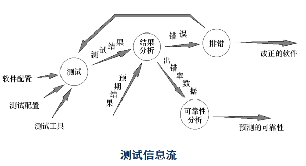
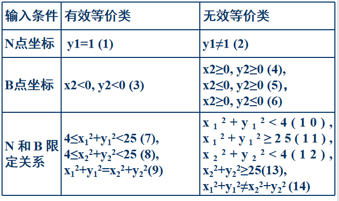
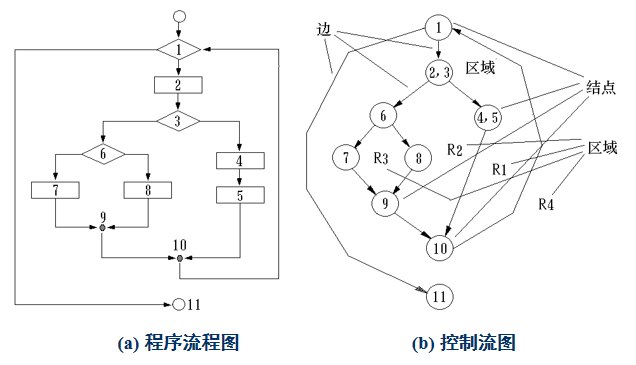
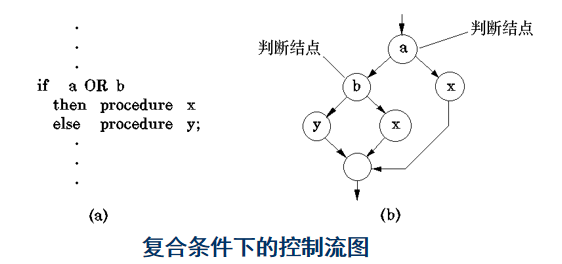

# 测试与维护
## 测试基础
### 测试的定义
(早期和狭义的定义是) 软件测试是为了发现错误而执行“程序”的过程。或者说，软件测试是根据软件开发各阶段的规格说明和程序的内部结构而精心设计一批测试用例（即输入数据及其预期的输出结果），并利用这些测试用例去运行程序，以发现程序错误的过程  

软件测试在软件生存期中横跨两个阶段
单元测试 （编码者）  
各种综合测试  （专门的测试人员）  

### 测试的目的
测试是执行程序的过程，目的在于发现错误  
一个好的测试用例在于能发现至今未发现的错误  
一个成功的测试是发现了至今未发现的错误的测试  

**测试不能表明软件中不存在错误，它只能说明软件中存在错误**  

### 测试的原则
* 尽早和不断地测试  
* 测试用例由输入数据和预期输出两部分组成  
* 程序员应避免测试自己的程序  
* 测试用例的输入条件中应包括合理的和不合理的  
* 注意测试种的群集现象[^群集现象]  
* 严格执行测试计划  
* 对每一个测试结果进行全面检查  
* 妥善保存测试计划，测试用例，出错统计和最终分析报告  
[^群集现象]: 群集现象意思是说在软件测试过程中，某个功能部件已发现的缺陷越多，找到它的更多未发现的缺陷的可能性就越大。

---------------
### 软件从可测试性
软件的可测试性是指一个计算机程序能够被检测的容易程度  

### 软件测试的对象
(现代和广义的测试定义) 软件测试并不等于程序测试，现代软件测试指为发现软件中存在的错误，对软件开发过程中形成的各项输出进行检查的过程  

测试应该贯穿于软件开发的整个期间，需求分析规格说明、概要设计说明、详细设计说明、单元代码、集成的系统以及其他输出文档，都应该成为测试的对象  

广义的软件测试包含三类具体活动：  
1. 测试：设计测试用例、运行程序、执行具体系统测试的过程  
2. 确认：评估软件的正确性、可行性和价值(是否满足了用户的预期，是否构造了正确的软件)  
3. 验证：检测软件开发的每个阶段、每个步骤是否正确无误(是否正确地构造了软件)  

### 软件测试信息流
测试过程需要三类输入：  
1. 软件配置：包括软件需求规格说明、软件设计规格说明、源代码等  
2. 测试配置：包括测试计划、测试用例、测试驱动程序等  
3. 测试工具：测试工具为测试的实施提供某种服务。例如，测试数据自动生成程序、静态分析程序、动态分析程序、测试结果分析程序、以及驱动测试的工作台等  
  

-----------------------
### 测试的步骤
* 单元测试  
  集中对用源代码实现的每一个程序单元进行测试。  

* 集成测试  
  根据设计规定的软件体系结构，把已测试过的模块组装起来，在组装过程中，检查程序结构组装的正确性。  

* 确认测试  
  检查已实现的软件是否满足了需求规格说明中确定了的各种需求，以及软件配置是否完全、正确  

* 系统测试  
  把已经经过确认的软件纳入实际运行环境中，与其它系统成份组合在一起进行测试  

* 验收测试  
  系统测试后可以正式投入试运行，一段时间后系统各方面均已满足需求，这时需对系统进行验收测试。验收测试是一个形式意义上的工作，选择用户最为关心的核心功能确认即可  

软件开发过程是一个自顶向下，逐步细化的过程，而测试过程则是依相反的顺序安排的自底向上，逐步集成的过程。低一级测试为上一级测试准备条件  

-----------------
## 常用测试方法与技术
* 静态测试：基本特征是对软件进行分析、检查和审阅，不实际运行被测试的软件，通常可找出30～70%的逻辑设计错误  
* 动态测试：指通过运行软件来检验软件的动态行为和运行结果的正确性。分为两种方法，黑盒测试和白盒测试  

### 黑盒测试
黑盒测试又叫做功能测试、数据驱动测试或基于规格说明的测试，指在不考虑程序内部结构和内部特征的情况下，根据软件产品的功能设计规格说明，在计算机上进行测试，以证实每个实现了的功能是否符合要求    

黑盒测试主要是为了发现以下几类错误：  
功能错误或遗漏  
输入和输出接口的正确性  
数据结构或外部信息访问错误  
性能要求满足情况  
初始化或终止性错误  

#### 黑盒测试技术
##### 等价类划分
该方法是把所有可能的输入数据划分为若干部分，从每一部分中选取少数有代表性的数据作为测试用例  

所谓**等价类是指某个输入域的子集合，在该子集合中，各个输入数据对于揭露程序中的错误都是等效的**，主要分为两类：  
**有效等价类**：是指对于程序规格说明来说是合理的、有意义的输入数据构成的集合。利用它可以测试软件在合法输入的情况下，是否给出了符合规格说明的输出  
**无效等价类**：是指对于程序规格说明来说是不合理的、无意义的输入数据构成的集合。利用它可以测试软件对于不合理的输入数据是否进行充分判断并给出提示信息  

划分出有效等价类和无效等价类之后进行顺序编号  
&nbsp;  
设计测试用例，尽可能多地覆盖尚未被覆盖的有效等价类，重复这一步骤，直到全部有效等价类均被覆盖到为止  
&nbsp;  
设计测试用例，每次只覆盖一个无效等价类，重复这一步骤，直到全部无效等价类均被覆盖到为止  

> 平面坐标系中存在两个点，分别为N(x1, y1)，B(x2, y2)，对其限定如下：  
> * 点N坐标：在y=1直线上  
> * 点B坐标：位于第三象限  
> * N和B限定关系：同时位于以(0, 0)为圆心，半径不小于2且小于5的圆上  
>   

##### 边界值分析
1. 如果输入条件规定了值的范围，则应选取刚达到这个范围的边界值，以及刚刚超过这个范围的边界值作为测试输入数据  
&nbsp;  
2. 如果输入条件规定了值的个数，则用最大个数、最小个数、比最大个数多1、比最小个数少1的数作为测试用例  
&nbsp;  
3. 如果输出结果限定在某个范围内，则应选取测试用例，使输出结果刚刚达到这个范围的边界值，或刚刚超过这个边界值  
&nbsp;  
4. 如果输出结果规定了个数，则选用使输出结果为最大个数、最小个数、比最大个数多1、比最小个数少1的数作为测试用例  
&nbsp;  
5. 如果输入与输出是有序集合，则应选取集合的第一个元素和最后一个元素作为测试用例  
&nbsp;  
6. 如果程序中使用了一个内部数据结构，则应当选择这个内部数据结构的边界的值作为测试用例  
&nbsp;  
7. 分析规格说明书，找到其他可能的边界条件进行测试  

##### 错误推测法
错误推测法的基本想法是：列举出程序中所有可能有的错误和容易发生错误的特殊情况，根据它们选择测试用例  

##### 因果图
如果在测试时必须考虑输入条件的各种组合，可能的组合数将是天文数字。因此必须考虑使用一种适合于描述对于多种条件的组合，相应产生多个动作的形式来考虑设计测试用例，这就需要利用因果图  

因果图方法最终生成的就是判定表。它适合于检查程序输入条件的各种组合情况  

### 白盒测试
白盒测试又称为结构测试、逻辑驱动测试或基于程序的测试，指根据软件产品的内部工作过程，在计算机上进行测试，以证实每种内部操作是否符合设计规格要求，所有内部成分是否已经过检查  

白盒测试方法主要对程序模块进行如下检查：  
程序模块所有独立执行路径至少测试一次  
所有逻辑判定分支至少测试一次  
循环边界和运行界限内执行情况  
程序内部数据结构的有效性  

#### 白盒测试技术
##### 逻辑覆盖
逻辑覆盖是以程序内部的逻辑结构为基础的设计测试用例的一种白盒测试技术  

逻辑覆盖可分为：语句覆盖、判定覆盖、条件覆盖、判定－条件覆盖、条件组合覆盖及路径覆盖  

* 语句覆盖(点覆盖)：设计若干个测试用例，运行被测程序，使得每一可执行语句至少执行一次  
* 判定覆盖(分支覆盖)：设计若干个测试用例，运行被测程序，使得程序中每个判断的取真分支和取假分支至少经历一次  
* 条件覆盖：设计若干个测试用例，运行被测程序，使得程序中每个判断的每个条件的可能取值至少执行一次  
* 判定－条件覆盖：设计足够的测试用例，使得判断中每个条件的所有可能取值至少执行一次，同时每个判断本身的所有可能判断结果至少执行一次  
* 多重条件覆盖：设计足够的测试用例，运行被测程序，使得每个判断的所有可能的条件取值组合至少执行一次  
* 路径测试：设计足够的测试用例，覆盖程序中所有可能的路径, 这是最强的覆盖准则  

##### 基本路径测试
真正做到完全路径覆盖是很困难的，必须把覆盖路径数目压缩到一定限度。如果把覆盖的路径数压缩到一定限度内，例如，程序中的循环体只执行零次和一次，就称为基本路径测试  

设计出的测试用例要保证在测试中，程序的每一个可执行语句至少要执行一次  

基本路径测试步骤：  
1. **导出程序流程图的拓扑结构-流图 (程序图)**  
     
   控制流图中边和结点圈定的区域叫做区域，当对区域计数时，图形外的区域也应记为一个区域  
   &nbsp;
   对于判定中的条件是复合条件时，需要拆分成只有单个条件的嵌套判定：  
     
2. **计算流图G的环路复杂度V(G)**  
   可以通过三种方法求得：  
   1. 将环路复杂性定义为控制流图中的区域数  
   2. 设E为控制流图的边数，N为图的结点数，则定义环路复杂性为 V(G)＝E－N＋2  
   3. 若设P为控制流图中的判定结点数，则有 V(G)＝P＋1  
3. **确定只包含独立路径的基本路径集**  
   程序的环路复杂性给出了程序基本路径集合中的独立路径条数，这是确保程序中每个可执行语句至少执行一次所必需的测试用例数目的上界  
   &nbsp;
   基本(独立)路径：指程序的控制流图中从入口到出口的路径，该路径包括一组以前没有处理的语句或条件  
   &nbsp;
   基本路径集不唯一，如上例中的：  
   > path1：1 - 11  
   > path2：1 - 2 - 3 - 4 - 5 - 10 - 1 - 11  
   > path3：1 - 2 - 3 - 6 - 8 - 9 - 10 - 1 - 11  
   > path4：1 - 2 - 3 - 6 - 7 - 9 - 10 - 1 - 11  

4. **设计测试用例**  
   根据前面所得到的基本路径集，设计测试用例，覆盖全部基本路径  

##### 控制结构测试
基本路径测试技术是控制结构测试技术之一。尽管基本路径测试简单高效，但是其并不充分  
控制结构测试中的其它测试技术：  
* 试验设计法  
* 条件测试的策略  
* 循环测试  

--------------
## 测试具体过程
### 单元测试
单元测试又称为模块测试，是针对程序模块进行正确性检验的测试。主要采用白盒测试为主、黑盒测试为辅的测试方法  

单元测试主要包括：模块接口测试、局部数据结构测试、路径测试、错误处理测试、边界测试  

模块并不是一个独立的程序，在考虑测试模块时，同时要考虑它和外界的联系，用一些辅助模块去模拟与被测模块相联系的其它模块。这些辅助模块分为两种：  
**驱动模块（driver）**：相当于被测模块的主程序。它接收测试数据，把这些数据传送给被测模块，最后输出实测结果  
**桩模块（stub）**：也叫做存根模块，用以代替被测模块调用的子模块  

### 集成测试
在单元测试的基础上，需要将所有模块按照设计要求组装成为系统，组装方式有两种：  
**一次性集成方式**：首先对每个模块分别进行模块测试，然后再把所有模块组装在一起进行测试，最终得到要求的软件系统  
**增量式集成方式**：首先对一个个模块进行模块测试，然后将这些模块逐步组装成较大的系统，在组装的过程中，边连接边测试，以发现连接过程中产生的问题。最后通过增殖逐步组装成为要求的软件系统  

### 确认测试
确认测试又称有效性测试，它的任务是验证软件的有效性，即验证软件的功能和性能及其它特性是否与用户的要求一致  

### 系统测试
所谓系统测试，是将通过确认测试的软件，作为整个基于计算机系统的一个元素，与计算机硬件、外设、某些支持软件、数据和人员等其它系统元素结合在一起，在实际运行（使用）环境下，对计算机系统进行一系列的组装测试和确认测试  

包括：恢复测试、压力测试、性能测试、安全测试  

### 验收测试
验收测试不再对系统的功能进行全面测试，选择用户最为关注的核心功能进行确认即可  

-----------------------------------
## 维护
### 维护的定义
所谓软件维护就是在软件已经交付使用之后，为了改正错误或满足新的需要而修改软件的过程，即在软件运行∕维护阶段对软件产品所进行的一切改动  

### 维护的分类
* **改正性维护**：  
  为了识别和纠正软件错误、改正软件性能上的缺陷、排除实施中的误使用而进行的诊断和改正错误的过程  
* **适应性维护**：  
  为了使软件适应外部环境或数据环境的变化，而去修改软件的过程  
* **完善性维护**：  
  为了满足用户对软件提出新的功能与性能要求而去修改和再开发软件的过程  
* **预防性维护**：  
  采用先进的软件工程方法对需要维护的软件或软件中的某一部分(重新)进行设计、编制和测试  

